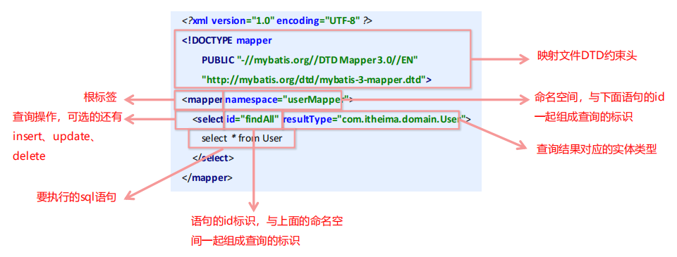
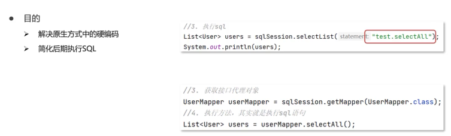
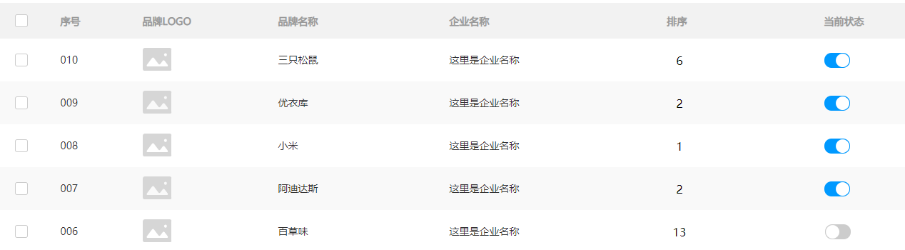
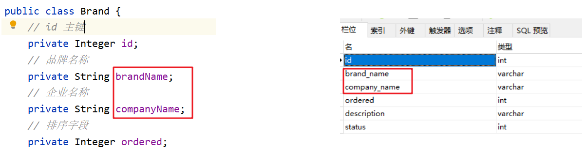
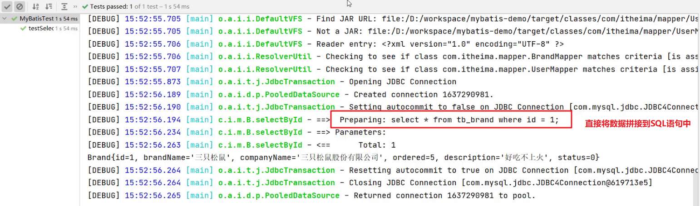
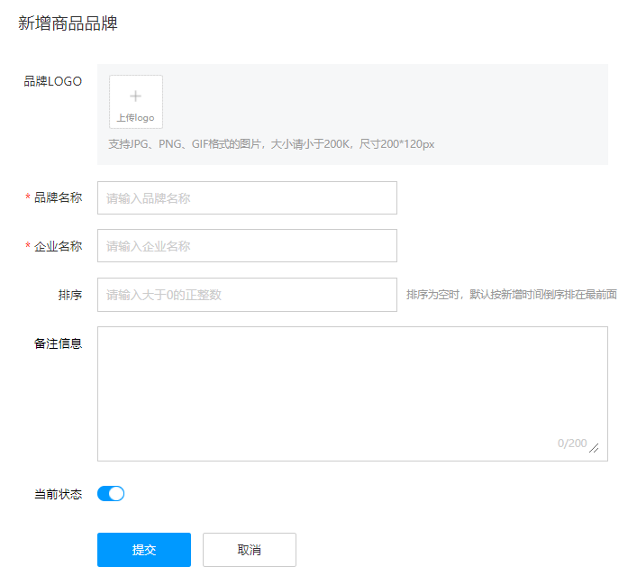
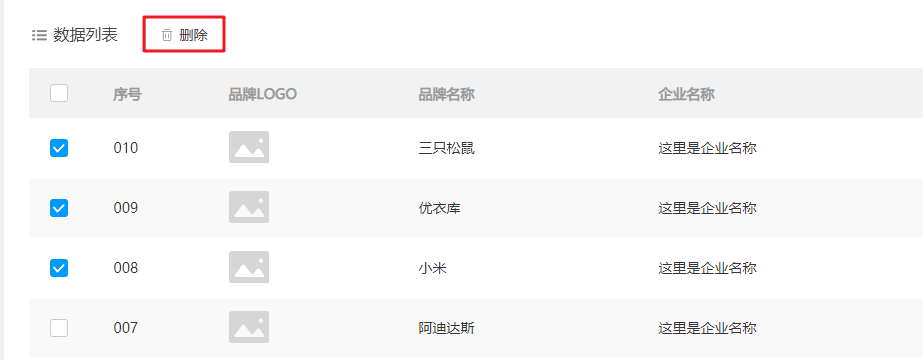

# **通用配置**

```properties
# jdbc.properties
jdbc.driver=com.mysql.jdbc.Driver
jdbc.url = jdbc:mysql://localhost:3306/studysql?useSSL=false
jdbc.username = root
jdbc.password= 5240zhouquan
```

```xml
<?xml version="1.0" encoding="UTF-8" ?>
<!DOCTYPE configuration
        PUBLIC "-//mybatis.org//DTD Config 3.0//EN"
        "http://mybatis.org/dtd/mybatis-3-config.dtd">

<configuration>
<!--    加载外部数据源配置-->
    <properties resource="jdbc.properties"></properties>
<!--		给实体类全限定名起别名-->
    <typeAliases>
        <package name="com.CCooky.pojo"/>
    </typeAliases>
<!--		配置数据库连接环境信息-->
    <environments default="development">
        <environment id="development">
            <transactionManager type="JDBC"/>
            <dataSource type="POOLED">
                <!--	数据库连接信息1-->
                <property name="driver" value="${jdbc.driver}"/>
                <property name="url" value="${jdbc.url}"/>
                <property name="username" value="${jdbc.username}"/>
                <property name="password" value="${jdbc.password}"/>
            </dataSource>
        </environment>
        <environment id="test">
            <transactionManager type="JDBC"/>
            <dataSource type="POOLED">
                <!--	数据库连接信息2-->
                <property name="driver" value="com.mysql.jdbc.Driver"/>
                <property name="url" value="jdbc:mysql:///mybatis?useSSL=false"/>
                <property name="username" value="root"/>
                <property name="password" value="1234"/>
            </dataSource>
        </environment>
    </environments>
<!--		加载SQL的映射文件，包扫描器。扫描的是resources目录下面的-->
    <mappers>
        <package name="com.CCooky.mapper"/>
    </mappers>
</configuration>
```

```xml
<?xml version="1.0" encoding="UTF-8" ?>
<!DOCTYPE mapper
        PUBLIC "-//mybatis.org//DTD Mapper 3.0//EN"
        "http://mybatis.org/dtd/mybatis-3-mapper.dtd">

<mapper namespace="test">
  
    <resultMap id="brandResultMap" type="brand">
        <result column="brand_name" property="brandName"/>
        <result column="company_name" property="companyName"/>
    </resultMap>

    <select id="selectAll" resultType="Blog">
        select * from tb_user;
    </select>

</mapper>
```

```java
public static void main(String[] args) throws IOException {

    //1.加载mybatis的核心配置文件，获取SqlSessionFactory
    String resource = "mybatis-config.xml";
    InputStream inputStream = Resources.getResourceAsStream(resource);
    SqlSessionFactory sqlSessionFactory = new SqlSessionFactoryBuilder().build(inputStream);

    //2. 获取SqlSession，用它来执行sql语句
    SqlSession sqlSession = sqlSessionFactory.openSession();

    //3. 执行SQL。
					//1. 获取接口代理对象
			UserMapper userMapper = sqlSession.getMapper(UserMapper.class);
					//2. 执行方法，其实就是执行SQL语句，
			List<User> users = userMapper.selectAll();
    
    //4. 释放资源
    sqlSession.close();

}
```

# MyBatis

## 1. 概述


==**这里提出一个概念：持久层，负责处理数据库之间的连接。**==

-  mybatis 是一个优秀的基于java的持久层框架，它内部封装了jdbc，使开发者只需要关注sql语句本身，而不需要花费精力去处理加载驱动、创建连接、创建statement等繁杂的过程。
-  mybatis通过xml或注解的方式将要执行的各种 statement配置起来，并通过java对象和statement中sql的动态参数进行映射生成最终执行的sql语句。
-  最后mybatis框架执行sql并将结果映射为java对象并返回。采用ORM思想（ObjectRelationMapping）解决了实体对象和数据库表映射的问题，对jdbc 进行了封装，屏蔽了jdbc api 底层访问细节，使我们不用与jdbc api打交道，就可以完成对数据库的持久化操作。


**其他的框架：**


## 2. 快速入门

快速案例需求：


**第一步：数据准备**

```sql
drop table if exists tb_user;

create table tb_user(
	id int primary key auto_increment,
	username varchar(20),
	password varchar(20),
	gender char(1),
	addr varchar(30)
);

INSERT INTO tb_user VALUES (1, 'zhangsan', '123', '男', '北京');
INSERT INTO tb_user VALUES (2, '李四', '234', '女', '天津');
INSERT INTO tb_user VALUES (3, '王五', '11', '男', '西安');
```

**第二步：创建Maven项目，导入很多坐标**

```xml
        <!--  mybatis  -->
        <dependency>
            <groupId>org.mybatis</groupId>
            <artifactId>mybatis</artifactId>
            <version>3.5.9</version>
        </dependency>
        
        <!--  mysql jdbc驱动（实现类） -->
        <dependency>
            <groupId>mysql</groupId>
            <artifactId>mysql-connector-java</artifactId>
            <version>5.1.49</version>
        </dependency>
        <!-- junit  -->
        <dependency>
            <groupId>junit</groupId>
            <artifactId>junit</artifactId>
            <version>4.12</version>
            <scope>test</scope>
        </dependency>

        <!-- 添加slf4j日志api -->
        <dependency>
            <groupId>org.slf4j</groupId>
            <artifactId>slf4j-api</artifactId>
            <version>1.7.20</version>
        </dependency>
        <!-- 添加logback-classic依赖 -->
        <dependency>
            <groupId>ch.qos.logback</groupId>
            <artifactId>logback-classic</artifactId>
            <version>1.2.3</version>
        </dependency>
        <!-- 添加logback-core依赖 -->
        <dependency>
            <groupId>ch.qos.logback</groupId>
            <artifactId>logback-core</artifactId>
            <version>1.2.3</version>
        </dependency>
```

**第三步：logback的配置文件，放在main的resurces下。**

​				logback.xml

```xml
<?xml version="1.0" encoding="UTF-8"?>
<configuration>
    <!--
        CONSOLE ：表示当前的日志信息是可以输出到控制台的。
    -->
    <appender name="Console" class="ch.qos.logback.core.ConsoleAppender">
        <encoder>
            <pattern>[%level] %blue(%d{HH:mm:ss.SSS}) %cyan([%thread]) %boldGreen(%logger{15}) - %msg %n</pattern>
        </encoder>
    </appender>
    <!--
      level:用来设置打印级别，大小写无关：TRACE, DEBUG, INFO, WARN, ERROR, ALL 和 OFF。 默认debug
      <root>可以包含零个或多个<appender-ref>元素，标识这个输出位置将会被本日志级别控制。
      -->
    <root level="DEBUG">
        <appender-ref ref="Console"/>
    </root>
</configuration>
```

**第四步：编写Mybatis的核心配置文件------->>替换连接信息，解决硬编码**

在main--resources目录下创建==mybatis-config.xml==文件，内容去官网下面复制那个简单的案例


**第五步：编写SQL映射文件，**===》》统一管理sql语句，解决硬编码问题。也是去官网找到，在上一步的mybatis-config里面提到过。

==文件命名规范：数据库表名+Mapper.xml==	例如UserMapper.xml


然后我们对映射文件进行修改，

```xml
<?xml version="1.0" encoding="UTF-8" ?>
<!DOCTYPE mapper
        PUBLIC "-//mybatis.org//DTD Mapper 3.0//EN"
        "http://mybatis.org/dtd/mybatis-3-mapper.dtd">

<!--
    namespace:名称空间
-->
<mapper namespace="test">
    <!--
        select -SQL语句类型
        id -该语句的唯一标示
        resultType - 该SQL语句结果对应的实体类必须为全限定名，
    -->
    <select id="selectAll" resultType="Blog">
        select * from tb_user;
    </select>

</mapper>
```

这里查询，应该返回的是我们的User实体类，所以我们现在去java下创建实体类User。

```
com.CCooky.pojo.User
```

更改上面的ResultType。使用的是类路径，在main.java下的，它可以自动识别

```xml
<select id="selectAll" resultType="com.CCooky.pojo.User">
```

最后，将前面mybatis核心配置文件中的SQL映射文件的路径改了，这样我们的配置就全部完成了。可以开始后面的编写实体类属性等操作。




**第六步：编码，测试**

先把实体类完善。

```java
public class User {
    private Integer id;
    private String userName;
    private String passWord;
    private String gender;
    private String addr;
  ......
}
```

**然后写我们的运行测试类。好好看写的注释哦**


**要使用mybatis，这里先要构建我们Mybatis的sqlSessionFactory工厂对象。这是mybatis的核心对象**

```java
public static void main(String[] args) throws IOException {

        //1.加载mybatis的核心配置文件，获取SqlSessionFactory
  			// 会自动从main下面的resources下查找，不用写全部的路径名称
        String resource = "mybatis-config.xml";
        InputStream inputStream = Resources.getResourceAsStream(resource);
        SqlSessionFactory sqlSessionFactory = new SqlSessionFactoryBuilder().build(inputStream);

        //2. 获取SqlSession，用它来执行sql语句
        SqlSession sqlSession = sqlSessionFactory.openSession();

        //3. 执行SQL。
        // 这里不同的SQL需求，对应使用不同的方法。
        // 参数部分传入你要执行的sql语句，采用 “Mapper的名称空间+sql语句的id” 来定位
        List<User> users = sqlSession.selectList("test.selectAll");
        System.out.println(users);

        //4. 释放资源
        sqlSession.close();
}
```

#### **SqlSessionFactoryBuilder**

**工厂构建器对象**，通过加载mybatis的核心文件的输入流的形式构建一个SqlSessionFactory对象。

```java
String resource = "mybatis-config.xml";
InputStream inputStream = Resources.getResourceAsStream(resource);
SqlSessionFactory sqlSessionFactory = new 	SqlSessionFactoryBuilder().build(inputStream);
```

#### **SqlSessionFactory**

**工厂对象**，通过它来创建我们的会话对象SqlSession。并且有多个方法创建 SqlSession 。


####  **SqlSession**

**会话对象**，SqlSession 实例在 MyBatis 中是非常强大的一个类。在这里你会看到所有执行语句、提交或回滚事务和获取映射器实例的方法。

执行语句的方法主要有：（后面代理开发，这个连接即可）

```java
<T> T selectOne(String statement, Object parameter) 
<E> List<E> selectList(String statement, Object parameter) 
int insert(String statement, Object parameter) 
int update(String statement, Object parameter) 
int delete(String statement, Object parameter)
```

**操作事务的方法主要有：**

```java
void commit()	//用的多一点
void rollback()
```


#### SqlSessionFactory工具类抽取

从我们的Mybatis的实现可以知道，每次使用的时候都需要写那三行代码来创建我们的工厂对象，这个对象是执行sql的核心，创建同时也会建立线程池等。以后我们在写后端资源的时候，以Servlet为例，每写一个资源都需要加上这三行代码，这就一引起代码重复问题，二是创建很多的工厂对象和线程池，极大占用后台资源，所以这个SqlSessionFactory工厂对象，我们希望只创建一次！！！


```java
package com.CCooky.util;

import org.apache.ibatis.io.Resources;
import org.apache.ibatis.session.SqlSessionFactory;
import org.apache.ibatis.session.SqlSessionFactoryBuilder;

import java.io.IOException;
import java.io.InputStream;

public class SqlSessionFactoryUtils {

    private static SqlSessionFactory sqlSessionFactory;
    static {
        try {
            String resource = "org/mybatis/example/mybatis-config.xml";
            InputStream inputStream = Resources.getResourceAsStream(resource);
            SqlSessionFactory sqlSessionFactory = new SqlSessionFactoryBuilder().build(inputStream);
        } catch (IOException e) {
            e.printStackTrace();
        }
    }
    public static SqlSessionFactory getSqlSessionFactory(){
            return sqlSessionFactory;
    }
}
```

#### SQL映射文件警告提示


#### IDEA写SQL语句无代码提示

IDEA连接MySQL数据库，没有代码提示的设置：

setting里面搜索SQl dialects，然后设置成为MySQL就行。


第二步，在IDEA里面连接上你的项目数据库就行，over


#### 增删改一定要提交事务

```java
sqlSession.commit();
```

## 3. Mapper代理开发

#### 概述

上面快速入门开发里面，还是存在硬编码问题，例如UserMapper里面的namespace、id，每次想要执行语句还要去Mapper里面找一下，名字啊什么的，不方便。



代理开发其实就是对执行SQL语句这里进行了改进：

原来是这样：

```java
 List<User> users = sqlSession.selectList("test.selectAll");
```

现在可以这样：

```java
//1. 获取接口代理对象
UserMapper userMapper = sqlSession.getMapper(UserMapper.class);
//2. 执行方法，其实就是执行SQL语句，
List<User> users = userMapper.selectAll();
```

#### 实现方式

必须的规则哦，按照一模一样的要求才行

**步骤：**

> 1. 定义SQL映射文件同名的Mapper接口，并且该Mapper接口与SQL映射文件要在同一个目录下
>
> 2. 设置SQL映射文件的namespace为Mapper接口全限定名。
>
>    **全限定类名：**就是类名全称，即全限定名 = 包名+类名
>
> 3. 在Mapper接口里面定义方法，方法名对应SQL映射文件中sql语句的id，并且参数类型，返回值一模一样
>
> 4. 编码
>
>    1. 通过sqlSession的getMapper方法获取Mapper接口对象；
>    2. 直接调用对象里面的方法完成sql的执行

**第一步：建立相同的目录结构**

这里有一个问题，因为我们的所有文件是放在resources下面的，代码文件在java目录下面，肯定不能直接放在一起啊，那不就项目结构乱套了。

这里Maven早就给我们想到了这一点，Maven在进行main目录的编译时，是把java目录和resources目录合在一起编译的，不相信的可以自己去试试，只要说：==UserMapper接口相对于java目录的路径与SQL映射文件相对于resources目录的路径，一模一样==，那么他们在编译的时候就会放在一起，wowowowo，牛的哦。

还要注意一点resources，创建目录的时候，只能用 “/” ，因为它只能创建目录，不能创建包。


​	编译的效果如下：


搞完了，记得把mybatis-config.xml里面的加载SQL映射文件的路径给改了，xml里面全部都是全限定名。


我们这个mybatis-config.xml中加载SQl映射文件，每次要写全限定名，是不是很麻烦啊，以后可能有几十个需要加载，那不完蛋了。所以说Mybatis给我们想好了。

只要我们使用的是代理开发模式，我们就可以采用Mapper代理的方式加载，原理是包扫描的方式加载SQL映射文件。它会自动加载这个包下面的所有SQL映射文件（注意，编译后，我们所有Mapper.xml都放在了包下面哦，细品，真的牛）

```java
    <!--加载resources下的SQL的映射文件-->
        <package name="com.CCooky.mapper"/>
    </mappers>
```

**第二步：映射文件设置对应的代理接口**

每一个SQL映射文件Mapper.xml都要设置对应的代理开发的接口；namespace为代理接口==全限定名==。


智能提示，牛的哇，Maven很细节，首先他的目录结构给你创建好了，java下放源代码，resources下方配置文件。然后只有java下面可以创建包，resources只能创建目录，这样所有的包不都在java下面了吗，所以写全限定名的时候，只要写这个 ‘’com.CCooky.mapper.UserMapper‘’ 就行了，前面的main包、java包都不用写，他会自动取java下面查找，Maven都给你整清楚了。

**第三步：编写代理接口方法**

```java
public interface UserMapper {
    List<User> selectAll();
}
```

```xml
<?xml version="1.0" encoding="UTF-8" ?>
<!DOCTYPE mapper
        PUBLIC "-//mybatis.org//DTD Mapper 3.0//EN"
        "http://mybatis.org/dtd/mybatis-3-mapper.dtd">

<mapper namespace="com.CCooky.mapper.UserMapper">

		<select id="selectAll" resultType="com.CCooky.pojo.User">
        select * from tb_user;
    </select>

</mapper>
```

**第四步：执行SQl语句**

最后了，编码就行了

```java
    public static void main(String[] args) throws IOException {

        //1.加载mybatis的核心配置文件，获取SqlSessionFactory
        String resource = "mybatis-config.xml";
        InputStream inputStream = Resources.getResourceAsStream(resource);
        SqlSessionFactory sqlSessionFactory = new SqlSessionFactoryBuilder().build(inputStream);

        //2. 获取SqlSession，用它来执行sql语句
        SqlSession sqlSession = sqlSessionFactory.openSession();

        //3. 执行SQL。
						//1. 获取接口代理对象
				UserMapper userMapper = sqlSession.getMapper(UserMapper.class);
						//2. 执行方法，其实就是执行SQL语句，
				List<User> users = userMapper.selectAll();
        
        //4. 释放资源
        sqlSession.close();

    }
```

## 4. Mybatis核心配置文件

在Mybatis的官网里面，有详细的配置信息。这里先只涉及到了三个内容，以后涉及到了以后再补充。详细的解析取官网，我已经写了在代码注释部分。==注意：一定要按照别人写的这个标签顺序来写配置文件，因为这是别人的约束嘛，xml的约束方式之一。==


- **将具体执行的SQL语句打印到控制台的配置**

  ```xml
  	<settings>
  <setting name="logImpl" value="STDOUT_LOGGING" />
    </settings>
  ```

### **1. environments标签**

数据库环境的配置，支持多环境配置


其中，事务管理器（transactionManager）类型有两种：

-  JDBC：这个配置就是直接使用了JDBC 的提交和回滚设置，它依赖于从数据源得到的连接来管理事务作用域。
-  MANAGED：这个配置几乎没做什么。它从来不提交或回滚一个连接，而是让容器来管理事务的整个生命周期（比如JEE 应用服务器的上下文）。 默认情况下它会关闭连接，然而一些容器并不希望这样，因此需要将 closeConnection 属性设置为 false 来阻止它默认的关闭行为。

其中，数据源（dataSource）类型有三种：

-  UNPOOLED：这个数据源实现的只是每次被请求时打开和关闭连接。
-  POOLED：这种数据源的实现利用“ 连接池 ”的概念将 JDBC 连接对象组织起来。
-  JNDI：这个数据源的实现是为了能在如 EJB 或应用服务器这类容器中使用，容器可以集中或在外部配置数据源，然后放置一个 JNDI 上下文的引用。

### **2. mapper标签**

用来加载SQL映射文件。

```xml
<mappers>
    <!--加载SQL的映射文件，包扫描器-->
  扫描的是resources目录下面的
    <package name="com.CCooky.mapper"/>
</mappers>
```

### **3. Properties标签**

该标签可以加载额外配置的properties文件。例如，实际开发中，习惯将数据源的配置信息单独抽取成一个properties文件，然后用properties标签引入，通过 ${ } 表达式拿取里面的数据。


### **4. typeAliases标签**

1. 针对SQL语句里面的resultType而言，可以简写数据库映射的java对象名称。
2. 类型别名可为 Java 类型设置一个缩写名字,仅用于XML配置,意在降低冗余的全限定类名书写。
3. 在没有注解的情况下，会使用 **Bean 的首字母小写的非限定类名**来作为它的别名。

```xml
<!--扫描的是java目录下面的，包扫描器。-->
<typeAliases>
    <package name="com.CCooky.pojo"/>
</typeAliases>
```


除此以外，Mybatis已经为我们配置了一些常用类型的别名。


###  5. **typeHandlers标签**

简单说，就是数据库的数据类型与我们Java的数据类型不是一样的，我们要对其进行转换。

无论是 MyBatis 在预处理语句（PreparedStatement）中设置一个参数时，还是从结果集中取出一个值时， 都会用类型处理器将数据库获取的值以合适的方式转换成 Java 类型。下表描述了一些默认的类型处理器（截取部分）。


但上面提供的并不能满足我们实际开发中的所有需求。例如说，我们想把Java的Date类型，在数据库内以时间毫秒值的形式存储，取出来时转换成java的Date，即java的Date与数据库的varchar毫秒值之间转换。（mybatis默认的转换是Date——yyyy-MM-dd HH:mm:ss）。

办法：你可以重写类型处理器或创建新的类型处理器来处理不支持的或非标准的类型。具体做法为：实现org.apache.ibatis.type.TypeHandler 接口或继承一个实现类org.apache.ibatis.type.BaseTypeHandler， 然后可以选择性地将它映射到一个JDBC类型。

**开发步骤：**

① 定义转换类继承类BaseTypeHandler<T>

② 覆盖4个未实现的方法，其中`setNonNullParameter`为java程序设置数据到数据库的回调方法，`getNullableResult`为查询时 mysql的字符串类型转换成 java的Type类型的方法

③ 在MyBatis核心配置文件中进行注册

④ 测试转换是否正确

第一步：

```java
// <T> 类型为需要转换的数据类型
public class MyDateTypeHandler extends BaseTypeHandler<Date> {
  	// java类型----数据库类型
  	// 这里的i是当前参数的位置，他已经给我们直接写就行了
		public void setNonNullParameter(PreparedStatement preparedStatement, int i, Date date, JdbcType type) {
      	long time = date.getTime();
				preparedStatement.setString(i, time+"");
		}
  	// 数据库类型----java类型
  	// String参数：数据库要转换的字段名称
  	// ResultSet：查询出来的结果集
		public Date getNullableResult(ResultSet resultSet, String s) throws SQLException {
      	// 获取结果集中需要的数据（str）转换成Date类型，返回
				return new Date(resultSet.getString(s));
		}
 	 	// 数据库类型----java类型
  	// i参数：数据库要转换的字段位置
		public Date getNullableResult(ResultSet resultSet, int i) throws SQLException {
				return new Date(resultSet.getString(i));
		}
 	 // 数据库类型----java类型
  
		public Date getNullableResult(CallableStatement callableStatement, int i) throws SQLException {
				return callableStatement.getDate(i);
} 
}
```

第二步：MyBatis核心配置文件中进行注册

```xml
<!--注册类型自定义转换器--> 
<typeHandlers> 
  	<typeHandler 			  
       	handler="com.itheima.typeHandlers.MyDateTypeHandler">
  	</typeHandler>
</typeHandlers>
```

第三步：测试


###  **6. plugins标签**

MyBatis可以使用第三方的插件来对功能进行扩展，**分页助手PageHelper**是将分页的复杂操作进行封装，使用简单的方式即可获得分页的相关数据。使用分页助手不用添加什么其他的代码，也不用继承实现之类的，他就像我们的IDEA里面的插件，只要配置了就会在内部直接起作用，卧槽真的舒服！！！

开发步骤：

① 导入通用PageHelper的坐标

② 在mybatis核心配置文件中配置PageHelper插件

③ 测试分页数据获取

第一步：pom.xml

```xml
<dependency>
    <groupId>com.github.pagehelper</groupId>
    <artifactId>pagehelper</artifactId>
    <version>3.7.5</version>
</dependency>
<dependency>
    <groupId>com.github.jsqlparser</groupId>
    <artifactId>jsqlparser</artifactId>
    <version>0.9.1</version>
</dependency>
```

第二步：mybatis-config.xml

```xml
<!--配置分页助手插件-->
<plugins>
    <plugin interceptor="com.github.pagehelper.PageHelper">
      	<!-- 指定方言 -->
        <property name="dialect" value="mysql"></property>
    </plugin>
</plugins>
```

第三步：直接使用，666666

```java
@Test
public void test3() throws IOException {
    InputStream resourceAsStream = Resources.getResourceAsStream("sqlMapConfig.xml");
    SqlSessionFactory sqlSessionFactory = new SqlSessionFactoryBuilder().build(resourceAsStream);
    SqlSession sqlSession = sqlSessionFactory.openSession();
    UserMapper mapper = sqlSession.getMapper(UserMapper.class);

    //设置分页相关参数   当前页+每页显示的条数
    PageHelper.startPage(1,3);

    List<User> userList = mapper.findAll();
    for (User user : userList) {
        System.out.println(user);
    }

    //获得与分页相关参数
    PageInfo<User> pageInfo = new PageInfo<User>(userList);
    System.out.println("当前页："+pageInfo.getPageNum());
    System.out.println("每页显示条数："+pageInfo.getPageSize());
    System.out.println("总条数："+pageInfo.getTotal());
    System.out.println("总页数："+pageInfo.getPages());
    System.out.println("上一页："+pageInfo.getPrePage());
    System.out.println("下一页："+pageInfo.getNextPage());
    System.out.println("是否是第一个："+pageInfo.isIsFirstPage());
    System.out.println("是否是最后一个："+pageInfo.isIsLastPage());

    sqlSession.close();
}
```

#### **通用配置**

```properties
# jdbc.properties
jdbc.driver=com.mysql.jdbc.Driver
jdbc.url = jdbc:mysql://localhost:3306/studysql?useSSL=false
jdbc.username = root
jdbc.password= 5240zhouquan
```

```xml
<?xml version="1.0" encoding="UTF-8" ?>
<!DOCTYPE configuration
        PUBLIC "-//mybatis.org//DTD Config 3.0//EN"
        "http://mybatis.org/dtd/mybatis-3-config.dtd">

<configuration>
  <!--    加载外部数据源配置-->
    <properties resource="jdbc.properties"></properties>
    <!--给实体类全限定名起别名-->
    <typeAliases>
        <package name="com.CCooky.pojo"/>
    </typeAliases>

    <!--
				配置数据库连接环境信息。
    -->
    <environments default="development">
        <environment id="development">
            <transactionManager type="JDBC"/>
            <dataSource type="POOLED">
                <!--数据库连接信息1-->
                <property name="driver" value="${jdbc.driver}"/>
                <property name="url" value="${jdbc.url}"/>
                <property name="username" value="${jdbc.username}"/>
                <property name="password" value="${jdbc.password}"/>
            </dataSource>
        </environment>
        <environment id="test">
            <transactionManager type="JDBC"/>
            <dataSource type="POOLED">
                <!--数据库连接信息2-->
                <property name="driver" value="com.mysql.jdbc.Driver"/>
                <property name="url" value="jdbc:mysql:///mybatis?useSSL=false"/>
                <property name="username" value="root"/>
                <property name="password" value="1234"/>
            </dataSource>
        </environment>

    </environments>
  
    <mappers>
        <!--加载SQL的映射文件，包扫描器-->
      扫描的是resources目录下面的
        <package name="com.CCooky.mapper"/>
    </mappers>
</configuration>
```

## 5.  Mybatis参数传递

正如前面所看见的，我们Mapper接口与Mapper.xml（SQL映射文件）的参数关系。在映射文件中，我们不用写接收参数的代码，就是直接拿传入的参数在使用，然后Mapper接口方法的参数需要按照一定的标准才行！！！下面详细解释一下。

Mybatis 接口方法中可以接收的参数类型如下，如下：

* 多个参数（使用较少）
* 单个参数：单个参数又可以是如下类型
  * POJO 类型（类似Javabean）
  * Map 集合类型
  * Collection 集合类型
  * List 集合类型
  * Array 类型
  * 其他类型

### 5.1  多个参数

```java
* 多个参数：Mybatis原理是将其封装为Map集合,可以使用@Param注解，替换Map集合中默认的arg键名
    map.put("arg0",参数值1)
    map.put("param1",参数值1)
    map.put("param2",参数值2)
    map.put("agr1",参数值2)
    ---------------@Param("username")
    map.put("username",参数值1)
    map.put("param1",参数值1)
    map.put("param2",参数值2)
    map.put("agr1",参数值2)
```

如下面的代码，就是接收两个参数，而接收多个参数需要使用 `@Param` 注解，那么为什么要加该注解呢？这个问题要弄明白就必须来研究Mybatis 底层对于这些参数是如何处理的。

```java
User select(@Param("username1") String username,@Param("password1") String password);
```

```xml
<select id="select" resultType="user">
	select *
    from tb_user
    where 
    	username=#{username1}
    	and password=#{password1}
</select>
```

- **下面是具体原理的解析**


我们在接口方法中定义多个参数，Mybatis 会将这些参数封装成 Map 集合对象，值就是传递的参数值，而键在没有使用 `@Param` 注解时有以下命名规则：

* 以 arg 开头  ：第一个参数就叫 arg0，第二个参数就叫 arg1，以此类推。如：

  > map.put("arg0"，参数值1);
  >
  > map.put("arg1"，参数值2);

* 以 param 开头 ： 第一个参数就叫 param1，第二个参数就叫 param2，依次类推。如：

  > map.put("param1"，参数值1);
  >
  > map.put("param2"，参数值2);

**代码验证：**

* 在 `UserMapper` 接口中定义如下方法

  ```java
  User select(String username,String password);
  ```

* 在 `UserMapper.xml` 映射配置文件中定义SQL

  ```xml
  <select id="select" resultType="user">
  	select *
      from tb_user
      where 
      	username=#{arg0}
      	and password=#{arg1}
  </select>
  ```

  或者

  ```xml
  <select id="select" resultType="user">
  	select *
      from tb_user
      where 
      	username=#{param1}
      	and password=#{param2}
  </select>
  ```

* 运行代码结果如下

  

在映射配合文件的SQL语句中使用用 `arg` 开头的和 `param` 书写，代码的可读性会变的特别差，此时可以使用 `@Param` 注解。

在接口方法参数上使用 `@Param` 注解，Mybatis 会将 `arg` 开头的键名替换为对应注解的属性值。

**代码验证：**

* 在 `UserMapper` 接口中定义如下方法，在 `username` 参数前加上 `@Param` 注解

  ```java
  User select(@Param("username") String username, String password);
  ```

  Mybatis 在封装 Map 集合时，键名就会变成如下：

  > map.put("username"，参数值1);
  >
  > map.put("arg1"，参数值2);
  >
  > map.put("param1"，参数值1);
  >
  > map.put("param2"，参数值2);

* 在 `UserMapper.xml` 映射配置文件中定义SQL

  ```xml
  <select id="select" resultType="user">
  	select *
      from tb_user
      where 
      	username=#{username}
      	and password=#{param2}
  </select>
  ```

* 运行程序结果没有报错。而如果将 `#{}` 中的 `username` 还是写成  `arg0` 

  ```xml
  <select id="select" resultType="user">
  	select *
      from tb_user
      where 
      	username=#{arg0}
      	and password=#{param2}
  </select>
  ```

* 运行程序则可以看到错误

  

==结论：以后接口参数是多个时，在每个参数上都使用 `@Param` 注解。这样代码的可读性更高。==

#### 传递自定义对象和数组

```java
boolean updateByIds(@Param("ids") String[] ids, @Param("bridgeAlertRecord") BridgeAlertRecord bridgeAlertRecord);
```

```xml
<update id="updateByIds">
        update bridge_alert_record
        set
            is_deal = #{bridgeAlertRecord.isDeal},
            deal_result = #{bridgeAlertRecord.dealResult},
            deal_content = #{bridgeAlertRecord.dealContent}
        where id in
            <foreach collection="ids" item="id" separator="," open="(" close=")">
                #{id}
            </foreach>
</update>
```

### 5.2 单个参数

```
/*
  MyBatis 参数封装：
    * 单个参数：
        1. POJO类型：直接使用，属性名 和 参数占位符名称 一致
        2. Map集合：直接使用，键名 和 参数占位符名称 一致
        3. Collection：封装为Map集合，可以使用@Param注解，替换Map集合中默认的arg键名
            map.put("arg0",collection集合);
            map.put("collection",collection集合);
        4. List：封装为Map集合，可以使用@Param注解，替换Map集合中默认的arg键名
            map.put("arg0",list集合);
            map.put("collection",list集合);
            map.put("list",list集合);
        5. Array：封装为Map集合，可以使用@Param注解，替换Map集合中默认的arg键名
            map.put("arg0",数组);
            map.put("array",数组);
        6. 其他类型：直接使用，例如单个的int参数
      
```

* POJO 类型

  直接使用。要求 `属性名` 和 `参数占位符名称` 一致

* Map 集合类型

  直接使用。要求 `map集合的键名` 和 `参数占位符名称` 一致

* Collection 集合类型

  Mybatis 会将集合封装到 map 集合中，如下：

  > map.put("arg0"，collection集合);
  >
  > map.put("collection"，collection集合;

  ==可以使用 `@Param` 注解替换map集合中默认的 arg 键名。==

* List 集合类型

  Mybatis 会将集合封装到 map 集合中，如下：

  > map.put("arg0"，list集合);
  >
  > map.put("collection"，list集合);
  >
  > map.put("list"，list集合);

  ==可以使用 `@Param` 注解替换map集合中默认的 arg 键名。==

* Array 类型

  Mybatis 会将集合封装到 map 集合中，如下：

  > map.put("arg0"，数组);
  >
  > map.put("array"，数组);

  ==可以使用 `@Param` 注解替换map集合中默认的 arg 键名。==

* 其他类型

  比如int类型，`参数占位符名称` 叫什么都可以。尽量做到见名知意

## 6. 技巧篇

### 6.1 查询时间段

不能直接用between...and...很不好用，而且容易报错.用下面这种方式，good，专业优雅

```xml
<if test="startTime !=null and startTime !='' ">
         <![CDATA[ and createTime  >=  #{startTime}  ]]>
</if>
<if test="endTime !=null and endTime!='' "  >
         <![CDATA[ and createTime <=  #{endTime}  ]]>
</if>
```

### 6.2 更新数据时更新时间字段

```sql
update goods_msg SET update_date = DATE_FORMAT(NOW(),'%Y-%m-%d %H:%i:%s') WHERE id = '1111122222';
-- 对应时间格式2022-2-20 12:30:30
```

## 7. Mybatis多表查询

之前学习数据库的时候，已经学习过了多表查询的分类，以及sql语句的写法。

**表的关系：**

- 一对多；多对多；一对一

**多表查询分类：**

- 内连接；外连接；子查询

这里学习的主要是，我们通过多表查询得到了复杂的数据列，（可能既有用户的信息，也有订单的信息，但在java里面这部分对应的是两个POJO），在mybatis里面如何去封装这些复杂的数据列。

#### 一对一查询

用户表和订单表的关系为，一个用户有多个订单，一个订单只从属于一个用户。（对于订单而言：他是一对一的关系，而对于用户而言是一对多关系哦）

一对一查询的需求：查询一个订单，与此同时查询出该订单所属的用户。


首先，我们的完整sql语句：我们给字段起了别名，为了区分两个不同的id。

`SELECT *,orders.id as oid FROM orders ,user  WHERE orders.uid=user.id；`

查询的结果如下：


**Java里面的实现：**

首先，我们user类和order类属性。然后核心就在这里，我们在Order实体里面，添加一个User类的属性。相应的添加getter、setter、toString等方法。


然后以代理开发方式。写好了mapper语句后，首先解决的是：查询到的数据表字段与java实体类之间的映射。对于user如何进行映射呢，就是用user.id这种，如下：

```xml
<?xml version="1.0" encoding="UTF-8" ?>
<!DOCTYPE mapper PUBLIC "-//mybatis.org//DTD Mapper 3.0//EN" "http://mybatis.org/dtd/mybatis-3-mapper.dtd">
<mapper namespace="com.itheima.mapper.OrderMapper">

    <resultMap id="orderMap" type="order">
        <id column="oid" property="id"></id>
        <result column="ordertime" property="ordertime"></result>
        <result column="total" property="total"></result>
        <result column="uid" property="user.id"></result>
      	// 映射到user属性
        <result column="username" property="user.username"></result>
        <result column="password" property="user.password"></result>
        <result column="birthday" property="user.birthday"></result>
    </resultMap>

    <select id="findAll" resultMap="orderMap">
         SELECT *,orders.id as oid FROM orders ,user  WHERE orders.uid=user.id
    </select>
</mapper>
```

对于映射到user属性，还有另外一种写法如下：**< /association>标签**

```xml
<?xml version="1.0" encoding="UTF-8" ?>
<!DOCTYPE mapper PUBLIC "-//mybatis.org//DTD Mapper 3.0//EN" "http://mybatis.org/dtd/mybatis-3-mapper.dtd">
<mapper namespace="com.itheima.mapper.OrderMapper">

    <resultMap id="orderMap" type="order">
        <id column="oid" property="id"></id>
        <result column="ordertime" property="ordertime"></result>
        <result column="total" property="total"></result>
        <result column="uid" property="user.id"></result>
      	// 映射到user属性
        <!--
            property: 当前实体(order)中的属性名称(private User user)
            javaType: 当前实体(order)中的属性的类型(User)(全限定名)
        -->
        <association property="user" javaType="user">
            <id column="uid" property="id"></id>
            <result column="username" property="username"></result>
            <result column="password" property="password"></result>
            <result column="birthday" property="birthday"></result>
        </association>
    </resultMap>

    <select id="findAll" resultMap="orderMap">
         SELECT *,orders.id as oid FROM orders ,user  WHERE orders.uid=user.id
    </select>
</mapper>
```

#### **一对多查询**

用户表和订单表的关系为，一个用户有多个订单，一个订单只从属于一个用户

一对多查询的需求：查询一个用户，与此同时查询出该用户具有的订单


对应的sql语句：`select *,o.id oid from user u left join orders o on u.id=o.uid;`

查询的结果如下：


**Java里面的实现：**

在前面的基础上修改User实体：


然后以代理开发方式。写好了mapper语句后，首先解决的是：查询到的数据表字段与java实体类之间的映射。 **< collection>标签**

```xml
<mapper namespace="com.itheima.mapper.UserMapper">

    <resultMap id="userMap" type="user">
        <id column="uid" property="id"></id>
        <result column="username" property="username"></result>
        <result column="password" property="password"></result>
        <result column="birthday" property="birthday"></result>
        <!--配置集合信息
            property:集合名称
            ofType：当前集合中的数据类型
        -->
        <collection property="orderList" ofType="order">
            <!--封装order的数据-->
            <id column="oid" property="id"></id>
            <result column="ordertime" property="ordertime"></result>
            <result column="total" property="total"></result>
        </collection>
    </resultMap>

    <select id="findAll" resultMap="userMap">
        SELECT *,o.id oid FROM USER u,orders o WHERE u.id=o.uid
    </select>
</mapper>
```

#### **多对多查询**

用户表和角色表的关系为，一个用户有多个角色，一个角色被多个用户使用（这是搭建系统里面经常遇到的内容）

多对多查询的需求：查询用户同时查询出该用户的所有角色 。


例如：

对应的sql语句：

```sql
SELECT * 
FROM user u, user_role ur,sys_role r 
WHERE u.id=ur.userId AND ur.roleId=r.id
```

查询结果如下：


**Java里面的实现：**

先新建一个实体类Role。然后在User实体里面添加一个集合属性。


然后以代理开发方式。写好了mapper语句后，首先解决的是：查询到的数据表字段与java实体类之间的映射。 **< collection>标签**

```xml
<?xml version="1.0" encoding="UTF-8" ?>
<!DOCTYPE mapper PUBLIC "-//mybatis.org//DTD Mapper 3.0//EN" "http://mybatis.org/dtd/mybatis-3-mapper.dtd">
<mapper namespace="com.itheima.mapper.UserMapper">
  
    <resultMap id="userRoleMap" type="user">
        <!--user的信息-->
        <id column="userId" property="id"></id>
        <result column="username" property="username"></result>
        <result column="password" property="password"></result>
        <result column="birthday" property="birthday"></result>
        <!--user内部的roleList信息-->
        <collection property="roleList" ofType="role">
            <id column="roleId" property="id"></id>
            <result column="roleName" property="roleName"></result>
            <result column="roleDesc" property="roleDesc"></result>
        </collection>
    </resultMap>

    <select id="findUserAndRoleAll" resultMap="userRoleMap">
        SELECT * FROM USER u,sys_user_role ur,sys_role r WHERE u.id=ur.userId AND ur.roleId=r.id
    </select>

</mapper>
```


# 大型案例

## 1. 需求

如上图所示产品原型，里面包含了品牌数据的 `查询` 、`按条件查询`、`添加`、`删除`、`批量删除`、`修改` 等功能，而这些功能其实就是对数据库表中的数据进行CRUD操作。接下来我们就使用Mybatis完成品牌数据的增删改查操作。以下是我们要完成功能列表：

> * 查询
>   * 查询所有数据
>   * 查询详情
>   * 条件查询
> * 添加
> * 修改
>   * 修改全部字段
>   * 修改动态字段
> * 删除
>   * 删除一个
>   * 批量删除

## 2. 环境准备

我们先将必要的环境准备一下。

* **数据库表（tb_brand）及数据准备**

  ```sql
  -- 删除tb_brand表
  drop table if exists tb_brand;
  -- 创建tb_brand表
  create table tb_brand
  (
      -- id 主键
      id           int primary key auto_increment,
      -- 品牌名称
      brand_name   varchar(20),
      -- 企业名称
      company_name varchar(20),
      -- 排序字段
      ordered      int,
      -- 描述信息
      description  varchar(100),
      -- 状态：0：禁用  1：启用
      status       int
  );
  -- 添加数据
  insert into tb_brand (brand_name, company_name, ordered, description, status)
  values ('三只松鼠', '三只松鼠股份有限公司', 5, '好吃不上火', 0),
         ('华为', '华为技术有限公司', 100, '华为致力于把数字世界带入每个人、每个家庭、每个组织，构建万物互联的智能世界', 1),
         ('小米', '小米科技有限公司', 50, 'are you ok', 1);
  ```

* **实体类 Brand**

  在 `com.itheima.pojo` 包下创建 Brand 实体类。

  ```java
  public class Brand {
      // id 主键
      private Integer id;
      // 品牌名称
      private String brandName;
      // 企业名称
      private String companyName;
      // 排序字段
      private Integer ordered;
      // 描述信息
      private String description;
      // 状态：0：禁用  1：启用
      private Integer status;
      
      //省略 setter and getter。自己写时要补全这部分代码
  }
  ```

* **编写测试用例**

  测试代码需要在 `test/java` 目录下创建包及测试用例。

  项目结构如下：

  

  


#### **安装 MyBatisX 插件**

* MybatisX 是一款基于 IDEA 的快速开发插件，为效率而生。

* 主要功能

  * SQL映射配置文件 和 接口方法 间相互跳转
  * 根据接口方法生成 statement 。（statement就是前面我们在Mapper写的SQl语句，专业术语叫做statement）

* 安装方式

  点击 `file` ，选择 `settings` ，就能看到如下图所示界面

  

  > 注意：安装完毕后需要重启IDEA

* 插件效果

  

  红色头绳的表示映射配置文件，蓝色头绳的表示mapper接口。

  在mapper接口点击红色头绳的小鸟图标会自动跳转到对应的映射配置文件。

  在映射配置文件中点击蓝色头绳的小鸟图标会自动跳转到对应的mapper接口。也可以在mapper接口中定义方法，自动生成映射配置文件中的 `statement` ，如图所示

  

  

  自动帮我们在Mapper.xml里面就创建好了statement（sql语句），并且指定了id，自动填充了返回值类型（只是说没有使用别名）。

## 3. 查询所有数据



如上图所示就页面上展示的数据，而这些数据需要从数据库进行查询。接下来我们就来讲查询所有数据功能，而实现该功能我们分以下步骤进行实现：

预先工作是：创建好SQL映射配置文件，内容抄官网的就行，改一改，前面讲了改的细节。然后创建好映射文件对应的Mapper接口。

1. 编写接口方法：Mapper接口

   * 参数：无

     查询所有数据功能是不需要根据任何条件进行查询的，所以此方法不需要参数。

     

   * 结果：List<Brand>

2. 编写SQL语句

我们会将查询出来的每一条数据封装成一个 `Brand` 对象，而多条数据封装多个 `Brand` 对象，需要将这些对象封装到List集合中返回。


3. 执行方法、测试

### 3.1 编写接口方法

在 `com.itheima.mapper` 包写创建名为 `BrandMapper` 的接口。并在该接口中定义 `List<Brand> selectAll()` 方法。

```java
public interface BrandMapper {

    /**
     * 查询所有
     */
    List<Brand> selectAll();
}
```

### 3.2 编写SQl语句

```xml
<?xml version="1.0" encoding="UTF-8" ?>
<!DOCTYPE mapper
        PUBLIC "-//mybatis.org//DTD Mapper 3.0//EN"
        "http://mybatis.org/dtd/mybatis-3-mapper.dtd">

<mapper namespace="com.CCooky.mapper.BrandMapper">
    <select id="selectAll" resultType="brand">
        select *
        from tb_brand;
    </select>
</mapper>
```

### 3.3 编写测试方法


在 `MybatisTest` 类中编写测试查询所有的方法

```java
@Test
public void testSelectAll() throws IOException {
    //1. 获取SqlSessionFactory
    String resource = "mybatis-config.xml";
    InputStream inputStream = Resources.getResourceAsStream(resource);
    SqlSessionFactory sqlSessionFactory = new SqlSessionFactoryBuilder().build(inputStream);

    //2. 获取SqlSession对象
    SqlSession sqlSession = sqlSessionFactory.openSession();

    //3. 获取Mapper接口的代理对象
    BrandMapper brandMapper = sqlSession.getMapper(BrandMapper.class);

    //4. 执行方法
    List<Brand> brands = brandMapper.selectAll();
    System.out.println(brands);

    //5. 释放资源
    sqlSession.close();
}
```

> 注意：现在我们感觉测试这部分代码写起来特别麻烦，我们可以先忍忍。以后我们只会写上面的第3步的代码，其他的都不需要我们来完成。

执行测试方法结果如下：


从上面结果我们看到了问题，有些数据封装成功了，而有些数据并没有封装成功。为什么这样呢？因为实体类属性名 和 数据库表列名 不一致，不能自动封装数据

这个问题可以通过两种方式进行解决：

* 给字段起别名
* 使用resultMap定义字段和属性的映射关系

### 3.4 起别名解决上诉问题

从上面结果可以看到 `brandName` 和 `companyName` 这两个属性的数据没有封装成功，查询 实体类 和 表中的字段 发现，在实体类中属性名是 `brandName` 和 `companyName` ，而表中的字段名为 `brand_name` 和 `company_name`，如下图所示 。那么我们只需要保持这两部分的名称一致这个问题就迎刃而解。

==原理是，我们的resultType指的是，返回的每一条数据的类型，首先啊，你看，数据库搜索出来的话是一个表，对不对，然后，我们jdbc是一个个去从上到下拿数据，这些数据一条条发给我们的java。我们将返回值类型指定为Brand实体类后，Mybatis帮我们做了一个自动封装复制的操作，他会去对应数据库发来数据的字段名和实体类的属性名，假如一模一样，他就会把该字段的数据，赋值给实体类的属性。==



我们可以在写sql语句时给这两个字段起别名，将别名定义成和属性名一致即可。

太麻烦了，不写了直接看下面的resultMap。

### 3.5 resultMap解决上述问题

==使用resultMap来定义字段和属性的映射关系的方式解决上述问题。==

原理就是，一个替换的功能。将数据库返回过来数据的brand_name字段和其对应数据，替换成brandName和其对应的数据，然后再给Mybatis坐自动封装注入，这样就有了。

将resultMap写好后，代替Statement（sql语句）的返回值类型就行了。

编写的最终BrandMapper.xml文件如下：

```xml
<?xml version="1.0" encoding="UTF-8" ?>
<!DOCTYPE mapper
        PUBLIC "-//mybatis.org//DTD Mapper 3.0//EN"
        "http://mybatis.org/dtd/mybatis-3-mapper.dtd">
<!--
    namespace:名称空间
-->
<mapper namespace="com.CCooky.mapper.BrandMapper">
<!--
    数据库表的字段名称 和 实体类的属性名称 不一样，则不能自动封装。
    数据库表的命名 规则：brand_name   实体类规则：brandName
        * 起别名：brand_name as brandName.太垃圾了麻烦
        * sql片段：也麻烦，垃圾东西
        * resultMap:
                参数id——是这个resultMap的唯一标识；
                参数type——指明需要映射哪一个实体类全限名，这里核心配置文件设置了别名
                根标签下面还有两个标签，分别是：
                <id/> ：完成主键字段的映射
                      column：查询结果表的列名（注意，我们在查询的时候，可以给数据库字段器别名哦，例如两个表里面都会有id，为了区分就会起别名）
                      property：实体类的属性名
                <result/> ：完成一般字段的映射
                      column：表的列名
                      property：实体类的属性名
-->
    <resultMap id="brandResultMap" type="brand">
        <result column="brand_name" property="brandName"/>
        <result column="company_name" property="companyName"/>
    </resultMap>
  
		<!-- 
			注意，要把返回值类型，改成这个resultMap哦，相对于替换了前面的那个实体类
		-->
    <select id="selectAll" resultMap="brandResultMap">
        select * from tb_brand;
    </select>
</mapper>
```

```java
/**
     * 分页查询
     * @param begin
     * @param size
     * @return
     */
@Select("select * from tb_brand limit #{begin} , #{size}")
@ResultMap("brandResultMap")
List<Brand> selectByPage(@Param("begin") int begin,@Param("size") int size);
```


## 4. 查询详情

	就是查询一条数据的详细信息。

分析：

1. 接口方法：

   ```java
   Brand selectById(int id);
   ```

2. SQL语句

   

### 4.1 编写接口方法

在 `BrandMapper` 接口中定义根据id查询数据的方法 

```java
/**
  * 查看详情：根据Id查询
  */
Brand selectById(int id);
```

### 4.2  编写SQL语句

在 `BrandMapper.xml` 映射配置文件中编写 `statement`，使用 `resultMap` , 而不是使用 `resultType`。

注意一点哦：这里sql语句的写法是永远不变的，因为他要发送给MySQL识别。这个resultMap的作用是，把查询结果，里面的字段相对于起了别名，让他和实体类对应一模一样，这样就会自动注入进去。

```xml
<select id="selectById"  resultMap="brandResultMap">
    select *
    from tb_brand where id = #{id};
</select>
```

> 注意：上述SQL中的 #{ id } 先这样写，一会我们再详细讲解

### 4.3  编写测试方法

在 `test/java` 下的 `com.itheima.mapper`  包下的 `MybatisTest类中` 定义测试方法

```java
 @Test
public void testSelectById() throws IOException {
    //接收参数，该id以后需要传递过来
    int id = 1;

    //1. 获取SqlSessionFactory
    String resource = "mybatis-config.xml";
    InputStream inputStream = Resources.getResourceAsStream(resource);
    SqlSessionFactory sqlSessionFactory = new SqlSessionFactoryBuilder().build(inputStream);

    //2. 获取SqlSession对象
    SqlSession sqlSession = sqlSessionFactory.openSession();

    //3. 获取Mapper接口的代理对象
    BrandMapper brandMapper = sqlSession.getMapper(BrandMapper.class);

    //4. 执行方法
    Brand brand = brandMapper.selectById(id);
    System.out.println(brand);

    //5. 释放资源
    sqlSession.close();
}
```

执行测试方法结果如下：


### 4.4 参数占位符

查询到的结果很好理解就是id为1的这行数据。而这里我们需要看控制台显示的SQL语句，能看到使用？进行占位。说明我们在映射配置文件中的写的 `#{id}` 最终会被？进行占位。接下来我们就聊聊映射配置文件中的参数占位符。

mybatis提供了两种参数占位符：

```
* 参数占位符
    #{}: 最终会将其替换成？为了防止SQL注入。将来自动设置参数值。
    		 底层使用的是PreparedStatement
```

上面的例子就是，使用的#{}。

```
* 参数占位符
    ${}：会进行拼接sql，存在问题
```



==注意：==从上面两个例子可以看出，以后开发我们使用 #{} 参数占位符。

==补充一点，对于仅有一个参数的方法==，调用的时候，我们传入的参数，他会自动去替换参数占位符。因为他就一个嘛，也不会弄错。多个参数就不一样了，需要指定明确，下面会讲。

### 4.5 parameterType使用

对于有参数的mapper接口方法，我们在映射配置文件中应该配置 `ParameterType` 来指定参数类型。只不过该属性都可以省略，因为我们在写接口方法的时候，不就给参数指定了类型嘛。

如下图：

```xml
<select id="selectById" parameterType="int" resultMap="brandResultMap">
    select *
    from tb_brand where id = ${id};
</select>
```

### 4.6 SQL语句中特殊字段处理

以后肯定会在SQL语句中写一下特殊字符，比如某一个字段大于某个值，如下图


可以看出报错了，因为映射配置文件是xml类型的问题，而 > < 等这些字符在xml中有特殊含义，所以此时我们需要将这些符号进行转义，可以使用以下两种方式进行转义.

SE部分都讲过了一遍。

* 转义字符

  下图的 `&lt;` 就是 `<` 的转义字符。

  

* <![CDATA[内容]]>

  

## 5.  多条件查询


条件查询就是解决两个问题：

1. 条件表达式怎么写，
2. 如何去连接到一起

从需求可以看出，`当前状态`应该是下拉框，所以为精确查询，而条件字段 `企业名称`  和 `品牌名称` 需要进行模糊查询


**步骤：	**这里比较特殊，最好先写SQl语句。

因为SQL语句是唯一的，但是接口方法的参数有三种。

### 5.1 接口方法

在 `BrandMapper` 接口中定义多条件查询的方法。而该功能有三个参数，我们就需要考虑定义接口时，参数应该如何定义。

==Mybatis针对多参数有多种实现==前面的查询详情，是仅有一个参数，比较简单。

注意，对应着下面的图来看三种方式哦。


1. 使用 `@Param("参数名称")` 标记每一个参数，在映射配置文件中就需要使用 `#{参数名称}` 进行占位。

   一一对应，参数名称就用实体类属性名，优雅规范

   ```java
   List<Brand> selectByCondition(@Param("status") int status, @Param("companyName") String companyName,@Param("brandName") String brandName);
   ```

2. 将多个参数封装成一个 实体对象 ，将该实体对象作为接口的方法参数。

   该方式要求在映射配置文件的SQL中使用  `#{内容} ` 时，内容名 = 实体类属性名。Mapper.xml会自动去查找对应的信息。

   ```java
   List<Brand> selectByCondition(Brand brand);
   ```

3. 将多个参数封装到map集合中，将map集合作为接口的方法参数。

   该方式要求在映射配置文件的SQL中使用 `#{内容}` 时，内容 = map集合中键的名称。键名称就用实体类属性名，优雅规范

   Mapper.xml会自动去查找对应的信息。

   ```java
   List<Brand> selectByCondition(Map map);
   ```

所以说啊，写SQL语句的时候，我们最好占位符里面的内容就写成——实体类的属性名，虽然不是必须，但这会方便很多，避免很多什么一一对应的问题，每次还要一个个看。我们就统一规范，写的代码才优雅！！！

### 5.2  编写SQL语句

SQL语句永远唯一，再强调一下。

```xml
    <!--
        多条件查询
    -->
    <select id="selectByCondition" resultMap="brandResultMap">
        select * from tb_brand where status=#{status} and company_name like#{companyName} and brand_name like#{brandName};
    </select>
```

### 5.3 测试方法

```java
//1. 散装参数        
BrandMapper brandMapper = sqlSession.getMapper(BrandMapper.class);
    		//接收参数
    		int status = 1;
    		String companyName = "华为";
    		String brandName = "华为";

   		 // 处理参数
   		 companyName = "%" + companyName + "%";
   		 brandName = "%" + brandName + "%";
        
        List<Brand> brands = brandMapper.selectByCondition(1,companyName,brandName);
        System.out.println(brands);
```

```java
//2. 对象参数
    		//接收参数
    		int status = 1;
    		String companyName = "华为";
    		String brandName = "华为";

   		 // 处理参数
   		 companyName = "%" + companyName + "%";
   		 brandName = "%" + brandName + "%";

        Brand brand = new Brand();
        brand.setBrandName(brandName);
        brand.setCompanyName(companyName);
        brand.setStatus(status);
        List<Brand> brands = brandMapper.selectByCondition(brand);
        System.out.println(brands);
```

```java
//3. map集合参数
    		// 接收参数
    		int status = 1;
    		String companyName = "华为";
    		String brandName = "华为";

   		 // 处理参数
   		 companyName = "%" + companyName + "%";
   		 brandName = "%" + brandName + "%";

        Map map = new HashMap<>();
        map.put("status", status);
        map.put("brandName", brandName);
        map.put("companyName", companyName);
        List<Brand> brands = brandMapper.selectByCondition(map);
        System.out.println(brands);
```

### 5.4 动态SQL

上述功能实现存在很大的问题。用户在输入条件时，肯定不会所有的条件都填写，这个时候我们的SQL语句就不能那样写的

例如用户只输入 当前状态 时，SQL语句就是

```sql
select * from tb_brand where status = #{status}
```

而用户如果只输入企业名称时，SQL语句就是

```sql
select * from tb_brand where company_name like #{companName}
```

而用户如果输入了 `当前状态` 和 `企业名称 ` 时，SQL语句又不一样

```sql
select * from tb_brand where status = #{status} and company_name like #{companName}
```

**针对上述的需要，Mybatis对动态SQL有很强大的支撑：**

即SQL语句随着用户的输入而变化。他给了一下几个强大的标签，真的不错哦！

> * if
> * where
> * choose (when, otherwise)
> * trim (where, set)
> * foreach

#### if标签

- 标签的属性为：test
- 作用：放逻辑表达式
- 注意到1=1的目的，因为拼接需要 and，....，自己体会，不然就可能出现，where后面直接跟关键字and，出现问题。

```xml
<select id="selectByCondition" resultMap="brandResultMap">
    select *
    from tb_brand
    where 1=1
        <if test="status != null">
            and status = #{status}
        </if>
        <if test="companyName != null and companyName != '' ">
            and company_name like #{companyName}
        </if>
        <if test="brandName != null and brandName != '' ">
            and brand_name like #{brandName}
        </if>
</select>
```

#### where标签

为了解决if标签例子中的问题，写1=1这种太不专业，很垃圾！！所以Mybatis提供了where标签。

作用：

* 替换SQL语句中的where关键字，最后编译完发给MySQL的时候，还是where关键字
* 会动态的去掉第一个条件前的 and 
* 如果所有的参数没有值则不加where关键字

> 注意：需要给每个条件前都加上 and 关键字。

```xml
    <select id="selectByCondition" resultMap="brandResultMap">
        select * from tb_brand
        <where>
            <if test="status!=null">
                and status=#{status}
            </if>
            <if test="companyName!=null and companyName!=''">
                and company_name like#{companyName}
            </if>
            <if test="brandName!=null and brandName!=''">
                and brand_name like#{brandName};
            </if>
        </where>
    </select>
```


## 6. 单条件查询


如上图所示，在查询时只能选择 `品牌名称`、`当前状态`、`企业名称` 这三个条件中的一个，但是用户到底选择哪儿一个，我们并不能确定。这种就属于单个条件的动态SQL语句。 

#### choose(when,otherwise)标签

这种需求需要使用到  `choose（when，otherwise）标签`  实现，  

 `choose` 等同于Java 中的switch。

`when`等同于java里面的case。有test属性，放判断语句

`otherwise`等同于default。

### 6.1 接口方法

在 `BrandMapper` 接口中定义单条件查询的方法。

```java
/**
  * 单条件动态查询
  * @param brand
  * @return
  */
List<Brand> selectByConditionSingle(Brand brand);
```

### 6.2 SQL语句

在 `BrandMapper.xml` 映射配置文件中编写 `statement`，使用 `resultMap` 而不是使用 `resultType`

```xml
<select id="selectByConditionSingle" resultMap="brandResultMap">
    select *
    from tb_brand
    <where>
        <choose>
            <when test="status != null">
                status = #{status}
            </when>
            <when test="companyName != null and companyName != '' ">
                company_name like #{companyName}
            </when>
            <when test="brandName != null and brandName != ''">
                brand_name like #{brandName}
            </when>
        </choose>
    </where>
</select>
```

### 6.3 编写测试方法

在 `test/java` 下的 `com.itheima.mapper`  包下的 `MybatisTest类中` 定义测试方法

```java
@Test
public void testSelectByConditionSingle() throws IOException {
    //接收参数
    int status = 1;
    String companyName = "华为";
    String brandName = "华为";

    // 处理参数
    companyName = "%" + companyName + "%";
    brandName = "%" + brandName + "%";

    //封装对象
    Brand brand = new Brand();
    //brand.setStatus(status);
    brand.setCompanyName(companyName);
    //brand.setBrandName(brandName);

    //1. 获取SqlSessionFactory
    String resource = "mybatis-config.xml";
    InputStream inputStream = Resources.getResourceAsStream(resource);
    SqlSessionFactory sqlSessionFactory = new SqlSessionFactoryBuilder().build(inputStream);
    //2. 获取SqlSession对象
    SqlSession sqlSession = sqlSessionFactory.openSession();
    //3. 获取Mapper接口的代理对象
    BrandMapper brandMapper = sqlSession.getMapper(BrandMapper.class);
    //4. 执行方法
    List<Brand> brands = brandMapper.selectByConditionSingle(brand);
    System.out.println(brands);

    //5. 释放资源
    sqlSession.close();
}
```

执行测试方法结果如下：


## 7. 添加数据



如上图是我们平时在添加数据时展示的页面，而我们在该页面输入想要的数据后添加 `提交` 按钮，就会将这些数据添加到数据库中。接下来我们就来实现添加数据的操作。

* 编写接口方法

  

  参数：除了id之外的所有的数据。id对应的是表中主键值，而主键我们是 ==自动增长== 生成的。

* 编写SQL语句

  

* 编写测试方法并执行

### 7.1  编写接口方法

在 `BrandMapper` 接口中定义添加方法。注意返回值哦，mysql执行完结果应该为被数据库里面被影响的行数。然后Mybatis对这个进行了改进==用int接收得到被影响行数，用boolean接收，得到是否成功，但也可以不要这个信息，用void。==

```java
 /**
   * 添加
   */
int add(Brand brand);
```

### 7.2  编写SQL语句

在 `BrandMapper.xml` 映射配置文件中编写添加数据的 `statement`

```xml
<insert id="add">
    insert into tb_brand (brand_name, company_name, ordered, description, status)
    values (#{brandName}, #{companyName}, #{ordered}, #{description}, #{status});
</insert>
```

### 7.3 编写测试方法

在 `test/java` 下的 `com.itheima.mapper`  包下的 `MybatisTest类中` 定义测试方法.

==这里出现了一个问题，那就是MySQL的事务管理功能。==

Mybatis为了数据的安全性，他给我们设置的是手动提交事务，不相信你看看下面的运行结果。

```java
@Test
public void testAdd() throws IOException {
    //接收参数
    int status = 1;
    String companyName = "波导手机";
    String brandName = "波导";
    String description = "手机中的战斗机";
    int ordered = 100;

    //封装对象
    Brand brand = new Brand();
    brand.setStatus(status);
    brand.setCompanyName(companyName);
    brand.setBrandName(brandName);
    brand.setDescription(description);
    brand.setOrdered(ordered);

    //1. 获取SqlSessionFactory
    String resource = "mybatis-config.xml";
    InputStream inputStream = Resources.getResourceAsStream(resource);
    SqlSessionFactory sqlSessionFactory = new SqlSessionFactoryBuilder().build(inputStream);
    //2. 获取SqlSession对象
    SqlSession sqlSession = sqlSessionFactory.openSession();
    //3. 获取Mapper接口的代理对象
    BrandMapper brandMapper = sqlSession.getMapper(BrandMapper.class);
    //4. 执行方法
    int count = brandMapper.add(brand);
  	System.out.println(count);
    //5. 释放资源
    sqlSession.close();
}
```

执行结果如下：


==解决办法==，

==手动再执行完方法后添加一行代码，提交事务：==

```java
        //提交事务
sqlSession.commit();
```

或者，直接把Mybatis的事务管理设置为自动提交，但是不推荐哦！！不要偷懒，出现异常就麻烦了

```java
SqlSession sqlSession = sqlSessionFactory.openSession(true); //设置自动提交事务，这种情况不需要手动提交事务了
```

弄好后，执行结果如下：


### 7.4 主键返回

什么意思呢？就是说啊，我们在插入了一条数据之后，希望得到插入的数据的id，因为id是数据库里面自动增长的（也可能用到其他方法，使id反正唯一），我们填写插入数据信息的时候，并没有赋值id属性。

==也就是在数据添加成功后，有时候需要获取插入数据库数据的主键==。例如下面这个例子


Mybatis都给我们做好了，不用再搞一次查询什么的，真滴牛哦，说实话。

前面我们不是通过把所有的输入参数封装给了实体类嘛，但是id一直是空的哈，然后只要我们在SQL语句的标签里面，添加两个属性，最后它就会自动从数据库里面获取该条数据的主键（id）值，并且赋值给我们前面封装的实体类的id属性中。ohohhohohoh！！！！！

```xml
// id----实体类的id属性
<insert id="add" useGeneratedKeys="true" keyProperty="id">
    insert into tb_brand (brand_name, company_name, ordered, description, status)
    values (#{brandName}, #{companyName}, #{ordered}, #{description}, #{status});
</insert>
```

> 在 insert 标签上添加如下属性：
>
> * **useGeneratedKeys**：是够获取自动增长的主键值。true表示获取
> * **keyProperty**  ：指定将获取到的主键值封装到哪儿个属性里

## 8. 修改


如图所示是修改页面，用户在该页面书写需要修改的数据，点击 `提交` 按钮，就会将数据库中对应的数据进行修改。注意一点，如果哪儿个输入框没有输入内容，我们是将表中数据对应字段值替换为空白还是保留字段之前的值？答案肯定是保留之前的数据。

#### set标签

作用：可以动态的去添加set后面的数据。自动去除逗号，后面不跟值就自动不添加set。

你看，假如我们使用sql里面的set，后面加if标签去判断，存在问题在于这个逗号啊！！！，还有一点假如所有数据都为空，那不更加完蛋嘛。

> 注意：每个设置值的那里都要加逗号哦

```xml
<update id="update">
    update tb_brand
  	set
        <if test="brandName != null and brandName != ''">
            brand_name = #{brandName},
        </if>
        <if test="companyName != null and companyName != ''">
            company_name = #{companyName},
        </if>
        <if test="ordered != null">
            ordered = #{ordered},
        </if>
        <if test="description != null and description != ''">
            description = #{description},
        </if>
        <if test="status != null">
            status = #{status}，
        </if>
    where id = #{id};
</update>
```

### 8.1  编写接口方法

在 `BrandMapper` 接口中定义修改方法。

```java
 /**
   * 修改
   */
void update(Brand brand);
```

> 上述方法参数 Brand 就是封装了需要修改的数据，而id肯定是有数据的，这也是和添加方法的区别。

### 8.2  编写SQL语句

在 `BrandMapper.xml` 映射配置文件中编写修改数据的 `statement`。

```xml
<update id="update">
    update tb_brand
    <set>
        <if test="brandName != null and brandName != ''">
            brand_name = #{brandName},
        </if>
        <if test="companyName != null and companyName != ''">
            company_name = #{companyName},
        </if>
        <if test="ordered != null">
            ordered = #{ordered},
        </if>
        <if test="description != null and description != ''">
            description = #{description},
        </if>
        <if test="status != null">
            status = #{status}，
        </if>
    </set>
    where id = #{id};
</update>
```

> *set* 标签可以用于动态包含需要更新的列，忽略其它不更新的列。
>
> **注意：每个设置值的那里都要加逗号哦**

### 8.3  编写测试方法

在 `test/java` 下的 `com.itheima.mapper`  包下的 `MybatisTest类中` 定义测试方法

```java
@Test
public void testUpdate() throws IOException {
    //接收参数
    int status = 0;
    String companyName = "波导手机";
    String brandName = "波导";
    String description = "波导手机,手机中的战斗机";
    int ordered = 200;
    int id = 6;

    //封装对象
    Brand brand = new Brand();
    brand.setStatus(status);
    //        brand.setCompanyName(companyName);
    //        brand.setBrandName(brandName);
    //        brand.setDescription(description);
    //        brand.setOrdered(ordered);
    brand.setId(id);

    //1. 获取SqlSessionFactory
    String resource = "mybatis-config.xml";
    InputStream inputStream = Resources.getResourceAsStream(resource);
    SqlSessionFactory sqlSessionFactory = new SqlSessionFactoryBuilder().build(inputStream);
    //2. 获取SqlSession对象
    SqlSession sqlSession = sqlSessionFactory.openSession();
    //3. 获取Mapper接口的代理对象
    BrandMapper brandMapper = sqlSession.getMapper(BrandMapper.class);
    //4. 执行方法
    int count = brandMapper.update(brand);
    System.out.println(count);
    //提交事务
    sqlSession.commit();
    //5. 释放资源
    sqlSession.close();
}
```

执行测试方法结果如下：


从结果中SQL语句可以看出，只修改了 `status`  字段值，因为我们给的数据中只给Brand实体对象的 `status` 属性设置值了。这就是 `set` 标签的作用。

## 9. 单条删除

这个很简单，通过id删除就行了。


接下来就来实现该功能。

### 9.1  编写接口方法

在 `BrandMapper` 接口中定义根据id删除方法。

返回值可以取 int、boolean、void

```java
/**
  * 根据id删除
  */
void deleteById(int id);
```

### 9.2  编写SQL语句

在 `BrandMapper.xml` 映射配置文件中编写删除一行数据的 `statement`

```xml
<delete id="deleteById">
    delete from tb_brand where id = #{id};
</delete>
```

### 9.3  编写测试方法

在 `test/java` 下的 `com.itheima.mapper`  包下的 `MybatisTest类中` 定义测试方法

```java
 @Test
public void testDeleteById() throws IOException {
    //接收参数
    int id = 6;

    //1. 获取SqlSessionFactory
    String resource = "mybatis-config.xml";
    InputStream inputStream = Resources.getResourceAsStream(resource);
    SqlSessionFactory sqlSessionFactory = new SqlSessionFactoryBuilder().build(inputStream);
    //2. 获取SqlSession对象
    SqlSession sqlSession = sqlSessionFactory.openSession();
    //3. 获取Mapper接口的代理对象
    BrandMapper brandMapper = sqlSession.getMapper(BrandMapper.class);
    //4. 执行方法
    brandMapper.deleteById(id);
    //提交事务
    sqlSession.commit();
    //5. 释放资源
    sqlSession.close();
}
```

运行过程只要没报错，直接到数据库查询数据是否还存在。

## 10. 批量删除



如上图所示，用户可以选择多条数据，然后点击上面的 `删除` 按钮，就会删除数据库中对应的多行数据。

所以说，我们需要传入一个数组，存放着需要删除的id。然后Mapper.xml的SQL语句里面需要遍历所有的id。

#### foreach标签

**foreach 标签**

用来迭代任何可迭代的对象（如数组，集合）

* collection 属性：
  * mybatis会将传入的数组参数，封装为一个Map集合。
    * 默认键名：array = 数组
    * 使用@Param注解改变map集合的默认key的名称
* item 属性：本次迭代获取到的元素。
* separator 属性：集合项迭代之间的分隔符。`foreach` 标签不会错误地添加多余的分隔符。也就是最后一次迭代不会加分隔符。
* open 属性：该属性值是在拼接SQL语句之前拼接的语句，只会拼接一次
* close 属性：该属性值是在拼接SQL语句拼接后拼接的语句，只会拼接一次

### 10.1  编写接口方法

在 `BrandMapper` 接口中定义删除多行数据的方法。

```java
/**
  * 批量删除
  */
void deleteByIds(int[] ids);
```

> 参数是一个数组，数组中存储的是多条数据的id

### 10.2  编写SQL语句

在 `BrandMapper.xml` 映射配置文件中编写删除多条数据的 `statement`。

编写SQL时需要遍历数组来拼接SQL语句。Mybatis 提供了 `foreach` 标签供我们使用

```xml
    <delete id="deleteByIds">
        delete from tb_brand
        <where>
            id in
            <foreach collection="array" item="id" separator="," open="(" close=")">
                #{id}
            </foreach>
        </where>
    </delete>
```

> 假如数组中的id数据是{1,2,3}，那么拼接后的sql语句就是：
>
> ```sql
> delete from tb_brand where id in (1,2,3);
> ```

### 10.3  编写测试方法

在 `test/java` 下的 `com.itheima.mapper`  包下的 `MybatisTest类中` 定义测试方法

```java
@Test
public void testDeleteByIds() throws IOException {
    //接收参数
    int[] ids = {5,7,8};

    //1. 获取SqlSessionFactory
    String resource = "mybatis-config.xml";
    InputStream inputStream = Resources.getResourceAsStream(resource);
    SqlSessionFactory sqlSessionFactory = new SqlSessionFactoryBuilder().build(inputStream);
    //2. 获取SqlSession对象
    SqlSession sqlSession = sqlSessionFactory.openSession();
    //SqlSession sqlSession = sqlSessionFactory.openSession(true);
    //3. 获取Mapper接口的代理对象
    BrandMapper brandMapper = sqlSession.getMapper(BrandMapper.class);
    //4. 执行方法
    brandMapper.deleteByIds(ids);
    //提交事务
    sqlSession.commit();
    //5. 释放资源
    sqlSession.close();
}
```

### sql标签

**Sql 标签**中可将重复的 sql 提取出来，使用时用 **include标签** 引用即可，最终达到 sql 重用的目的。


## 12. 注解开发

使用注解开发会比配置文件开发更加方便。如下就是使用注解进行开发

```java
@Select(value = "select * from tb_user where id = #{id}")
@ResultMap("userResultMap")
public User select(int id);
```

> ==注意：==
>
> * 注解是用来替换映射配置文件方式配置的，所以使用了注解，就不需要再映射配置文件中书写对应的 `statement`。

Mybatis 针对 CURD 操作都提供了对应的注解，已经做到见名知意。如下：

* 查询 ：@Select
* 添加 ：@Insert
* 修改 ：@Update
* 删除 ：@Delete

接下来我们做一个案例来使用 Mybatis 的注解开发

**代码实现：**

* 将之前案例中 `UserMapper.xml` 中的 根据id查询数据 的 `statement` 注释掉

  

* 在 `UserMapper` 接口的 `selectById` 方法上添加注解

  

* 运行测试程序也能正常查询到数据

我们课程上只演示这一个查询的注解开发，其他的同学们下来可以自己实现，都是比较简单。

==注意：==在官方文档中 `入门` 中有这样的一段话：


所以，==注解完成简单功能，配置文件完成复杂功能。==

而我们之前写的动态 SQL 就是复杂的功能，如果用注解使用的话，就需要使用到 Mybatis 提供的SQL构建器来完成，而对应的代码如下：


上述代码将java代码和SQL语句融到了一块，使得代码的可读性大幅度降低。