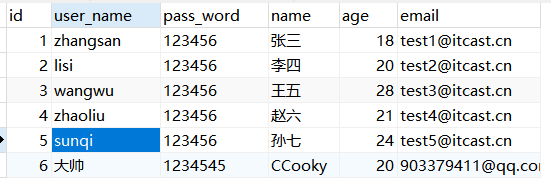

** 课程介绍**

- 了解Mybatis-Plus
- 整合Mybatis-Plus
- 通用CRUD
- Mybatis-Plus的配置
- 条件构造器

# 1. **了解Mybatis-Plus**

MyBatis-Plus（简称 MP）是一个 MyBatis 的增强工具，在 MyBatis 的基础上只做增强不做改变，为简化开发、提高效率而生。

官网：https://mybatis.plus/ 或 https://mp.baomidou.com/

文档地址：https://mybatis.plus/guide/

源码地址：https://github.com/baomidou/mybatis-plus

> **愿景**
>
> 我们的愿景是成为 MyBatis 最好的搭档，就像 魂斗罗 中的 1P、2P，基友搭配，效率翻倍。


### **特性**

- **无侵入**：只做增强不做改变，引入它不会对现有工程产生影响，如丝般顺滑。

- **损耗小**：启动即会自动注入基本 CURD，性能基本无损耗，直接面向对象操作。

- **强大的** **CRUD** **操作**：内置通用 Mapper、通用 Service，仅仅通过少量配置即可实现单表大部分 CRUD 操作，更有强大的条件构造器，满足各类使用需求。

- **支持** **Lambda** **形式调用**：通过 Lambda 表达式，方便的编写各类查询条件，无需再担心字段写错。

- **支持多种数据库**：支持 MySQL、MariaDB、Oracle、DB2、H2、HSQL、SQLite、Postgre、

  SQLServer2005、SQLServer 等多种数据库。

- **支持主键自动生成**：支持多达 4 种主键策略（内含分布式唯一 ID 生成器 - Sequence），可自由配置，完美解决主键问题。

- **支持** **XML** **热加载**：Mapper 对应的 XML 支持热加载，对于简单的 CRUD 操作，甚至可以无 XML 启动。

- **支持** **ActiveRecord** **模式**：支持 ActiveRecord 形式调用，实体类只需继承 Model 类即可进行强大的 CRUD 操作。

- **支持自定义全局通用操作**：支持全局通用方法注入（ Write once, use anywhere ）。

- **支持关键词自动转义**：支持数据库关键词（order、key......）自动转义，还可自定义关键词。

- **内置代码生成器**：采用代码或者 Maven 插件可快速生成 Mapper 、 Model 、 Service 、 Controller 层代码，支持模板引擎，更有超多自定义配置等您来使用。

- **内置分页插件**：基于 MyBatis 物理分页，开发者无需关心具体操作，配置好插件之后，写分页等同于普通 List查询。

- **内置性能分析插件**：可输出 Sql 语句以及其执行时间，建议开发测试时启用该功能，能快速揪出慢查询。

- **内置全局拦截插件**：提供全表 delete 、 update 操作智能分析阻断，也可自定义拦截规则，预防误操作。

- **内置** **Sql** **注入剥离器**：支持 Sql 注入剥离，有效预防 Sql 注入攻击。

### **架构**


### **作者**

Mybatis-Plus是由baomidou（苞米豆）组织开发并且开源的，目前该组织大概有30人左右。

码云地址：https://gitee.com/organizations/baomidou

# 2. 快速开始

对于Mybatis整合MP有常常有三种用法，分别是**Mybatis+MP**、**Spring+Mybatis+MP**、**Spring Boot+Mybatis+MP**。

**1. 创建空项目，创建一个java的Maven模块**

**2. 在这个模块里面导入依赖，作为后面模块的父模块**

```xml
<!--		Dao相关-->
        <dependency>
            <groupId>mysql</groupId>
            <artifactId>mysql-connector-java</artifactId>
            <version>5.1.49</version>
        </dependency>
        <dependency>
            <groupId>com.baomidou</groupId>
            <artifactId>mybatis-plus</artifactId>
            <version>3.4.2</version>
        </dependency>
        <dependency>
            <groupId>com.alibaba</groupId>
            <artifactId>druid</artifactId>
            <version>1.2.6</version>
        </dependency>

<!--		简化bean代码的工具包-->
        <dependency>
            <groupId>org.projectlombok</groupId>
            <artifactId>lombok</artifactId>
            <version>1.18.20</version>
            <scope>provided</scope>
        </dependency>
        <dependency>
            <groupId>junit</groupId>
            <artifactId>junit</artifactId>
            <version>4.12</version>
            <scope>test</scope>
        </dependency>
<!--   logback-->
        <dependency>
            <groupId>ch.qos.logback</groupId>
            <artifactId>logback-core</artifactId>
            <version>1.2.9</version>
        </dependency>
        <dependency>
            <groupId>ch.qos.logback</groupId>
            <artifactId>logback-classic</artifactId>
            <version>1.2.9</version>
        </dependency>
        <dependency>
            <groupId>org.slf4j</groupId>
            <artifactId>slf4j-api</artifactId>
            <version>1.7.32</version>
        </dependency>
```

logback.xml

```xml
<?xml version="1.0" encoding="UTF-8"?>
<configuration>
    <!--
        CONSOLE ：表示当前的日志信息是可以输出到控制台的。
    -->
    <appender name="CONSOLE" class="ch.qos.logback.core.ConsoleAppender">
        <!--输出流对象 默认 System.out 改为 System.err-->
        <target>System.out</target>
        <encoder>
            <!--格式化输出：%d表示日期，%thread表示线程名，%-5level：级别从左显示5个字符宽度
                %msg：日志消息，%n是换行符-->
            <pattern>%d{yyyy-MM-dd HH:mm:ss.SSS} [%-5level]  %c [%thread] : %msg%n</pattern>
        </encoder>
    </appender>

    <!--
          File是输出的方向通向文件的
    -->
    <appender name="FILE" class="ch.qos.logback.core.rolling.RollingFileAppender">
        <encoder>
            <pattern>%d{yyyy-MM-dd HH:mm:ss.SSS} [%thread] %-5level %logger{36} - %msg%n</pattern>
            <charset>utf-8</charset>
        </encoder>
        <!--日志输出路径-->
        <file>C:/code/itheima-data.log</file>
        <!--指定日志文件拆分和压缩规则-->
        <rollingPolicy
                class="ch.qos.logback.core.rolling.SizeAndTimeBasedRollingPolicy">
            <!--通过指定压缩文件名称，来确定分割文件方式-->
            <fileNamePattern>C:/code/itheima-data2-%d{yyyy-MMdd}.log%i.gz</fileNamePattern>
            <!--文件拆分大小-->
            <maxFileSize>1MB</maxFileSize>
        </rollingPolicy>
    </appender>

    <!--
    level:用来设置打印级别，大小写无关：TRACE, DEBUG, INFO, WARN, ERROR, ALL 和 OFF
   ， 默认debug
    <root>可以包含零个或多个<appender-ref>元素，标识这个输出位置将会被本日志级别控制。
    -->
    <root level="debug">
        <appender-ref ref="CONSOLE"/>
    </root>
</configuration>
```

### M+MP

**3. 在该模块下建立子模块完成Mybatis与Mybatis-Plus整合。**

这里先自己写一个简单的使用Mybatis对数据库进行查询的例子。就不写了，太麻烦了。很简单。代理开发方式。

以查询所有数据 为例子，在我们的测试类中如下：

```java
@Test
public void testFindAll() throws IOException {

    //1.加载mybatis的核心配置文件，获取SqlSessionFactory
    String resource = "mybatis-config.xml";
    InputStream inputStream = Resources.getResourceAsStream(resource);
    SqlSessionFactory sqlSessionFactory = new SqlSessionFactoryBuilder().build(inputStream);

    //2. 获取SqlSession，用它来执行sql语句
    SqlSession sqlSession = sqlSessionFactory.openSession();
    //3. 执行SQL。
    //1. 获取接口代理对象
    UserMapper userMapper = sqlSession.getMapper(UserMapper.class);
    //2. 执行方法，其实就是执行SQL语句，
    List<User> users = userMapper.findAll();
    System.out.println(users);
    //4. 释放资源
    sqlSession.close();
}
```

好了，现在开始整合Mybatis-Plus实现上面这个查询。

**第一步，**将UserMapper继承BaseMapper，就拥有了BaseMapper中的所有方法：

```java
public interface UserMapper extends BaseMapper<User> {

    public List<User> findAll();
}
```

**第二步，**使用MP中的MybatisSqlSessionFactoryBuilder进程构建：

```java
    @Test
    public void testFindAll() throws IOException {

        String resource = "mybatis-config.xml";
        InputStream inputStream = Resources.getResourceAsStream(resource);
      	//这里使用的是MP中的MybatisSqlSessionFactoryBuilder
        SqlSessionFactory sqlSessionFactory = new MybatisSqlSessionFactoryBuilder().build(inputStream);

        SqlSession sqlSession = sqlSessionFactory.openSession();

        UserMapper userMapper = sqlSession.getMapper(UserMapper.class);
				// 可以调用BaseMapper中定义的方法
        List<User> userList = userMapper.selectList(null);
      
        System.out.println(userList);
        sqlSession.close();
    }
```

运行报错：

#### @TableName()

解决：（MybatisPlus注解）在User对象中添加@TableName，指定数据库表名


这里看他这个方法运行后的SQL语句，就引发了一个小细节点。就是我们实体类属性命名规范与数据库表字段的命名规范。之前也讲过，POJO采用小驼峰命名，数据库字段采用全小写加下划线连接。MP在生成SQL语句时，会将小驼峰的属性变成数据库字段命名规范，即userName——user_name。

简单说明：由于使用了MybatisSqlSessionFactoryBuilder进行了构建，继承的BaseMapper中的方法就载入到了SqlSession中，所以就可以直接使用相关的方法；


**总结：**只要继承了就可以直接使用里面所有方法，不用再写SQL语句。

### Spring+M+MP

**3. 在该模块下建立子模块完成Spring与Mybatis与Mybatis-Plus整合。**

引入了Spring框架，数据源、构建等工作就交给了Spring管理。

子模块的导入依赖：

```xml
<dependency>
    <groupId>org.springframework</groupId>
    <artifactId>spring-webmvc</artifactId>
    <version>5.3.14</version>
</dependency>
<dependency>
    <groupId>org.springframework</groupId>
    <artifactId>spring-jdbc</artifactId>
    <version>5.3.8</version>
</dependency>
<dependency>
    <groupId>org.springframework</groupId>
    <artifactId>spring-test</artifactId>
    <version>5.3.14</version>
</dependency>
```

第一步，编写jdbc.properties

```properties
# jdbc.properties
jdbc.driver=com.mysql.jdbc.Driver
jdbc.url = jdbc:mysql://localhost:3306/mp?useSSL=false
jdbc.username = root
jdbc.password= 5240zhouquan
```

第二步，编写applicationContext.xml

```xml
<?xml version="1.0" encoding="UTF-8"?>
<beans xmlns="http://www.springframework.org/schema/beans"
       xmlns:xsi="http://www.w3.org/2001/XMLSchema-instance"
      xmlns:context="http://www.springframework.org/schema/context"
    xsi:schemaLocation="http://www.springframework.org/schema/beans
       http://www.springframework.org/schema/beans/spring-beans.xsd
       http://www.springframework.org/schema/context
       http://www.springframework.org/schema/context/spring-context.xsd">

    <context:property-placeholder location="classpath:jdbc.properties"/>
    <bean id="dataSource" class="com.alibaba.druid.pool.DruidDataSource">
        <property name="driverClassName" value="${jdbc.driver}"/>
        <property name="url" value="${jdbc.url}"/>
        <property name="username" value="${jdbc.username}"/>
        <property name="password" value="${jdbc.password}"/>
    </bean>
    <!--这里使用MP提供的sqlSessionFactory，完成了Spring与MP的整合-->
    <bean id="sqlSessionFactory" class="com.baomidou.mybatisplus.extension.spring.MybatisSqlSessionFactoryBean">
        <property name="dataSource" ref="dataSource"/>
        <property name="configLocation" value="classpath:mybatis-config.xml"/>
    </bean>
    <!--扫描mapper接口，使用的依然是Mybatis原生的扫描器-->
    <bean class="org.mybatis.spring.mapper.MapperScannerConfigurer">
        <property name="basePackage" value="com.CCooky.mapper"/>
    </bean>
</beans>
```

第三步，编写User对象以及UserMapper接口：


第四步，编写测试用例：

```java
@RunWith(SpringJUnit4ClassRunner.class)
@ContextConfiguration(value = {"classpath:applicationContext.xml"})
public class Test111 {

    @Autowired
    private UserMapper userMapper;
    @Test
    public void testFindAll(){
        List<User> userList = userMapper.selectList(null);
        System.out.println(userList);
    }
}
```


**总结：ok，完成整合！其实就改了一个地方而已**

### SpringBoot+M+MP

使用SpringBoot将进一步的简化MP的整合，需要注意的是，由于使用SpringBoot需要继承parent，所以需要重新创建工程，并不是创建子Module。


# 3. 通用CRUD

通过前面的学习，我们了解到通过继承BaseMapper就可以获取到各种各样的单表操作，接下来我们将详细讲解这些操作。


## 3.1 插入

#### insert

```java
/**
* 插入一条记录 
*
* @param entity 实体对象 
*/ 
int insert(T entity);
```

```java
@Test
public void testInsert(){
  // 未设置id
    User user = new User();
    user.setAge(20);
    user.setEmail("903379411@qq.com");
    user.setUserName("大帅");
    user.setName("CCooky");
    user.setPassWord("1234545");
  
    int insert = userMapper.insert(user);
    System.out.println("Result==>"+insert);//返回的是受影响的行数，并不是自增后的id
    System.out.println("用户id："+user.getId());//自增后的id会回填到对象中
}
```

这里注意第一点，返回值是什么，这个和就是数据库返回的值，前面学数据库说过；第二点，这个回写数据的问题，这个应该是MySQL的特性，前面学习的时候讲过一点点，反正java连接mysql，JDBC给我们做的封装吧。

```java
// 结果
[DEBUG]  org.mybatis.spring.transaction.SpringManagedTransaction [main] : JDBC Connection [com.mysql.jdbc.JDBC4Connection@3a5ecce3] will not be managed by Spring
[DEBUG]  CCooky.mapper.UserMapper.insert [main] : ==>  Preparing: INSERT INTO tb_user ( id, user_name, pass_word, name, age, email ) VALUES ( ?, ?, ?, ?, ?, ? )
[DEBUG]  CCooky.mapper.UserMapper.insert [main] : ==> Parameters: 1507178249891872770(Long), 大帅(String), 1234545(String), CCooky(String), 20(Integer), 903379411@qq.com(String)
[DEBUG]  CCooky.mapper.UserMapper.insert [main] : <==    Updates: 1
[DEBUG]  org.mybatis.spring.SqlSessionUtils [main] : Closing non transactional SqlSession [org.apache.ibatis.session.defaults.DefaultSqlSession@5ddcc487]
Result==>1
用户id：1507178249891872770
```


出现问题：id的值不正确，我们期望的是数据库自增长，实际是MP生成了id的值写入到了数据库。（MybatisPlus会自动过滤实体类的字段，发现属性名  **id**  时，会自动调用生成策略。

**解决：设置MybatisPlus的id生成策略！！** 

### @TableId( )

打开我们的实体类，在id上加上该注解，点击去可以看到该注解的内容。以前的版本是有注释的，现在没有了


可见。默认是NONE，第一个AUTO是设置数据库ID自增长的。然后删除之前插入数据，重新设置一些MySQl的id自动递增为6.


再次执行测试：OK



### @TableFiled

在MP中通过@TableField注解可以指定字段的一些属性，常常解决的问题有2个：

1、对象中的属性名和表字段名不一致的问题（非小驼峰）

2、对象中的属性字段在表中不存在的问题。

使用：


3、其他用法，如设置某属性不加入查询字段：即查询时不返回该字段的值。


## 3.2 更新

在MP中，更新操作有2种，一种是根据id更新，另一种是根据条件更新。

#### updateById

**==根据id更新==**

```java
/**
* 根据 ID 修改 
*
* @param entity 实体对象 
*/ 
int updateById(@Param(Constants.ENTITY) T entity);
```

```java
@Test
public void testUpdateById(){
    User user = new User();
    user.setId(1L); //主键(这个L是整数类型Long的标注）
    user.setAge(21); //更新的字段

    // 根据id更新，更新不为null的字段
    int i = userMapper.updateById(user);
    System.out.println(i);
}
```

#### update

==**根据条件更新**==

```java
/**
* 根据 whereEntity 条件，更新记录 
*
* @param entity 实体对象 (set 条件值,可以为 null) 
* @param updateWrapper 实体对象封装操作类（可以为 null,里面的 entity 用于生成 where 语句） 
*/ 
int update(@Param(Constants.ENTITY) T entity, @Param(Constants.WRAPPER) Wrapper<T> updateWrapper);
```

这里注意到，第二个参数是Wrapper，MybatisPlus的条件类，点进去看一下源码，这个接口主要有两个实现，我们用的比较多：


下面是这两个实现的用法：

```java
@Test
public void testUpdate(){
    User user = new User();
    user.setAge(50); //更新的字段
    user.setPassWord("qwqwqwqw");

    QueryWrapper<User> wrapper = new QueryWrapper<>();
    wrapper.eq("user_name","zhangsan");//column--表的列名，val--条件对应的值

    int update = userMapper.update(user, wrapper);
}
```

测试结果，查看生成的Sql语句：


```java
@Test
public void testUpdate2(){

    UpdateWrapper<User> wrapper = new UpdateWrapper<>();
    wrapper.set("age",50).set("pass_word","qwqwqwq") // 更新的表字段
            .eq("user_name","zhangsan"); // 条件

    int update = userMapper.update(null, wrapper);
}
```

测试结果还是一样的。但是这种用的少，因为我们数据信息一般都是用对象进行封装的，实际开发不可能一个个去自己写。

**关于wrapper更多的用法后面会详细讲解。**

## **3.3 删除操作（delete）**

#### **deleteById**

```java
/**
* 根据 ID 删除 
*
* @param id 主键ID 
*/ 
int deleteById(Serializable id); 
```

```java
@Test
public void testDeleteById(){

    int result = userMapper.deleteById(5);
}
```


#### **deleteByMap**

多条件删除，讲实话，这个可能有点鸡肋！

```java
/**
* 根据 columnMap 条件，删除记录 
*
* @param columnMap 表字段 map 对象 
*/ 
int deleteByMap(@Param(Constants.COLUMN_MAP) Map<String, Object> columnMap); 
```

```java
@Test
public void testDeleteByMap(){
    Map<String,Object> map= new HashMap<>();
    map.put("id",1L);
    map.put("user_name","zhangsan");
    //将columnMap中的元素设置为删除的条件，多个之间为and关系
    int result = userMapper.deleteByMap(map);
}
```

#### **delete**

条件删除，Wrapper包装条件

```java
/**
* 根据 entity 条件，删除记录 
*
* @param wrapper 实体对象封装操作类（可以为 null） 
*/ 
int delete(@Param(Constants.WRAPPER) Wrapper<T> wrapper); 
```

```java
@Test
public void testDelete(){
  	// 写法一
    QueryWrapper<User> wrapper = new QueryWrapper<>();
    wrapper.eq("user_name","zhangsan")
            .eq("pass_word","123456");
    int delete = userMapper.delete(wrapper);
  // 写法二（推荐）
    User user = new User();
    user.setUserName("zhangsan");
    user.setPassWord("123456");
    QueryWrapper<User> wrapper = new QueryWrapper<>(user);
    int delete = userMapper.delete(wrapper);
}
```


#### **deleteBatchIds**

```java
/**
* 删除（根据ID 批量删除） 
*
* @param idList 主键ID列表(不能为 null 以及 empty) 
*/ 
int deleteBatchIds(@Param(Constants.COLLECTION) Collection<? extends Serializable> idList); 
```

```java
@Test
public void testDeleteBatchIds(){
    int result = userMapper.deleteBatchIds(Arrays.asList(1L, 2L));
}
```


## 3.4 查询操作

MP提供了多种查询操作，包括根据id查询、批量查询、查询单条数据、查询列表、分页查询等操作。

#### **selectById**

```java
/**
* 根据 ID 查询 
*
* @param id 主键ID 
*/ 

T selectById(Serializable id); 
```

```java
@Test
public void testSelectById(){
    User user = userMapper.selectById(3L);
    System.out.println(user);
}
```


#### **selectBatchIds**

```java
/**
* 查询（根据ID 批量查询） 
*
* @param idList 主键ID列表(不能为 null 以及 empty) 
*/ 

List<T> selectBatchIds(@Param(Constants.COLLECTION) Collection<? extends Serializable> idList); 
```

#### **selectOne**

```java
/**
* 根据 entity 条件，查询一条记录,如果结果超过一条会报错
*
* @param queryWrapper 实体对象封装操作类（可以为 null） 
*/ 
T selectOne(@Param(Constants.WRAPPER) Wrapper<T> queryWrapper); 
```

```java
    @Test
    public void testSelectOne() {
        QueryWrapper<User> wrapper = new QueryWrapper<User>();
        wrapper.eq("name", "李四");
        //根据条件查询一条数据，如果结果超过一条会报错
        User user = userMapper.selectOne(wrapper);
        System.out.println(user);
    }
```


#### **selectCount**

```java
/**
* 根据 Wrapper 条件，查询总记录数 
*
* @param queryWrapper 实体对象封装操作类（可以为 null） 
*/ 

Integer selectCount(@Param(Constants.WRAPPER) Wrapper<T> queryWrapper); 
```

```java
@Test
public void testSelectCount() {
    QueryWrapper<User> wrapper = new QueryWrapper<User>();
    wrapper.gt("age", 23); //年龄大于23岁 
    // 根据条件查询数据条数
    Integer count = this.userMapper.selectCount(wrapper);
    System.out.println("count = " + count);
}
```

#### **selectList**

```java
/**
* 根据 entity 条件，查询全部记录 
*
* @param queryWrapper 实体对象封装操作类（可以为 null） 
*/ 

List<T> selectList(@Param(Constants.WRAPPER) Wrapper<T> queryWrapper);
```

```java
@Test
public void testSelectList() {
    QueryWrapper<User> wrapper = new QueryWrapper<User>();
    wrapper.gt("age", 23); //年龄大于23岁
    //根据条件查询数据 
    List<User> users = this.userMapper.selectList(wrapper);
    for (User user : users) {
        System.out.println("user = " + user);
    }
}
```

#### **selectPage**

```java
/**
* 根据 entity 条件，查询全部记录（并翻页） 
*
* @param page 分页查询条件（可以为 RowBounds.DEFAULT） 
* @param queryWrapper 实体对象封装操作类（可以为 null） 
*/ 

IPage<T> selectPage(IPage<T> page, @Param(Constants.WRAPPER) Wrapper<T> queryWrapper);
```

这里很重要哦，一定注意！！！第一个参数是Page对象。要完成这样的分页，首先要去配置一个Plus提供的分页插件。

点进去看一下Ipage类，他有一个实现类为Page，我们就用这个，点击进去会有set方法，设置当前页和每页条数。

