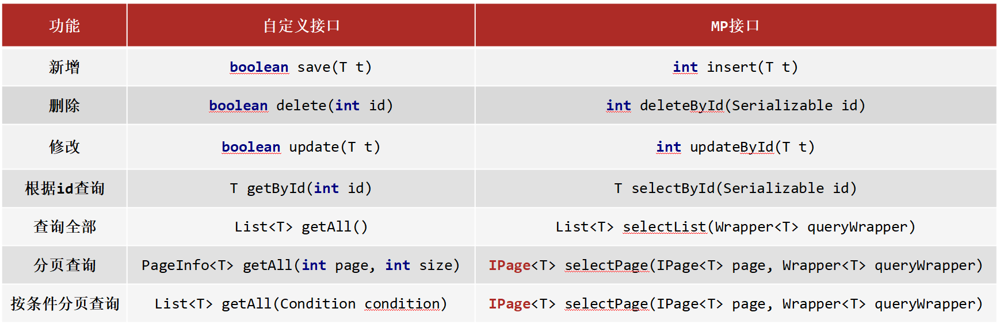
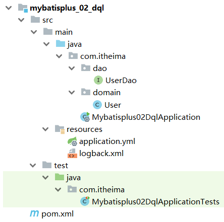
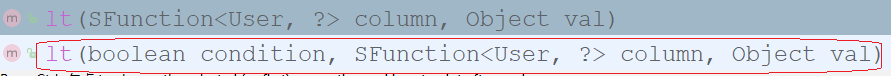
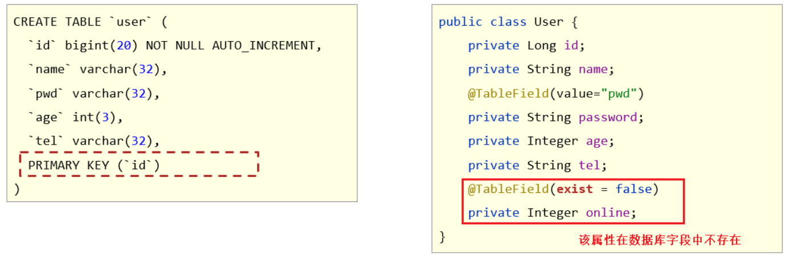
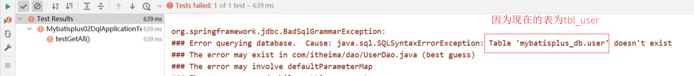
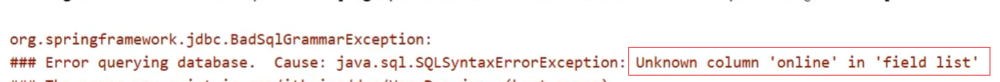

** 课程介绍**

- 了解Mybatis-Plus
- 整合Mybatis-Plus
- 通用CRUD
- Mybatis-Plus的配置
- 条件构造器

# 1. **了解Mybatis-Plus**

MyBatis-Plus（简称 MP）是一个 MyBatis 的增强工具，在 MyBatis 的基础上只做增强不做改变，为简化开发、提高效率而生。

官网：https://mybatis.plus/ 或 https://mp.baomidou.com/

文档地址：https://mybatis.plus/guide/

源码地址：https://github.com/baomidou/mybatis-plus

> **愿景**
>
> 我们的愿景是成为 MyBatis 最好的搭档，就像 魂斗罗 中的 1P、2P，基友搭配，效率翻倍。


### **特性**

- **无侵入**：只做增强不做改变，引入它不会对现有工程产生影响，如丝般顺滑。

- **损耗小**：启动即会自动注入基本 CURD，性能基本无损耗，直接面向对象操作。

- **强大的** **CRUD** **操作**：内置通用 Mapper、通用 Service，仅仅通过少量配置即可实现单表大部分 CRUD 操作，更有强大的条件构造器，满足各类使用需求。

- **支持** **Lambda** **形式调用**：通过 Lambda 表达式，方便的编写各类查询条件，无需再担心字段写错。

- **支持多种数据库**：支持 MySQL、MariaDB、Oracle、DB2、H2、HSQL、SQLite、Postgre、

  SQLServer2005、SQLServer 等多种数据库。

- **支持主键自动生成**：支持多达 4 种主键策略（内含分布式唯一 ID 生成器 - Sequence），可自由配置，完美解决主键问题。

- **支持** **XML** **热加载**：Mapper 对应的 XML 支持热加载，对于简单的 CRUD 操作，甚至可以无 XML 启动。

- **支持** **ActiveRecord** **模式**：支持 ActiveRecord 形式调用，实体类只需继承 Model 类即可进行强大的 CRUD 操作。

- **支持自定义全局通用操作**：支持全局通用方法注入（ Write once, use anywhere ）。

- **支持关键词自动转义**：支持数据库关键词（order、key......）自动转义，还可自定义关键词。

- **内置代码生成器**：采用代码或者 Maven 插件可快速生成 Mapper 、 Model 、 Service 、 Controller 层代码，支持模板引擎，更有超多自定义配置等您来使用。

- **内置分页插件**：基于 MyBatis 物理分页，开发者无需关心具体操作，配置好插件之后，写分页等同于普通 List查询。

- **内置性能分析插件**：可输出 Sql 语句以及其执行时间，建议开发测试时启用该功能，能快速揪出慢查询。

- **内置全局拦截插件**：提供全表 delete 、 update 操作智能分析阻断，也可自定义拦截规则，预防误操作。

- **内置** **Sql** **注入剥离器**：支持 Sql 注入剥离，有效预防 Sql 注入攻击。

### **架构**


### **作者**

Mybatis-Plus是由baomidou（苞米豆）组织开发并且开源的，目前该组织大概有30人左右。

码云地址：https://gitee.com/organizations/baomidou

# 2. 快速开始

## SpringBoot+M+MP

**步骤①**：导入MyBatisPlus与Druid对应的starter

```xml
<dependency>
    <groupId>com.baomidou</groupId>
    <artifactId>mybatis-plus-boot-starter</artifactId>
    <version>3.4.3</version>
</dependency>
<dependency>
    <groupId>com.alibaba</groupId>
    <artifactId>druid-spring-boot-starter</artifactId>
    <version>1.2.6</version>
</dependency>
```

**步骤②**：配置数据库连接相关的数据源配置。

####  一般配置

<font color="#f0f"><b>温馨提示</b></font>

​	MP技术默认的主键生成策略为雪花算法，生成的主键ID长度较大，和目前的数据库设定规则不相符，需要配置一下使MP使用数据库的主键生成策略，方式嘛还是老一套，做配置。

```yml
server:
  port: 80

spring:
  datasource:
    druid:
      driver-class-name: com.mysql.cj.jdbc.Driver
      url: jdbc:mysql://localhost:3306/studysql?useSSL=false&serverTimezone=UTC
      username: root
      password: 5240zhouquan
      
mybatis-plus:
  global-config:
    db-config:
      id-type: auto		#设置主键id字段的生成策略为数据库自增
  configuration:
    log-impl: org.apache.ibatis.logging.stdout.StdOutImpl   # 开启MP运行日志
```

此处设置的是日志的显示形式，当前配置的是控制台输出，当然还可以由更多的选择，根据需求切换即可


**步骤③**：使用MP的标准通用接口BaseMapper加速开发，别忘了==@Mapper和泛型的指定==

```java
@Mapper
public interface BookMapper extends BaseMapper<Book> {
}
```

MP默认进行了ResultMap的转换哦，"小驼峰——user_name"

```xml
<?xml version="1.0" encoding="UTF-8" ?>
<!DOCTYPE mapper
        PUBLIC "-//mybatis.org//DTD Mapper 3.0//EN"
        "http://mybatis.org/dtd/mybatis-3-mapper.dtd">

<mapper namespace="com.CCooky.mapper.BookMapper">


</mapper>
```

## 2. 标准数据层开发

在这一节中我们重点学习的是数据层标准的CRUD(增删改查)的实现与分页功能。代码比较多，我们一个个来学习。

### 2.1 标准CRUD使用

对于标准的CRUD功能都有哪些以及MP都提供了哪些方法可以使用呢?  我们先来看张图:



对于这张图的方法，我们挨个来演示下:

### 2.2 新增

在进行新增之前，我们可以分析下新增的方法:

```java
int insert (T t)
```

* T:  泛型，新增用来保存新增数据

* int:  返回值，新增成功后返回1，没有新增成功返回的是0

在测试类中进行新增操作:

```java
@SpringBootTest
class Mybatisplus01QuickstartApplicationTests {

    @Autowired
    private UserDao userDao;

    @Test
    void testSave() {
        User user = new User();
        user.setName("黑马程序员");
        user.setPassword("itheima");
        user.setAge(12);
        user.setTel("4006184000");
        userDao.insert(user);
    }
}
```

执行测试后，数据库表中就会添加一条数据。


但是数据中的主键ID，有点长，那这个主键ID是如何来的?我们更想要的是主键自增，应该是5才对，这个是我们后面要学习的主键ID生成策略，这块的这个问题，我们暂时先放放。

### 2.3 删除

在进行删除之前，我们可以分析下删除的方法:

```java
int deleteById (Serializable id)
```

* Serializable：参数类型

  * 思考:参数类型为什么是一个序列化类?

    

    从这张图可以看出，

    * String和Number是Serializable的子类，
    * Number又是Float,Double,Integer等类的父类，
    * 能作为主键的数据类型都已经是Serializable的子类，
    * MP使用Serializable作为参数类型，就好比我们可以用Object接收任何数据类型一样。

* int:返回值类型，数据删除成功返回1，未删除数据返回0。

在测试类中进行新增操作:

```java
 @SpringBootTest
class Mybatisplus01QuickstartApplicationTests {

    @Autowired
    private UserDao userDao;

    @Test
    void testDelete() {
        userDao.deleteById(1401856123725713409L);
    }
}

```

### 2.4 修改

在进行修改之前，我们可以分析下修改的方法:

```java
int updateById(T t);
```

- T: 泛型，需要修改的数据内容，注意因为是根据ID进行修改，所以传入的对象中需要有ID属性值
- int:  返回值，修改成功后返回1，未修改数据返回0.
- **说明: ** 修改的时候，只修改实体对象中有值的字段。部分覆盖机制。

在测试类中进行新增操作:

```java
@SpringBootTest
class Mybatisplus01QuickstartApplicationTests {
    @Autowired
    private UserDao userDao;

    @Test
    void testUpdate() {
        User user = new User();
        user.setId(1L);
        user.setName("Tom888");
        user.setPassword("tom888");
        userDao.updateById(user);
    }
}
```

### 2.5 根据ID查询

在进行根据ID查询之前，我们可以分析下根据ID查询的方法:

```java
T selectById (Serializable id)
```

- Serializable：参数类型,主键ID的值
- T:根据ID查询只会返回一条数据

在测试类中进行新增操作:

```java
@SpringBootTest
class Mybatisplus01QuickstartApplicationTests {

    @Autowired
    private UserDao userDao;
    
    @Test
    void testGetById() {
        User user = userDao.selectById(2L);
        System.out.println(user);
    }
}
```

### 2.6 查询所有

在进行查询所有之前，我们可以分析下查询所有的方法:

```java
List<T> selectList(Wrapper<T> queryWrapper)
```

- Wrapper：用来构建条件查询的条件，目前我们没有可直接传为Null
- List<T>:因为查询的是所有，所以返回的数据是一个集合

在测试类中进行新增操作:

```java
@SpringBootTest
class Mybatisplus01QuickstartApplicationTests {

    @Autowired
    private UserDao userDao;
    
    @Test
    void testGetAll() {
        List<User> userList = userDao.selectList(null);
        System.out.println(userList);
    }
}
```

我们所调用的方法都是来自于DAO接口继承的BaseMapper类中。里面的方法有很多，我们后面会慢慢去学习里面的内容。

### 2.8 分页功能

```java
/**
* 根据 entity 条件，查询全部记录（并翻页） 
*
* @param page 分页查询条件（可以为 RowBounds.DEFAULT） 
* @param queryWrapper 实体对象封装操作类（可以为 null） 
*/ 

IPage<T> selectPage(IPage<T> page, @Param(Constants.WRAPPER) Wrapper<T> queryWrapper);
```

这里很重要哦，一定注意！！！第一个参数是Page对象。要完成这样的分页，首先要去配置一个Plus提供的分页插件。

点进去看一下Ipage类，他有一个实现类为Page，我们就用这个，点击进去会有set方法，设置当前页和每页条数。


```java
@Test
public void testGetByPage(){
    IPage page = new Page(1,5);
    bookMapper.selectPage(page,null);
}
```

运行结果：


哟，怎么回事呢？其实MybatisPlus做分页查询，也就是在我们正常的Select语句后面加上`Limit ?, ?`，对吧，看似很简单但Mybatis没有默认给我们开启这个功能。因为第一点，你不一定会用到这个往SQL语句后面添加的操作，第二点还有很多其他的可以SQL语句添加的功能，所以让开发者自己来使用。

实现过程，是通过MybatisPlus的拦截器实现的（可以理解成先是生成正常的语句，然后他给拦截下来强制加上一些东西再给数据库）。这个就不能通过yml配置文件了，需要我们新建一个配置类，然后把拦截器类给到Spring容器，后面MP他就会自己调用。（需要熟悉一些Spring注解写配置文件）


```java
@Configuration
public class MPConfig {

    @Bean
    public MybatisPlusInterceptor mybatisPlusInterceptor(){
        MybatisPlusInterceptor mybatisPlusInterceptor = new MybatisPlusInterceptor();
      // 这里可以添加多个拦截器，需要什么加什么
        mybatisPlusInterceptor.addInnerInterceptor(new PaginationInnerInterceptor());
        return mybatisPlusInterceptor;
    }
}
```

**那我们加了@Configuration，SpringBoot的主配置类会识别到吗？会的，之前讲过这个引导类会自动识别当前包及其子包下所有的注解。**

然后我们再直接测试前面的代码：GOOD


**第二步：拿到我们的分页查询到的数据。**


方法执行结果返回的还是一个Ipage对象，其实最后的结果全部封装给了我们传入的这个Ipage对象！！！真的不错，太方便了。我们通过Getter方法拿到里面的值。

```java
@Test
public void testGetByPage(){
    IPage page = new Page(1,5);
    bookMapper.selectPage(page,null);
    System.out.println(page.getCurrent()); //当前页码值
    System.out.println(page.getSize());    //每页显示数
    System.out.println(page.getTotal());   //数据总量
    System.out.println(page.getPages());   //总页数
    System.out.println(page.getRecords()); //详细数据
}
```

### 2.9 条件查询

这里的核心对象就是之前我们遇见的**Wrapper**，在很多方法里面都有例如SelectList、selectPage、update、delete（可以在BaseMapper里面看到），我们点进去看一下这个**Wrapper类**，Crtl+H查看一下他的父类和实现类：


标红的两个实现类就是我们用的最多最多的，**一个QueryWrapper、一个LambdaQueryWrapper**。他的专业名称叫做 实体对象封装操作类，通过调用里面的方法组后在SQL语句中生成Where条件！

我们来看一下这两个实现类的使用方式：	高级程序员都使用第二种嘿嘿

#### **QueryWrapper**

Wrapper里面有很多方法，like就是用来模糊查询的等等......

```java
@Test
public void testGetBy(){
    String bookName = "Spring";
    QueryWrapper<Book> qw = new QueryWrapper();
    if (Strings.isNotEmpty(bookName)){
        qw.like("name",bookName);// 第一个参数是column——表的列名
 
    }
    bookMapper.selectList(qw);
}
```

运行结果：


<font color="#f0f"><b>温馨提示</b></font>

​		假如不加 非null验证，最后加载where的条件会变成  `%null%` ，那就GG洛

#### **LambdaQueryWrapper**

大司马见了，直呼内行内行！！！！Lambda表达式写法，就不可能出现写错`column`的情况

```java
@Test
public void testGetBy2(){
    String bookName = "String";
    LambdaQueryWrapper<Book> lqw = new LambdaQueryWrapper<>();
  // 第一个是codition——判断语句，是true的话，这行代码就会真正执行，否则失效
  // 第二个还是column——表的列名，只不过是通过我们的实体类来确定的！！细细细
    lqw.like(Strings.isNotEmpty(bookName), Book::getName, bookName);
  
    bookMapper.selectList(lqw);
}
```

## 3，DQL编程控制

增删改查四个操作中，查询是非常重要的也是非常复杂的操作，这块需要我们重点学习下，这节我们主要学习的内容有:

* 条件查询方式
* 查询投影
* 查询条件设定
* 字段映射与表名映射

### 3.1 条件查询

#### 3.1.2 环境构建

在构建条件查询之前，我们先来准备下环境

* 创建一个SpringBoot项目

* 编写UserDao接口

  ```java
  @Mapper
  public interface UserDao extends BaseMapper<User> {
  }
  ```

* 编写模型类

  ```java
  @Data
  public class User {
      private Long id;
      private String name;
      private String password;
      private Integer age;
      private String tel;
  }
  ```

* 编写测试类

  ```java
  @SpringBootTest
  class Mybatisplus02DqlApplicationTests {
  
      @Autowired
      private UserDao userDao;
      
      @Test
      void testGetAll(){
          List<User> userList = userDao.selectList(null);
          System.out.println(userList);
      }
  }
  ```

  最终创建的项目结构为:

  

==测试的时候，控制台打印的日志比较多，速度有点慢而且不利于查看运行结果，所以接下来我们把这个日志处理下:==

* 取消初始化spring日志打印，resources目录下添加logback.xml（不用加任何依赖），名称固定，内容如下:

  ```xml
  <?xml version="1.0" encoding="UTF-8"?>
  <configuration>
  </configuration>
  ```

  **说明:**logback.xml的配置内容，不是我们学习的重点，有兴趣可以自行百度查询。

* 取消MybatisPlus启动banner图标

  

  application.yml添加如下内容:

  ```yml
  # mybatis-plus日志控制台输出
  mybatis-plus:
    configuration:
      log-impl: org.apache.ibatis.logging.stdout.StdOutImpl
    global-config:
      banner: off # 关闭mybatisplus启动图标
  ```

* 取消SpringBoot的log打印

  

  application.yml添加如下内容:

  ```yml
  spring:
    main:
      banner-mode: off # 关闭SpringBoot启动图标(banner)
  ```

解决控制台打印日志过多的相关操作可以不用去做，一般会被用来方便我们查看程序运行的结果。

取消这些东西前，日志台的打印：


Then


#### 3.1.4 多条件构建

> 需求:查询数据库表中，年龄在10岁到30岁之间的用户信息

```java
@SpringBootTest
class Mybatisplus02DqlApplicationTests {

    @Autowired
    private UserDao userDao;
    
    @Test
    void testGetAll(){
        LambdaQueryWrapper<User> lqw = new LambdaQueryWrapper<User>();
        lqw.lt(User::getAge, 30);
        lqw.gt(User::getAge, 10);
        List<User> userList = userDao.selectList(lqw);
        System.out.println(userList);
    }
}
```

* gt：大于(>),最终的SQL语句为：

  ```sql
  SELECT id,name,password,age,tel FROM user WHERE (age < ? AND age > ?)
  ```

> 需求:查询数据库表中，年龄小于10或年龄大于30的数据

```java
@SpringBootTest
class Mybatisplus02DqlApplicationTests {

    @Autowired
    private UserDao userDao;
    
    @Test
    void testGetAll(){
        LambdaQueryWrapper<User> lqw = new LambdaQueryWrapper<User>();
        lqw.lt(User::getAge, 10).or().gt(User::getAge, 30);
        List<User> userList = userDao.selectList(lqw);
        System.out.println(userList);
    }
}
```

* or()就相当于我们sql语句中的`or`关键字,不加默认是`and`，最终的sql语句为:

  ```sql
  SELECT id,name,password,age,tel FROM user WHERE (age < ? OR age > ?)
  ```

#### 3.1.5 null判定

先来看一张图，


> 需求:查询数据库表中，根据输入年龄范围来查询符合条件的记录
>
> 用户在输入值的时候，
>
> ​	如果只输入第一个框，说明要查询大于该年龄的用户
>
> ​	如果只输入第二个框，说明要查询小于该年龄的用户
>
> ​    如果两个框都输入了，说明要查询年龄在两个范围之间的用户

思考第一个问题：后台如果想接收前端的两个数据，该如何接收?

我们可以使用两个简单数据类型，也可以使用一个模型类，但是User类中目前只有一个age属性,如:

```java
@Data
public class User {
    private Long id;
    private String name;
    private String password;
    private Integer age;
    private String tel;
}
```

使用一个age属性，如何去接收页面上的两个值呢?这个时候我们有两个解决方案

**方案一: **添加属性age2,这种做法可以但是会影响到原模型类的属性内容

```java
@Data
public class User {
    private Long id;
    private String name;
    private String password;
    private Integer age;
    private String tel;
    private Integer age2;
}
```

**方案二: **新建一个模型类,让其继承User类，并在其中添加age2属性，UserQuery在拥有User属性后同时添加了age2属性。

```java
@Data
public class User {
    private Long id;
    private String name;
    private String password;
    private Integer age;
    private String tel;
}

@Data
public class UserQuery extends User {
    private Integer age2;
}
```

环境准备好后，我们来实现下刚才的需求：

```java
@SpringBootTest
class Mybatisplus02DqlApplicationTests {
    @Autowired
    private UserDao userDao;
    
    @Test
    void testGetAll(){
        //模拟页面传递过来的查询数据
        UserQuery uq = new UserQuery();
        uq.setAge(10);
        uq.setAge2(30);
        LambdaQueryWrapper<User> lqw = new LambdaQueryWrapper<User>();
        lqw.lt(null!=uq.getAge2(),User::getAge, uq.getAge2());
        lqw.gt(null!=uq.getAge(),User::getAge, uq.getAge());
        List<User> userList = userDao.selectList(lqw);
        System.out.println(userList);
    }
}
```

* lt( ) 方法


condition为boolean类型，返回true，则添加条件，返回false则不添加条件。

### 3.2 查询投影

#### 3.2.1 查询指定字段

目前我们在查询数据的时候，什么都没有做默认就是查询表中所有字段的内容，我们所说的查询投影即不查询所有字段，只查询出指定内容的数据。

具体如何来实现?

```java
@SpringBootTest
class Mybatisplus02DqlApplicationTests {

    @Autowired
    private UserDao userDao;
    
    @Test
    void testGetAll(){
        LambdaQueryWrapper<User> lqw = new LambdaQueryWrapper<User>();
        lqw.select(User::getId,User::getName,User::getAge);
        List<User> userList = userDao.selectList(lqw);
        System.out.println(userList);
    }
}
```

* select(...)方法用来设置查询的字段列，可以设置多个，最终的sql语句为:

  ```sql
  SELECT id,name,age FROM user
  ```

* 如果使用的不是lambda，就需要手动指定字段

  ```java
  @SpringBootTest
  class Mybatisplus02DqlApplicationTests {
  
      @Autowired
      private UserDao userDao;
      
      @Test
      void testGetAll(){
          QueryWrapper<User> lqw = new QueryWrapper<User>();
          lqw.select("id","name","age","tel");
          List<User> userList = userDao.selectList(lqw);
          System.out.println(userList);
      }
  }
  ```

  * 最终的sql语句为:SELECT id,name,age,tel FROM user

#### 3.2.2 聚合查询

> 需求:聚合函数查询，完成count、max、min、avg、sum的使用
>
> count:总记录数
>
> max:最大值
>
> min:最小值
>
> avg:平均值
>
> sum:求和

```java
@SpringBootTest
class Mybatisplus02DqlApplicationTests {

    @Autowired
    private UserDao userDao;
    
    @Test
    void testGetAll(){
        QueryWrapper<User> lqw = new QueryWrapper<User>();
        //lqw.select("count(*) as count");
        //SELECT count(*) as count FROM user
        //lqw.select("max(age) as maxAge");
        //SELECT max(age) as maxAge FROM user
        //lqw.select("min(age) as minAge");
        //SELECT min(age) as minAge FROM user
        //lqw.select("sum(age) as sumAge");
        //SELECT sum(age) as sumAge FROM user
        lqw.select("avg(age) as avgAge");
        //SELECT avg(age) as avgAge FROM user
        List<Map<String, Object>> userList = userDao.selectMaps(lqw);
        System.out.println(userList);
    }
}
```

为了在做结果封装的时候能够更简单，我们将上面的聚合函数都起了个名称，方面后期来获取这些数据

#### 3.2.3 分组查询

> 需求:分组查询，完成 group by的查询使用

```java
@SpringBootTest
class Mybatisplus02DqlApplicationTests {

    @Autowired
    private UserDao userDao;
    
    @Test
    void testGetAll(){
        QueryWrapper<User> lqw = new QueryWrapper<User>();
        lqw.select("count(*) as count,tel");
        lqw.groupBy("tel");
        List<Map<String, Object>> list = userDao.selectMaps(lqw);
        System.out.println(list);
    }
}
```

* groupBy为分组，最终的sql语句为

  ```sql
  SELECT count(*) as count,tel FROM user GROUP BY tel
  ```

**注意:**

* 聚合与分组查询，无法使用lambda表达式来完成
* MP只是对MyBatis的增强，如果MP实现不了，我们可以直接在DAO接口中使用MyBatis的方式实现

### 3.3 查询条件

前面我们只使用了lt()和gt(),除了这两个方法外，MP还封装了很多条件对应的方法，这一节我们重点把MP提供的查询条件方法进行学习下。

MP的查询条件有很多:

* 范围匹配（> 、 = 、between）
* 模糊匹配（like）
* 空判定（null）
* 包含性匹配（in）
* 分组（group）
* 排序（order）
* ……

#### 3.3.1 等值查询

> 需求:根据用户名和密码查询用户信息

```java
@SpringBootTest
class Mybatisplus02DqlApplicationTests {

    @Autowired
    private UserDao userDao;
    
    @Test
    void testGetAll(){
        LambdaQueryWrapper<User> lqw = new LambdaQueryWrapper<User>();
        lqw.eq(User::getName, "Jerry").eq(User::getPassword, "jerry");
        User loginUser = userDao.selectOne(lqw);
        System.out.println(loginUser);
    }
}
```

* eq()： 相当于 `=`,对应的sql语句为

  ```sql
  SELECT id,name,password,age,tel FROM user WHERE (name = ? AND password = ?)
  ```

* selectList：查询结果为多个或者单个

* selectOne:查询结果为单个

#### 3.3.2 范围查询

> 需求:对年龄进行范围查询，使用lt()、le()、gt()、ge()、between()进行范围查询

```java
@SpringBootTest
class Mybatisplus02DqlApplicationTests {

    @Autowired
    private UserDao userDao;
    
    @Test
    void testGetAll(){
        LambdaQueryWrapper<User> lqw = new LambdaQueryWrapper<User>();
        lqw.between(User::getAge, 10, 30);
        //SELECT id,name,password,age,tel FROM user WHERE (age BETWEEN ? AND ?)
        List<User> userList = userDao.selectList(lqw);
        System.out.println(userList);
    }
}
```

* gt():大于(>)
* ge():大于等于(>=)
* lt():小于(<)
* lte():小于等于(<=)
* between():between ? and ?

#### 3.3.3 模糊查询

> 需求:查询表中name属性的值以`J`开头的用户信息,使用like进行模糊查询

```java
@SpringBootTest
class Mybatisplus02DqlApplicationTests {

    @Autowired
    private UserDao userDao;
    
    @Test
    void testGetAll(){
        LambdaQueryWrapper<User> lqw = new LambdaQueryWrapper<User>();
        lqw.likeLeft(User::getName, "J");
        //SELECT id,name,password,age,tel FROM user WHERE (name LIKE ?)
        List<User> userList = userDao.selectList(lqw);
        System.out.println(userList);
    }
}
```

* like():前后加百分号,如 %J%
* likeLeft():前面加百分号,如 %J
* likeRight():后面加百分号,如 J%

#### 3.3.4 排序查询

> 需求:查询所有数据，然后按照id降序

```java
@SpringBootTest
class Mybatisplus02DqlApplicationTests {

    @Autowired
    private UserDao userDao;
    
    @Test
    void testGetAll(){
        LambdaQueryWrapper<User> lwq = new LambdaQueryWrapper<>();
        /**
         * condition ：条件，返回boolean，
         		当condition为true，进行排序，如果为false，则不排序
         * isAsc:是否为升序，true为升序，false为降序
         * columns：需要操作的列
         */
        lwq.orderBy(true,false, User::getId);

        userDao.selectList(lw
    }
}
```

除了上面演示的这种实现方式，还有很多其他的排序方法可以被调用，如图:


* orderBy排序
  * condition:条件，true则添加排序，false则不添加排序
  * isAsc:是否为升序，true升序，false降序
  * columns:排序字段，可以有多个
* orderByAsc/Desc(单个column):按照指定字段进行升序/降序
* orderByAsc/Desc(多个column):按照多个字段进行升序/降序
* orderByAsc/Desc
  * condition:条件，true添加排序，false不添加排序
  * 多个columns：按照多个字段进行排序

除了上面介绍的这几种查询条件构建方法以外还会有很多其他的方法，比如isNull,isNotNull,in,notIn等等方法可供选择，具体参考官方文档的条件构造器来学习使用，具体的网址为:

`https://mp.baomidou.com/guide/wrapper.html#abstractwrapper`

### 3.4 映射匹配兼容性

前面我们已经能从表中查询出数据，并将数据封装到模型类中，这整个过程涉及到一张表和一个模型类:


之所以数据能够成功的从表中获取并封装到模型对象中，原因是表的字段列名和模型类的属性名一样。

那么问题就来了:

#### 问题1:表字段与编码属性设计不同步

当表的列名和模型类的属性名发生不一致，就会导致数据封装不到模型对象，这个时候就需要其中一方做出修改，那如果前提是两边都不能改又该如何解决?

MP给我们提供了一个注解`@TableField`,使用该注解可以实现模型类属性名和表的列名之间的映射关系


#### 问题2:编码中添加了数据库中未定义的属性

当模型类中多了一个数据库表不存在的字段，就会导致生成的sql语句中在select的时候查询了数据库不存在的字段，程序运行就会报错，错误信息为:

==Unknown column '多出来的字段名称' in 'field list'==

具体的解决方案用到的还是`@TableField`注解，它有一个属性叫`exist`，设置该字段是否在数据库表中存在，如果设置为false则不存在，生成sql语句查询的时候，就不会再查询该字段了。



#### 问题3：采用默认查询开放了更多的字段查看权限

查询表中所有的列的数据，就可能把一些敏感数据查询到返回给前端，这个时候我们就需要限制哪些字段默认不要进行查询。解决方案是`@TableField`注解的一个属性叫`select`，该属性设置默认是否需要查询该字段的值，true(默认值)表示默认查询该字段，false表示默认不查询该字段。


#### 知识点1：@TableField

| 名称     | @TableField                                                  |
| -------- | ------------------------------------------------------------ |
| 类型     | ==属性注解==                                                 |
| 位置     | 模型类属性定义上方                                           |
| 作用     | 设置当前属性对应的数据库表中的字段关系                       |
| 相关属性 | value(默认)：设置数据库表字段名称<br/>exist:设置属性在数据库表字段中是否存在，默认为true，此属性不能与value合并使用<br/>select:设置属性是否参与查询，此属性与select()映射配置不冲突 |

#### 问题4:表名与编码开发设计不同步

该问题主要是表的名称和模型类的名称不一致，导致查询失败，这个时候通常会报如下错误信息:

==Table 'databaseName.tableNaem' doesn't exist==,翻译过来就是数据库中的表不存在。


解决方案是使用MP提供的另外一个注解`@TableName`来设置表与模型类之间的对应关系。


#### 知识点2：@TableName

| 名称     | @TableName                    |
| -------- | ----------------------------- |
| 类型     | ==类注解==                    |
| 位置     | 模型类定义上方                |
| 作用     | 设置当前类对应于数据库表关系  |
| 相关属性 | value(默认)：设置数据库表名称 |

#### 代码演示

接下来我们使用案例的方式把刚才的知识演示下:

##### 步骤1:修改数据库表user为tbl_user

直接查询会报错，原因是MP默认情况下会使用模型类的类名首字母小写当表名使用。



##### 步骤2:模型类添加@TableName注解

```java
@Data
@TableName("tbl_user")
public class User {
    private Long id;
    private String name;
    private String password;
    private Integer age;
    private String tel;
}
```

##### 步骤3:将字段password修改成pwd

直接查询会报错，原因是MP默认情况下会使用模型类的属性名当做表的列名使用


##### 步骤4：使用@TableField映射关系

```java
@Data
@TableName("tbl_user")
public class User {
    private Long id;
    private String name;
    @TableField(value="pwd")
    private String password;
    private Integer age;
    private String tel;
}
```

##### 步骤5:添加一个数据库表不存在的字段

```java
@Data
@TableName("tbl_user")
public class User {
    private Long id;
    private String name;
    @TableField(value="pwd")
    private String password;
    private Integer age;
    private String tel;
    private Integer online;
}
```

直接查询会报错，原因是MP默认情况下会查询模型类的所有属性对应的数据库表的列，而online不存在



##### 步骤6：使用@TableField排除字段

```java
@Data
@TableName("tbl_user")
public class User {
    private Long id;
    private String name;
    @TableField(value="pwd")
    private String password;
    private Integer age;
    private String tel;
    @TableField(exist=false)
    private Integer online;
}
```

##### 步骤7:查询时将pwd隐藏

```java
@Data
@TableName("tbl_user")
public class User {
    private Long id;
    private String name;
    @TableField(value="pwd",select=false)
    private String password;
    private Integer age;
    private String tel;
    @TableField(exist=false)
    private Integer online;
}
```


 


# 3. 通用CRUD

通过前面的学习，我们了解到通过继承BaseMapper就可以获取到各种各样的单表操作，接下来我们将详细讲解这些操作。


## 3.1 插入

#### insert

```java
/**
* 插入一条记录 
*
* @param entity 实体对象 
*/ 
int insert(T entity);
```

```java
@Test
public void testInsert(){
  // 未设置id
    User user = new User();
    user.setAge(20);
    user.setEmail("903379411@qq.com");
    user.setUserName("大帅");
    user.setName("CCooky");
    user.setPassWord("1234545");
  
    int insert = userMapper.insert(user);
    System.out.println("Result==>"+insert);//返回的是受影响的行数，并不是自增后的id
    System.out.println("用户id："+user.getId());//自增后的id会回填到对象中
}
```

这里注意第一点，返回值是什么，这个和就是数据库返回的值，前面学数据库说过；第二点，这个回写数据的问题，这个应该是MySQL的特性，前面学习的时候讲过一点点，反正java连接mysql，JDBC给我们做的封装吧。

```java
// 结果
[DEBUG]  org.mybatis.spring.transaction.SpringManagedTransaction [main] : JDBC Connection [com.mysql.jdbc.JDBC4Connection@3a5ecce3] will not be managed by Spring
[DEBUG]  CCooky.mapper.UserMapper.insert [main] : ==>  Preparing: INSERT INTO tb_user ( id, user_name, pass_word, name, age, email ) VALUES ( ?, ?, ?, ?, ?, ? )
[DEBUG]  CCooky.mapper.UserMapper.insert [main] : ==> Parameters: 1507178249891872770(Long), 大帅(String), 1234545(String), CCooky(String), 20(Integer), 903379411@qq.com(String)
[DEBUG]  CCooky.mapper.UserMapper.insert [main] : <==    Updates: 1
[DEBUG]  org.mybatis.spring.SqlSessionUtils [main] : Closing non transactional SqlSession [org.apache.ibatis.session.defaults.DefaultSqlSession@5ddcc487]
Result==>1
用户id：1507178249891872770
```


出现问题：id的值不正确，我们期望的是数据库自增长，实际是MP生成了id的值写入到了数据库。（MybatisPlus会自动过滤实体类的字段，发现属性名  **id**  时，会自动调用生成策略。

**解决：设置MybatisPlus的id生成策略！！** 

### @TableId( )

打开我们的实体类，在id上加上该注解，点击去可以看到该注解的内容。以前的版本是有注释的，现在没有了


可见。默认是NONE，第一个AUTO是设置数据库ID自增长的。然后删除之前插入数据，重新设置一些MySQl的id自动递增为6.


再次执行测试：OK


### @TableFiled

在MP中通过@TableField注解可以指定字段的一些属性，常常解决的问题有2个：

1、对象中的属性名和表字段名不一致的问题（非小驼峰）

2、对象中的属性字段在表中不存在的问题。

使用：


3、其他用法，如设置某属性不加入查询字段：即查询时不返回该字段的值。


## 3.2 更新

在MP中，更新操作有2种，一种是根据id更新，另一种是根据条件更新。

#### updateById

**==根据id更新==**

```java
/**
* 根据 ID 修改 
*
* @param entity 实体对象 
*/ 
int updateById(@Param(Constants.ENTITY) T entity);
```

```java
@Test
public void testUpdateById(){
    User user = new User();
    user.setId(1L); //主键(这个L是整数类型Long的标注）
    user.setAge(21); //更新的字段

    // 根据id更新，更新不为null的字段
    int i = userMapper.updateById(user);
    System.out.println(i);
}
```

#### update

==**根据条件更新**==

```java
/**
* 根据 whereEntity 条件，更新记录 
*
* @param entity 实体对象 (set 条件值,可以为 null) 
* @param updateWrapper 实体对象封装操作类（可以为 null,里面的 entity 用于生成 where 语句） 
*/ 
int update(@Param(Constants.ENTITY) T entity, @Param(Constants.WRAPPER) Wrapper<T> updateWrapper);
```

这里注意到，第二个参数是Wrapper，MybatisPlus的条件类，点进去看一下源码，这个接口主要有两个实现，我们用的比较多：


下面是这两个实现的用法：

```java
@Test
public void testUpdate(){
    User user = new User();
    user.setAge(50); //更新的字段
    user.setPassWord("qwqwqwqw");

    QueryWrapper<User> wrapper = new QueryWrapper<>();
    wrapper.eq("user_name","zhangsan");//column--表的列名，val--条件对应的值

    int update = userMapper.update(user, wrapper);
}
```

测试结果，查看生成的Sql语句：


```java
@Test
public void testUpdate2(){

    UpdateWrapper<User> wrapper = new UpdateWrapper<>();
    wrapper.set("age",50).set("pass_word","qwqwqwq") // 更新的表字段
            .eq("user_name","zhangsan"); // 条件

    int update = userMapper.update(null, wrapper);
}
```

测试结果还是一样的。但是这种用的少，因为我们数据信息一般都是用对象进行封装的，实际开发不可能一个个去自己写。

**关于wrapper更多的用法后面会详细讲解。**

## **3.3 删除操作（delete）**

#### **deleteById**

```java
/**
* 根据 ID 删除 
*
* @param id 主键ID 
*/ 
int deleteById(Serializable id); 
```

```java
@Test
public void testDeleteById(){

    int result = userMapper.deleteById(5);
}
```


#### **deleteByMap**

多条件删除，讲实话，这个可能有点鸡肋！

```java
/**
* 根据 columnMap 条件，删除记录 
*
* @param columnMap 表字段 map 对象 
*/ 
int deleteByMap(@Param(Constants.COLUMN_MAP) Map<String, Object> columnMap); 
```

```java
@Test
public void testDeleteByMap(){
    Map<String,Object> map= new HashMap<>();
    map.put("id",1L);
    map.put("user_name","zhangsan");
    //将columnMap中的元素设置为删除的条件，多个之间为and关系
    int result = userMapper.deleteByMap(map);
}
```

#### **delete**

条件删除，Wrapper包装条件

```java
/**
* 根据 entity 条件，删除记录 
*
* @param wrapper 实体对象封装操作类（可以为 null） 
*/ 
int delete(@Param(Constants.WRAPPER) Wrapper<T> wrapper); 
```

```java
@Test
public void testDelete(){
  	// 写法一
    QueryWrapper<User> wrapper = new QueryWrapper<>();
    wrapper.eq("user_name","zhangsan")
            .eq("pass_word","123456");
    int delete = userMapper.delete(wrapper);
  // 写法二（推荐）
    User user = new User();
    user.setUserName("zhangsan");
    user.setPassWord("123456");
    QueryWrapper<User> wrapper = new QueryWrapper<>(user);
    int delete = userMapper.delete(wrapper);
}
```


#### **deleteBatchIds**

```java
/**
* 删除（根据ID 批量删除） 
*
* @param idList 主键ID列表(不能为 null 以及 empty) 
*/ 
int deleteBatchIds(@Param(Constants.COLLECTION) Collection<? extends Serializable> idList); 
```

```java
@Test
public void testDeleteBatchIds(){
    int result = userMapper.deleteBatchIds(Arrays.asList(1L, 2L));
}
```


## 3.4 查询操作

MP提供了多种查询操作，包括根据id查询、批量查询、查询单条数据、查询列表、分页查询等操作。

#### **selectById**

```java
/**
* 根据 ID 查询 
*
* @param id 主键ID 
*/ 

T selectById(Serializable id); 
```

```java
@Test
public void testSelectById(){
    User user = userMapper.selectById(3L);
    System.out.println(user);
}
```


#### **selectBatchIds**

```java
/**
* 查询（根据ID 批量查询） 
*
* @param idList 主键ID列表(不能为 null 以及 empty) 
*/ 

List<T> selectBatchIds(@Param(Constants.COLLECTION) Collection<? extends Serializable> idList); 
```

#### **selectOne**

```java
/**
* 根据 entity 条件，查询一条记录,如果结果超过一条会报错
*
* @param queryWrapper 实体对象封装操作类（可以为 null） 
*/ 
T selectOne(@Param(Constants.WRAPPER) Wrapper<T> queryWrapper); 
```

```java
    @Test
    public void testSelectOne() {
        QueryWrapper<User> wrapper = new QueryWrapper<User>();
        wrapper.eq("name", "李四");
        //根据条件查询一条数据，如果结果超过一条会报错
        User user = userMapper.selectOne(wrapper);
        System.out.println(user);
    }
```


#### **selectCount**

```java
/**
* 根据 Wrapper 条件，查询总记录数 
*
* @param queryWrapper 实体对象封装操作类（可以为 null） 
*/ 

Integer selectCount(@Param(Constants.WRAPPER) Wrapper<T> queryWrapper); 
```

```java
@Test
public void testSelectCount() {
    QueryWrapper<User> wrapper = new QueryWrapper<User>();
    wrapper.gt("age", 23); //年龄大于23岁 
    // 根据条件查询数据条数
    Integer count = this.userMapper.selectCount(wrapper);
    System.out.println("count = " + count);
}
```

#### **selectList**

```java
/**
* 根据 entity 条件，查询全部记录 
*
* @param queryWrapper 实体对象封装操作类（可以为 null） 
*/ 

List<T> selectList(@Param(Constants.WRAPPER) Wrapper<T> queryWrapper);
```

```java
@Test
public void testSelectList() {
    QueryWrapper<User> wrapper = new QueryWrapper<User>();
    wrapper.gt("age", 23); //年龄大于23岁
    //根据条件查询数据 
    List<User> users = this.userMapper.selectList(wrapper);
    for (User user : users) {
        System.out.println("user = " + user);
    }
}
```

#### **selectPage**

```java
/**
* 根据 entity 条件，查询全部记录（并翻页） 
*
* @param page 分页查询条件（可以为 RowBounds.DEFAULT） 
* @param queryWrapper 实体对象封装操作类（可以为 null） 
*/ 

IPage<T> selectPage(IPage<T> page, @Param(Constants.WRAPPER) Wrapper<T> queryWrapper);
```

这里很重要哦，一定注意！！！第一个参数是Page对象。要完成这样的分页，首先要去配置一个Plus提供的分页插件。

点进去看一下Ipage类，他有一个实现类为Page，我们就用这个，点击进去会有set方法，设置当前页和每页条数。


```java
@Test
public void testGetByPage(){
    IPage page = new Page(1,5);
    bookMapper.selectPage(page,null);
}
```

运行结果：


哟，怎么回事呢？其实MybatisPlus做分页查询，也就是在我们正常的Select语句后面加上`Limit ?, ?`，对吧，看似很简单但Mybatis没有默认给我们开启这个功能。因为第一点，你不一定会用到这个往SQL语句后面添加的操作，第二点还有很多其他的可以SQL语句添加的功能，所以让开发者自己来使用。

实现过程，是通过MybatisPlus的拦截器实现的（可以理解成先是生成正常的语句，然后他给拦截下来强制加上一些东西再给数据库）。这个就不能通过yml配置文件了，需要我们新建一个配置类，然后把拦截器类给到Spring容器，后面MP他就会自己调用。（需要熟悉一些Spring注解写配置文件）


```java
@Configuration
public class MPConfig {

    @Bean
    public MybatisPlusInterceptor mybatisPlusInterceptor(){
        MybatisPlusInterceptor mybatisPlusInterceptor = new MybatisPlusInterceptor();
      // 这里可以添加多个拦截器，需要什么加什么
        mybatisPlusInterceptor.addInnerInterceptor(new PaginationInnerInterceptor());
        return mybatisPlusInterceptor;
    }
}
```

**那我们加了@Configuration，SpringBoot的主配置类会识别到吗？会的，之前讲过这个引导类会自动识别当前包及其子包下所有的注解。**

然后我们再直接测试前面的代码：GOOD


**第二步：拿到我们的分页查询到的数据。**


方法执行结果返回的还是一个Ipage对象，其实最后的结果全部封装给了我们传入的这个Ipage对象！！！真的不错，太方便了。我们通过Getter方法拿到里面的值。

```java
@Test
public void testGetByPage(){
    IPage page = new Page(1,5);
    bookMapper.selectPage(page,null);
    System.out.println(page.getCurrent()); //当前页码值
    System.out.println(page.getSize());    //每页显示数
    System.out.println(page.getTotal());   //数据总量
    System.out.println(page.getPages());   //总页数
    System.out.println(page.getRecords()); //详细数据
}
```

## 3.5 条件查询

这里的核心对象就是之前我们遇见的**Wrapper**，在很多方法里面都有例如SelectList、selectPage、update、delete（可以在BaseMapper里面看到），我们点进去看一下这个**Wrapper类**，Crtl+H查看一下他的父类和实现类：


标红的两个实现类就是我们用的最多最多的，**一个QueryWrapper、一个LambdaQueryWrapper**。他的专业名称叫做 实体对象封装操作类，通过调用里面的方法组后在SQL语句中生成Where条件！

我们来看一下这两个实现类的使用方式：	高级程序员都使用第二种嘿嘿

### **QueryWrapper**

Wrapper里面有很多方法，like就是用来模糊查询的等等......

```java
@Test
public void testGetBy(){
    String bookName = "Spring";
    QueryWrapper<Book> qw = new QueryWrapper();
    if (Strings.isNotEmpty(bookName)){
        qw.like("name",bookName);// 第一个参数是column——表的列名
 
    }
    bookMapper.selectList(qw);
}
```

运行结果：


<font color="#f0f"><b>温馨提示</b></font>

​		假如不加 非null验证，最后加载where的条件会变成  `%null%` ，那就GG洛

### **LambdaQueryWrapper**

大司马见了，直呼内行内行！！！！Lambda表达式写法，就不可能出现写错`column`的情况

```java
@Test
public void testGetBy2(){
    String bookName = "String";
    LambdaQueryWrapper<Book> lqw = new LambdaQueryWrapper<>();
  // 第一个是codition——判断语句，是true的话，这行代码就会真正执行，否则失效
  // 第二个还是column——表的列名，只不过是通过我们的实体类来确定的！！细细细
    lqw.like(Strings.isNotEmpty(bookName), Book::getName, bookName);
  
    bookMapper.selectList(lqw);
}
```

## 4. **SQL注入的原理**

前面我们已经知道，MP在启动后会将BaseMapper中的一系列的方法注册到meppedStatements中，那么究竟是如何注入的呢？流程又是怎么样的？下面我们将一起来分析下。

在MP中，ISqlInjector负责SQL的注入工作，它是一个接口，AbstractSqlInjector是它的实现类，实现关系如下：


在AbstractSqlInjector中，主要是由inspectInject()方法进行注入的，如下：

```java
 @Override
    public void inspectInject(MapperBuilderAssistant builderAssistant, Class<?> mapperClass) {
        Class<?> modelClass = extractModelClass(mapperClass);
        if (modelClass != null) {
            String className = mapperClass.toString();
            Set<String> mapperRegistryCache = GlobalConfigUtils.getMapperRegistryCache(builderAssistant.getConfiguration());
            if (!mapperRegistryCache.contains(className)) {
                List<AbstractMethod> methodList = this.getMethodList(mapperClass);
                if (CollectionUtils.isNotEmpty(methodList)) {
                    TableInfo tableInfo = TableInfoHelper.initTableInfo(builderAssistant, modelClass);
                    // 循环注入自定义方法
                    methodList.forEach(m -> m.inject(builderAssistant, mapperClass, modelClass, tableInfo));
                } else {
                    logger.debug(mapperClass.toString() + ", No effective injection method was found.");
                }
                mapperRegistryCache.add(className);
            }
        }
    }
```

在实现方法中， `methodList.forEach(m -> m.inject(builderAssistant, mapperClass, modelClass, tableInfo));` 是关键，循环遍历方法，进行注入。

最终调用抽象方法injectMappedStatement进行真正的注入：


查看该方法的实现：


以SelectById为例查看：

```java
public class SelectById extends AbstractMethod {

    @Override
    public MappedStatement injectMappedStatement(Class<?> mapperClass, Class<?> modelClass, TableInfo tableInfo) {
        SqlMethod sqlMethod = SqlMethod.SELECT_BY_ID;
        SqlSource sqlSource = new RawSqlSource(configuration, String.format(sqlMethod.getSql(),
            sqlSelectColumns(tableInfo, false),
            tableInfo.getTableName(), tableInfo.getKeyColumn(), tableInfo.getKeyProperty(),
            tableInfo.getLogicDeleteSql(true, true)), Object.class);
        return this.addSelectMappedStatementForTable(mapperClass, getMethod(sqlMethod), sqlSource, tableInfo);
    }
}
```

可以看到，生成了SqlSource对象，再将SQL通过addSelectMappedStatement方法添加到meppedStatements中。


