** 课程介绍**

- 了解Mybatis-Plus
- 整合Mybatis-Plus
- 通用CRUD
- Mybatis-Plus的配置
- 条件构造器

# 1. **了解Mybatis-Plus**

MyBatis-Plus（简称 MP）是一个 MyBatis 的增强工具，在 MyBatis 的基础上只做增强不做改变，为简化开发、提高效率而生。

官网：https://mybatis.plus/ 或 https://mp.baomidou.com/

文档地址：https://mybatis.plus/guide/

源码地址：https://github.com/baomidou/mybatis-plus

> **愿景**
>
> 我们的愿景是成为 MyBatis 最好的搭档，就像 魂斗罗 中的 1P、2P，基友搭配，效率翻倍。


### **特性**

- **无侵入**：只做增强不做改变，引入它不会对现有工程产生影响，如丝般顺滑。

- **损耗小**：启动即会自动注入基本 CURD，性能基本无损耗，直接面向对象操作。

- **强大的** **CRUD** **操作**：内置通用 Mapper、通用 Service，仅仅通过少量配置即可实现单表大部分 CRUD 操作，更有强大的条件构造器，满足各类使用需求。

- **支持** **Lambda** **形式调用**：通过 Lambda 表达式，方便的编写各类查询条件，无需再担心字段写错。

- **支持多种数据库**：支持 MySQL、MariaDB、Oracle、DB2、H2、HSQL、SQLite、Postgre、

  SQLServer2005、SQLServer 等多种数据库。

- **支持主键自动生成**：支持多达 4 种主键策略（内含分布式唯一 ID 生成器 - Sequence），可自由配置，完美解决主键问题。

- **支持** **XML** **热加载**：Mapper 对应的 XML 支持热加载，对于简单的 CRUD 操作，甚至可以无 XML 启动。

- **支持** **ActiveRecord** **模式**：支持 ActiveRecord 形式调用，实体类只需继承 Model 类即可进行强大的 CRUD 操作。

- **支持自定义全局通用操作**：支持全局通用方法注入（ Write once, use anywhere ）。

- **支持关键词自动转义**：支持数据库关键词（order、key......）自动转义，还可自定义关键词。

- **内置代码生成器**：采用代码或者 Maven 插件可快速生成 Mapper 、 Model 、 Service 、 Controller 层代码，支持模板引擎，更有超多自定义配置等您来使用。

- **内置分页插件**：基于 MyBatis 物理分页，开发者无需关心具体操作，配置好插件之后，写分页等同于普通 List查询。

- **内置性能分析插件**：可输出 Sql 语句以及其执行时间，建议开发测试时启用该功能，能快速揪出慢查询。

- **内置全局拦截插件**：提供全表 delete 、 update 操作智能分析阻断，也可自定义拦截规则，预防误操作。

- **内置** **Sql** **注入剥离器**：支持 Sql 注入剥离，有效预防 Sql 注入攻击。

### **架构**


### **作者**

Mybatis-Plus是由baomidou（苞米豆）组织开发并且开源的，目前该组织大概有30人左右。

码云地址：https://gitee.com/organizations/baomidou

# 2. 入门案例

数据库表：

```sql
CREATE TABLE user (
    id bigint(20) primary key auto_increment,
    name varchar(32) not null,
    password  varchar(32) not null,
    age int(3) not null ,
    tel varchar(32) not null
);
insert into user values(1,'Tom','tom',3,'18866668888');
insert into user values(2,'Jerry','jerry',4,'16688886666');
insert into user values(3,'Jock','123456',41,'18812345678');
insert into user values(4,'传智播客','itcast',15,'4006184000');
```

**步骤①**：导入MyBatisPlus与Druid对应的starter

```xml
<dependency>
    <groupId>com.baomidou</groupId>
    <artifactId>mybatis-plus-boot-starter</artifactId>
    <version>3.4.3</version>
</dependency>
<dependency>
    <groupId>com.alibaba</groupId>
    <artifactId>druid-spring-boot-starter</artifactId>
    <version>1.2.6</version>
</dependency>
        <dependency>
            <groupId>mysql</groupId>
            <artifactId>mysql-connector-java</artifactId>
            <scope>runtime</scope>
        </dependency>
        <dependency>
            <groupId>org.projectlombok</groupId>
            <artifactId>lombok</artifactId>
        </dependency>
```

**步骤②**：**配置数据库连接相关的数据源配置。**

​	MP技术默认的主键生成策略为雪花算法，生成的主键ID长度较大，和目前的数据库设定规则不相符，需要配置一下使MP使用数据库的主键生成策略，方式嘛还是老一套，做配置。

**说明:**==serverTimezone是用来设置时区，UTC是标准时区，和咱们的时间差8小时，所以可以将其修改为`Asia/Shanghai`==

```yml
server:
  port: 80

spring:
  datasource:
    druid:
      driver-class-name: com.mysql.cj.jdbc.Driver
      url: jdbc:mysql://localhost:3306/studysql?useSSL=false&serverTimezone=UTC
      username: root
      password: 5240zhouquan
      
mybatis-plus:
  global-config:
    db-config:
      id-type: auto		#设置主键id字段的生成策略为数据库自增
  configuration:
    log-impl: org.apache.ibatis.logging.stdout.StdOutImpl   # 开启MP运行日志
```

此处设置的是日志的显示形式，当前配置的是控制台输出，当然还可以由更多的选择，根据需求切换即可


**步骤3**：**实体类**

```java
@Data
@TableName("user")
public class User {
    private Long id;
    private String name;
    private String password;
    private Integer age;
    private String tel;
}
```

**步骤4**：**Mapper接口和对应的xml文件**

使用MP的标准通用接口BaseMapper加速开发，别忘了==@Mapper和泛型的指定==

```java
@Mapper
public interface BookMapper extends BaseMapper<Book> {
}
```

MP默认进行了ResultMap的转换哦，"小驼峰——user_name"

```xml
<?xml version="1.0" encoding="UTF-8" ?>
<!DOCTYPE mapper
        PUBLIC "-//mybatis.org//DTD Mapper 3.0//EN"
        "http://mybatis.org/dtd/mybatis-3-mapper.dtd">

<mapper namespace="com.CCooky.mapper.BookMapper">


</mapper>
```

**步骤5：编写引导类**

```java
@SpringBootApplication
//@MapperScan("com.itheima.dao")
public class Mybatisplus01QuickstartApplication {
    public static void main(String[] args) {
        SpringApplication.run(Mybatisplus01QuickstartApplication.class, args);
    }

}
```

**说明:**Dao接口要想被容器扫描到，有两种解决方案:

* 方案一:在Dao接口上添加`@Mapper`注解，并且确保Dao处在引导类所在包或其子包中
  * 该方案的缺点是需要在每一Dao接口中添加注解
* 方案二:在引导类上添加`@MapperScan`注解，其属性为所要扫描的Dao所在包
  * 该方案的好处是只需要写一次，则指定包下的所有Dao接口都能被扫描到，`@Mapper`就可以不写。

**步骤6：编写测试类**

```java
@SpringBootTest
class MpDemoApplicationTests {

	@Autowired
	private UserDao userDao;
	@Test
	public void testGetAll() {
		List<User> userList = userDao.selectList(null);
		System.out.println(userList);
	}
}
```

**说明:**

userDao注入的时候下面有红线提示的原因是什么?

* UserDao是一个接口，不能实例化对象

* 只有在服务器启动IOC容器初始化后，由框架创建DAO接口的代理对象来注入
* 现在服务器并未启动，所以代理对象也未创建，IDEA查找不到对应的对象注入，所以提示报红
* 一旦服务启动，就能注入其代理对象，所以该错误提示不影响正常运行。

查看运行结果:


跟之前整合MyBatis相比，你会发现我们不需要在DAO接口中编写方法和SQL语句了，只需要继承`BaseMapper`接口即可。整体来说简化很多。


# 3. 标准数据层开发

对于标准的CRUD功能都有哪些以及MP都提供了哪些方法可以使用呢?  我们先来看张图:


## 3.1 新增

在进行新增之前，我们可以分析下新增的方法:

```java
int insert (T t)
```

* T:  泛型，新增用来保存新增数据

* int:  返回值，新增成功后返回1，没有新增成功返回的是0

在测试类中进行新增操作:

```java
@SpringBootTest
class Mybatisplus01QuickstartApplicationTests {

    @Autowired
    private UserDao userDao;

    @Test
    void testSave() {
        User user = new User();
        user.setName("黑马程序员");
        user.setPassword("itheima");
        user.setAge(12);
        user.setTel("4006184000");
        userDao.insert(user);
    }
}
```

执行测试后，数据库表中就会添加一条数据。


但是数据中的主键ID，有点长，那这个主键ID是如何来的?我们更想要的是主键自增，应该是5才对，这个是我们后面要学习的主键ID生成策略，这块的这个问题，我们暂时先放放。

## 3.2 删除

在进行删除之前，我们可以分析下删除的方法:

```java
int deleteById (Serializable id)
```

* Serializable：参数类型

  * 思考:参数类型为什么是一个序列化类?

    

    从这张图可以看出，

    * String和Number是Serializable的子类，
    * Number又是Float,Double,Integer等类的父类，
    * 能作为主键的数据类型都已经是Serializable的子类，
    * MP使用Serializable作为参数类型，就好比我们可以用Object接收任何数据类型一样。

* int:返回值类型，数据删除成功返回1，未删除数据返回0。

在测试类中进行新增操作:

```java
 @SpringBootTest
class Mybatisplus01QuickstartApplicationTests {

    @Autowired
    private UserDao userDao;

    @Test
    void testDelete() {
        userDao.deleteById(1401856123725713409L);
    }
}

```

## 3.3 修改

在进行修改之前，我们可以分析下修改的方法:

```java
int updateById(T t);
```

- T: 泛型，需要修改的数据内容，注意因为是根据ID进行修改，所以传入的对象中需要有ID属性值
- int:  返回值，修改成功后返回1，未修改数据返回0.
- **说明: ** 修改时是部分覆盖机制。

在测试类中进行修改操作:

```java
@SpringBootTest
class Mybatisplus01QuickstartApplicationTests {
    @Autowired
    private UserDao userDao;

    @Test
    void testUpdate() {
        User user = new User();
        user.setId(1L);
        user.setName("Tom888");
        user.setPassword("tom888");
        userDao.updateById(user);
    }
}
```

## 3.4 根据ID查询

在进行根据ID查询之前，我们可以分析下根据ID查询的方法:

```java
T selectById (Serializable id)
```

- Serializable：参数类型,主键ID的值
- T:根据ID查询只会返回一条数据

在测试类中进行查询操作:

```java
@SpringBootTest
class Mybatisplus01QuickstartApplicationTests {

    @Autowired
    private UserDao userDao;
    
    @Test
    void testGetById() {
        User user = userDao.selectById(2L);
        System.out.println(user);
    }
}
```

## 3.5 查询所有

在进行查询所有之前，我们可以分析下查询所有的方法:

```java
List<T> selectList(Wrapper<T> queryWrapper)
```

- Wrapper：用来构建条件查询的条件，目前我们没有可直接传为Null
- List<T>:因为查询的是所有，所以返回的数据是一个集合

在测试类中进行新增操作:

```java
@SpringBootTest
class Mybatisplus01QuickstartApplicationTests {

    @Autowired
    private UserDao userDao;
    
    @Test
    void testGetAll() {
        List<User> userList = userDao.selectList(null);
        System.out.println(userList);
    }
}
```

我们所调用的方法都是来自于DAO接口继承的BaseMapper类中。里面的方法有很多，我们后面会慢慢去学习里面的内容。

## 3.6 分页功能

```java
/**
* 根据 entity 条件，查询全部记录（并翻页） 
*
* @param page 分页查询条件（可以为 RowBounds.DEFAULT） 
* @param queryWrapper 实体对象封装操作类（可以为 null） 
*/ 

IPage<T> selectPage(IPage<T> page, @Param(Constants.WRAPPER) Wrapper<T> queryWrapper);
```

这里很重要哦，一定注意！！！第一个参数是Page对象。要完成这样的分页，首先要去配置一个Plus提供的分页插件。

点进去看一下Ipage类，他有一个实现类为Page，我们就用这个，点击进去会有set方法，设置当前页和每页条数。


```java
@Test
public void testGetByPage(){
    IPage page = new Page(1,5);
    bookMapper.selectPage(page,null);
}
```

运行结果：


哟，怎么回事呢？其实MybatisPlus做分页查询，也就是在我们正常的Select语句后面加上`Limit ?, ?`，对吧，看似很简单但Mybatis没有默认给我们开启这个功能。因为第一点，你不一定会用到这个往SQL语句后面添加的操作，第二点还有很多其他的可以SQL语句添加的功能，所以让开发者自己来使用。

实现过程，是通过MybatisPlus的拦截器实现的（可以理解成先是生成正常的语句，然后他给拦截下来强制加上一些东西再给数据库）。这个就不能通过yml配置文件了，需要我们新建一个配置类，然后把拦截器类给到Spring容器，后面MP他就会自己调用。（需要熟悉一些Spring注解写配置文件）


```java
@Configuration
public class MPConfig {

    @Bean
    public MybatisPlusInterceptor mybatisPlusInterceptor(){
        MybatisPlusInterceptor mybatisPlusInterceptor = new MybatisPlusInterceptor();
      // 这里可以添加多个拦截器，需要什么加什么
        mybatisPlusInterceptor.addInnerInterceptor(new PaginationInnerInterceptor());
        return mybatisPlusInterceptor;
    }
}
```

**那我们加了@Configuration，SpringBoot的主配置类会识别到吗？会的，之前讲过这个引导类会自动识别当前包及其子包下所有的注解。**

然后我们再直接测试前面的代码：GOOD


**第二步：拿到我们的分页查询到的数据。**


==方法执行结果返回的还是一个Ipage对象，其实最后的结果全部封装给了我们传入的这个Ipage对象！！！==真的不错，太方便了。我们通过Getter方法拿到里面的值。

```java
@Test
public void testGetByPage(){
    IPage page = new Page(1,5);
    bookMapper.selectPage(page,null);
    System.out.println(page.getCurrent()); //当前页码值
    System.out.println(page.getSize());    //每页显示数
    System.out.println(page.getTotal());   //数据总量
    System.out.println(page.getPages());   //总页数
    System.out.println(page.getRecords()); //详细数据
}
```

## 3.7 条件查询

这里的核心对象就是之前我们遇见的**Wrapper**，在很多方法里面都有例如SelectList、selectPage、update、delete（可以在BaseMapper里面看到），我们点进去看一下这个**Wrapper类**，Crtl+H查看一下他的父类和实现类：


标红的两个实现类就是我们用的最多最多的，**一个QueryWrapper、一个LambdaQueryWrapper**。他的专业名称叫做 实体对象封装操作类，通过调用里面的方法组后在SQL语句中生成Where条件！

我们来看一下这两个实现类的使用方式：	高级程序员都使用第二种嘿嘿

#### **QueryWrapper(聚合查询**

最常用的地方在于聚合查询，真不错！！！！优点在于自由拼接sql

Wrapper里面有很多方法，like就是用来模糊查询的等等......

```java
@Test
public void testGetBy(){
    String bookName = "Spring";
    QueryWrapper<User> qw = new QueryWrapper<>();
    if (Strings.isNotEmpty(bookName)){
        qw.like("name",bookName);// 第一个参数是column——表的列名
    }
    bookMapper.selectList(qw);
}
```

运行结果：


<font color="#f0f"><b>温馨提示</b></font>

​		假如不加 非null验证，最后加载where的条件会变成  `%null%` ，那就GG洛

#### **LambdaQueryWrapper**

大司马见了，直呼内行内行！！！！Lambda表达式写法，就不可能出现写错`column`的情况

```java
@Test
public void testGetBy2(){
    String bookName = "String";
    LambdaQueryWrapper<Book> lqw = new LambdaQueryWrapper<>();
  // 第一个是codition——判断语句，是true的话，这行代码就会真正执行，否则失效
  // 第二个还是column——表的列名，只不过是通过我们的实体类来确定的！！细细细
    lqw.like(Strings.isNotEmpty(bookName), Book::getName, bookName);
  
    bookMapper.selectList(lqw);
}
```

#### Wrapper的拼接语句

wrapper里面的这个last方法，可以直接在最后生成的SQL语句后拼接自己要加的东西

```java
LambdaQueryWrapper<Bridge_2021_01> lqw = new LambdaQueryWrapper<>();
lqw.eq(Bridge_2021_01::getChildProjectName,bridgeName);
lqw.eq(Bridge_2021_01::getMeasureNo,sensorId);
lqw.orderByDesc(Bridge_2021_01::getSensorTime);
lqw.last("limit 300");
```

# 环境构建（减少日志打印）

还是之前那个环境：


==测试的时候，控制台打印的日志比较多，速度有点慢而且不利于查看运行结果，所以接下来我们把这个日志处理下:==

1. **取消初始化spring日志打印**，resources目录下添加logback.xml（不用加任何依赖），名称固定，内容如下:（不需要导包）

  ```xml
<?xml version="1.0" encoding="UTF-8"?>
<configuration>
</configuration>
  ```

  ​		**说明:**logback.xml的配置内容，不是我们学习的重点，有兴趣可以自行百度查询。

2. **取消MybatisPlus启动banner图标**

  

  application.yml添加如下内容:

  ```yml
# mybatis-plus日志控制台输出
mybatis-plus:
  configuration:
    log-impl: org.apache.ibatis.logging.stdout.StdOutImpl
  global-config:
    banner: off # 关闭mybatisplus启动图标
  ```

3. **取消SpringBoot的log打印**

  

  application.yml添加如下内容:

  ```yml
spring:
  main:
    banner-mode: off # 关闭SpringBoot启动图标(banner)
  ```

解决控制台打印日志过多的相关操作可以不用去做，一般会被用来方便我们查看程序运行的结果。

取消这些东西前，日志台的打印：


Then


# 4. DQL编程控制

增删改查四个操作中，查询是非常重要的也是非常复杂的操作，这块需要我们重点学习下，这节我们主要学习的内容有:

* 条件查询方式
* 查询投影
* 查询条件设定
* 字段映射与表名映射


## 4.1 条件查询


### 4.1.2 多条件构建

> 需求:查询数据库表中，年龄在10岁到30岁之间的用户信息

```java
@SpringBootTest
class Mybatisplus02DqlApplicationTests {

    @Autowired
    private UserDao userDao;
    
    @Test
    void testGetAll(){
        LambdaQueryWrapper<User> lqw = new LambdaQueryWrapper<User>();
        lqw.lt(User::getAge, 30);
        lqw.gt(User::getAge, 10);
        List<User> userList = userDao.selectList(lqw);
        System.out.println(userList);
    }
}
```

* **gt：大于(>)；lt：小于(<)**,最终的SQL语句为：

  ```sql
  SELECT id,name,password,age,tel FROM user WHERE (age < ? AND age > ?)
  ```

> 需求:查询数据库表中，年龄小于10或年龄大于30的数据

```java
@SpringBootTest
class Mybatisplus02DqlApplicationTests {

    @Autowired
    private UserDao userDao;
    
    @Test
    void testGetAll(){
        LambdaQueryWrapper<User> lqw = new LambdaQueryWrapper<User>();
        lqw.lt(User::getAge, 10).or().gt(User::getAge, 30);
        List<User> userList = userDao.selectList(lqw);
        System.out.println(userList);
    }
}
```

* **or( )**  就相当于我们sql语句中的`or`关键字, 不加默认是`and`，最终的sql语句:

  ```sql
  SELECT id,name,password,age,tel FROM user WHERE (age < ? OR age > ?)
  ```

### 4.1.3  null判定

先来看一张图，


> 需求:查询数据库表中，根据输入年龄范围来查询符合条件的记录
>
> 用户在输入值的时候，
>
> ​	如果只输入第一个框，说明要查询大于该年龄的用户
>
> ​	如果只输入第二个框，说明要查询小于该年龄的用户
>
> ​    如果两个框都输入了，说明要查询年龄在两个范围之间的用户

思考第一个问题：后台如果想接收前端的两个数据，该如何接收?

我们可以使用两个简单数据类型，也可以使用一个模型类，但是User类中目前只有一个age属性,如:

```java
@Data
public class User {
    private Long id;
    private String name;
    private String password;
    private Integer age;
    private String tel;
}
```

使用一个age属性，如何去接收页面上的两个值呢?这个时候我们有两个解决方案

**方案一: **添加属性age2,这种做法可以但是会影响到原模型类的属性内容

```java
@Data
public class User {
    private Long id;
    private String name;
    private String password;
    private Integer age;
    private String tel;
    private Integer age2;
}
```

**方案二: **新建一个模型类,让其继承User类，并在其中添加age2属性，UserQuery在拥有User属性后同时添加了age2属性。

```java
@Data
public class User {
    private Long id;
    private String name;
    private String password;
    private Integer age;
    private String tel;
}

@Data
public class UserQuery extends User {
    private Integer age2;
}
```

环境准备好后，我们来实现下刚才的需求：

```java
@SpringBootTest
class Mybatisplus02DqlApplicationTests {
    @Autowired
    private UserDao userDao;
    
    @Test
    void testGetAll(){
        //模拟页面传递过来的查询数据
        UserQuery uq = new UserQuery();
        uq.setAge(10);
        uq.setAge2(30);
      // 查询
        LambdaQueryWrapper<User> lqw = new LambdaQueryWrapper<User>();
        lqw.lt(null!=uq.getAge2(),User::getAge, uq.getAge2());
        lqw.gt(null!=uq.getAge(),User::getAge, uq.getAge());
        List<User> userList = userDao.selectList(lqw);
        System.out.println(userList);
    }
}
```


## 4.2 查询投影

### 4.2.1 查询指定字段

目前我们在查询数据的时候，什么都没有做默认就是查询表中所有字段的内容，我们所说的查询投影即**不查询所有字段，只查询出指定内容的数据**。

**Wrapper里的select方法！！！使用后直接会把方法里的参数、字符串设置为SQL语句的查询内容**

**两个实现类均可。**

具体如何来实现?

```java
@SpringBootTest
class Mybatisplus02DqlApplicationTests {

    @Autowired
    private UserDao userDao;
    
    @Test
    void testGetAll(){
        LambdaQueryWrapper<User> lqw = new LambdaQueryWrapper<User>();
        lqw.select(User::getId,User::getName,User::getAge);
        List<User> userList = userDao.selectList(lqw);
        System.out.println(userList);
    }
}
```

* select(...)方法用来设置查询的字段列，可以设置多个，最终的sql语句为:

  ```sql
  SELECT id,name,age FROM user
  ```

* 如果使用的不是lambda，就需要手动指定字段

  ```java
  @SpringBootTest
  class Mybatisplus02DqlApplicationTests {
  
      @Autowired
      private UserDao userDao;
      
      @Test
      void testGetAll(){
          QueryWrapper<User> lqw = new QueryWrapper<User>();
          lqw.select("id","name","age","tel");
          List<User> userList = userDao.selectList(lqw);
          System.out.println(userList);
      }
  }
  ```

  * 最终的sql语句为:SELECT id,name,age,tel FROM user

### 4.2.2 聚合查询

**也是用的Wrapper的select方法，但这个只限于QuerryWrapper，并且我们查询出来的应该是一个数据，就不能再用之前的selectList，他的返回值是我们List< User>，无法接收，所以需要用到selectMaps方法，返回的是List<Map<String, Object>>**

> 需求:聚合函数查询，完成count、max、min、avg、sum的使用
>
> count:总记录数
>
> max:最大值
>
> min:最小值
>
> avg:平均值
>
> sum:求和

```java
@SpringBootTest
class Mybatisplus02DqlApplicationTests {

    @Autowired
    private UserDao userDao;
    
    @Test
    void testGetAll(){
        QueryWrapper<User> lqw = new QueryWrapper<>();
        lqw.select("count(*) as count");
        //SELECT count(*) as count FROM user
        //lqw.select("max(age) as maxAge");
        //SELECT max(age) as maxAge FROM user
        //lqw.select("min(age) as minAge");
        //SELECT min(age) as minAge FROM user
        //lqw.select("sum(age) as sumAge");
        //SELECT sum(age) as sumAge FROM user
        //lqw.select("avg(age) as avgAge");
        //SELECT avg(age) as avgAge FROM user
        List<Map<String, Object>> userList = userDao.selectMaps(lqw);
        System.out.println(userList);
    }
}
```

看到了把，这个selectMaps还是很不错的，键名为我们查询的字段（有别名就用别名）


### 4.2.3 分组查询

Wrapper的grouBy方法。仅限QuerryWrapper

> 需求:分组查询，完成 group by的查询使用，分组查询一定和聚合函数放在一起，有点忘记了

```java
@SpringBootTest
class Mybatisplus02DqlApplicationTests {

    @Autowired
    private UserDao userDao;
    
    @Test
    void testGetAll(){
        QueryWrapper<User> lqw = new QueryWrapper<User>();
        lqw.select("count(*) as count, tel");
        lqw.groupBy("tel");
        List<Map<String, Object>> list = userDao.selectMaps(lqw);
        System.out.println(list);
    }
}
```

* groupBy为分组，最终的sql语句为

  ```sql
  SELECT count(*) as count,tel FROM user GROUP BY tel
  ```


**注意:**

* 聚合与分组查询，无法使用lambda表达式来完成
* MP只是对MyBatis的增强，如果MP实现不了，我们可以直接在DAO接口中使用MyBatis的方式实现

## 4.3 查询条件

前面我们只使用了 **lt( )** 和 **gt( )** ,除了这两个方法外，MP还封装了很多条件对应的方法，这一节我们重点把MP提供的查询条件方法进行学习下。

MP的查询条件有很多:

* 范围匹配（> 、 = 、between）
* 模糊匹配（like）
* 空判定（null）
* 包含性匹配（in）
* 分组（group）
* 排序（order）
* ……

### 4.3.1 等值查询eq

> 需求:根据用户名和密码查询用户信息

```java
@SpringBootTest
class Mybatisplus02DqlApplicationTests {

    @Autowired
    private UserDao userDao;
    
    @Test
    void testGetAll(){
        LambdaQueryWrapper<User> lqw = new LambdaQueryWrapper<User>();
        lqw.eq(User::getName, "Jerry").eq(User::getPassword, "jerry");
        User loginUser = userDao.selectOne(lqw);
        System.out.println(loginUser);
    }
}
```

* eq( )： 相当于 `=`, 对应的sql语句为

  ```sql
  SELECT id,name,password,age,tel FROM user WHERE (name = ? AND password = ?)
  ```

* selectList：查询结果为多个或者单个

* selectOne:查询结果为单个

### 4.3.2 范围查询

> 需求:对年龄进行范围查询，使用**lt()、le()、gt()、ge()、between()**进行范围查询

```java
@SpringBootTest
class Mybatisplus02DqlApplicationTests {

    @Autowired
    private UserDao userDao;
    
    @Test
    void testGetAll(){
        LambdaQueryWrapper<User> lqw = new LambdaQueryWrapper<User>();
        lqw.between(User::getAge, 10, 30);
        //SELECT id,name,password,age,tel FROM user WHERE (age BETWEEN ? AND ?)
        List<User> userList = userDao.selectList(lqw);
        System.out.println(userList);
    }
}
```

* **gt( ):** 大于(>)
* **ge( ):** 大于等于(>=)
* **lt( ): **小于(<)
* **lte( ): **小于等于(<=)
* **between( )**: between ? and ?

### 4.3.3 模糊查询

> 需求:查询表中name属性的值以`J`开头的用户信息,使用like进行模糊查询

```java
@SpringBootTest
class Mybatisplus02DqlApplicationTests {

    @Autowired
    private UserDao userDao;
    
    @Test
    void testGetAll(){
        LambdaQueryWrapper<User> lqw = new LambdaQueryWrapper<User>();
        lqw.likeLeft(User::getName, "J");
        //SELECT id,name,password,age,tel FROM user WHERE (name LIKE ?)
        List<User> userList = userDao.selectList(lqw);
        System.out.println(userList);
    }
}
```

* **like( ):**  前后加百分号,如 %J%
* **likeLeft( )**:  前面加百分号,如 %J
* **likeRight( ): ** 后面加百分号,如 J%

### 4.3.4 排序查询

> 需求:查询所有数据，然后按照id降序

```java
@SpringBootTest
class Mybatisplus02DqlApplicationTests {

    @Autowired
    private UserDao userDao;
    
    @Test
    void testGetAll(){
        LambdaQueryWrapper<User> lwq = new LambdaQueryWrapper<>();
        /**
         * condition ：条件，返回boolean，
         		当condition为true，进行排序，如果为false，则不排序
         * isAsc:是否为升序，true为升序，false为降序
         * columns：需要操作的列
         */
        lwq.orderBy(true,false, User::getId);

        userDao.selectList(lw
    }
}
```

除了上面演示的这种实现方式，还有很多其他的排序方法可以被调用，如图:

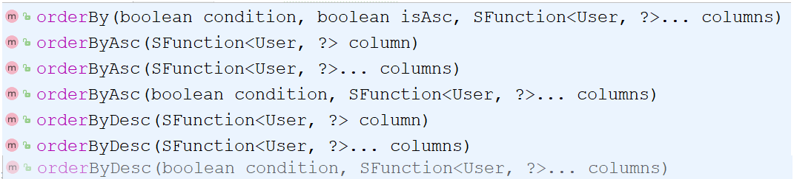

* orderBy排序
  * condition:条件，true则添加排序，false则不添加排序
  * isAsc:是否为升序，true升序，false降序
  * columns:排序字段，可以有多个
* **orderByAsc/Desc**(单个column):按照指定字段进行升序/降序
* orderByAsc/Desc(多个column):按照多个字段进行升序/降序
* orderByAsc/Desc
  * condition:条件，true添加排序，false不添加排序
  * 多个columns：按照多个字段进行排序

### 4.3.5 其他查询

除了上面介绍的这几种查询条件构建方法以外还会有很多其他的方法，比如  **isNull, isNotNull,  in,  notIn**等等方法可供选择，具体参考官方文档的条件构造器来学习使用，具体的网址为:

`https://mp.baomidou.com/guide/wrapper.html#abstractwrapper`

## 4.4 映射匹配兼容性

前面我们已经能从表中查询出数据，并将数据封装到模型类中，这整个过程涉及到一张表和一个模型类:


之所以数据能够成功的从表中获取并封装到模型对象中，原因是表的字段列名和模型类的属性名一样。

那么问题就来了:

#### 问题1:表字段与编码属性设计不同步

当表的列名和模型类的属性名发生不一致，就会导致数据封装不到模型对象，这个时候就需要其中一方做出修改，那如果前提是两边都不能改又该如何解决?

MP给我们提供了一个注解**`@TableField`,**使用该注解可以实现模型类属性名和表的列名之间的映射关系

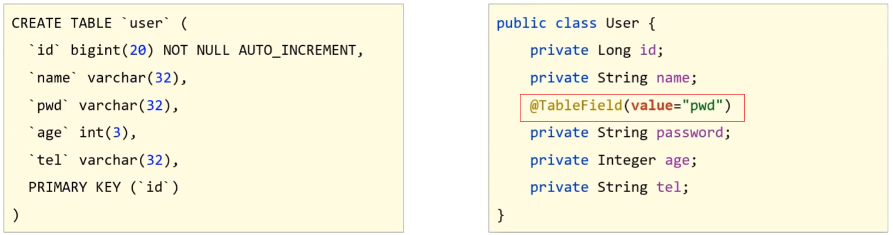

#### 问题2:编码中添加了数据库中未定义的属性

当模型类中多了一个数据库表不存在的字段，就会导致生成的sql语句中在select的时候查询了数据库不存在的字段，程序运行就会报错，错误信息为:

==Unknown column '多出来的字段名称' in 'field list'==

具体的解决方案用到的还是**`@TableField`注解，它有一个属性叫`exist`**，设置该字段是否在数据库表中存在，如果设置为false则不存在，生成sql语句查询的时候，就不会再查询该字段了。


#### 问题3：采用默认查询开放了更多的字段查看权限

查询表中所有的列的数据，就可能把一些敏感数据查询到返回给前端，这个时候我们就需要限制哪些字段默认不要进行查询。解决方案是**`@TableField`注解的一个属性叫`select`**，该属性设置默认是否需要查询该字段的值，true(默认值)表示默认查询该字段，false表示默认不查询该字段。


#### 知识点1：@TableField

| 名称     | @TableField                                                  |
| -------- | ------------------------------------------------------------ |
| 类型     | ==属性注解==                                                 |
| 位置     | 模型类属性定义上方                                           |
| 作用     | 设置当前属性对应的数据库表中的字段关系                       |
| 相关属性 | **value(默认)**：设置数据库表字段名称<br/>**exist:** 设置属性在数据库表字段中是否存在，默认为true，此属性不能与value合并使用<br/>**select:**  设置属性是否参与查询，此属性与select()映射配置不冲突 |

#### 问题4:表名与编码开发设计不同步

默认的情况下，我们实体类为User，他就会去找对应的小写user表明。

该问题主要是表的名称和模型类的名称不一致，导致查询失败，这个时候通常会报如下错误信息:

==Table 'databaseName.tableNaem' doesn't exist==,翻译过来就是数据库中的表不存在。


解决方案是使用MP提供的另外一个注解**`@TableName`**来设置表与模型类之间的对应关系。


#### 知识点2：@TableName

| 名称     | @TableName                    |
| -------- | ----------------------------- |
| 类型     | ==类注解==                    |
| 位置     | 模型类定义上方                |
| 作用     | 设置当前类对应于数据库表关系  |
| 相关属性 | value(默认)：设置数据库表名称 |

#### 代码演示

接下来我们使用案例的方式把刚才的知识演示下:

##### 步骤1:修改数据库表user为tbl_user

直接查询会报错，原因是MP默认情况下会使用模型类的类名首字母小写当表名使用。


##### 步骤2:模型类添加@TableName注解

```java
@Data
@TableName("tbl_user")
public class User {
    private Long id;
    private String name;
    private String password;
    private Integer age;
    private String tel;
}
```

##### 步骤3:将字段password修改成pwd

直接查询会报错，原因是MP默认情况下会使用模型类的属性名当做表的列名使用

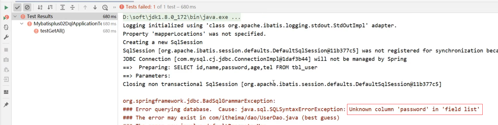

##### 步骤4：使用@TableField映射关系

```java
@Data
@TableName("tbl_user")
public class User {
    private Long id;
    private String name;
    @TableField(value="pwd")
    private String password;
    private Integer age;
    private String tel;
}
```

##### 步骤5:添加一个数据库表不存在的字段

```java
@Data
@TableName("tbl_user")
public class User {
    private Long id;
    private String name;
    @TableField(value="pwd")
    private String password;
    private Integer age;
    private String tel;
    private Integer online;
}
```

直接查询会报错，原因是MP默认情况下会查询模型类的所有属性对应的数据库表的列，而online不存在


##### 步骤6：使用@TableField排除字段

```java
@Data
@TableName("tbl_user")
public class User {
    private Long id;
    private String name;
    @TableField(value="pwd")
    private String password;
    private Integer age;
    private String tel;
    @TableField(exist=false)
    private Integer online;
}
```

##### 步骤7:查询时将pwd隐藏

```java
@Data
@TableName("tbl_user")
public class User {
    private Long id;
    private String name;
    @TableField(value="pwd",select=false)
    private String password;
    private Integer age;
    private String tel;
    @TableField(exist=false)
    private Integer online;
}
```

# 5. DML编程控制

查询相关的操作我们已经介绍完了，紧接着我们需要对另外三个，增删改进行内容的讲解。挨个来说明下，首先是新增(insert)中的内容。

## 5.1 id生成策略控制

前面我们在新增的时候留了一个问题，就是新增成功后，主键ID是一个很长串的内容，我们更想要的是按照数据库表字段进行自增长，在解决这个问题之前，我们先来分析下ID该如何选择:


不同的业务采用的ID生成方式应该是不一样的，那么在MP中都提供了哪些主键生成策略，以及我们该如何进行选择?

在这里我们又需要用到MP的一个注解叫`@TableId`

### 知识点1：@TableId

| 名称     | @TableId                                                     |
| -------- | ------------------------------------------------------------ |
| 类型     | ==属性注解==                                                 |
| 位置     | 模型类中用于表示主键的属性定义上方                           |
| 作用     | 设置当前类中主键属性的生成策略                               |
| 相关属性 | value(默认)：设置数据库表主键名称<br/>type: 设置主键属性的生成策略，值查照IdType的枚举值 |

### 4.1.1 环境构建

在构建条件查询之前，我们先来准备下环境

- 创建一个SpringBoot项目

- pom.xml中添加对应的依赖

- 编写UserDao接口

  ```java
  @Mapper
  public interface UserDao extends BaseMapper<User> {
  }
  ```

- 编写模型类

  ```java
  @Data
  @TableName("tbl_user")
  public class User {
      private Long id;
      private String name;
      @TableField(value="pwd",select=false)
      private String password;
      private Integer age;
      private String tel;
      @TableField(exist=false)
      private Integer online;
  }
  ```

- 编写引导类

  ```java
  @SpringBootApplication
  public class Mybatisplus03DqlApplication {
  
      public static void main(String[] args) {
          SpringApplication.run(Mybatisplus03DqlApplication.class, args);
      }
  
  }
  ```

- 编写配置文件

  ```yml
  # dataSource
  spring:
    datasource:
      type: com.alibaba.druid.pool.DruidDataSource
      driver-class-name: com.mysql.cj.jdbc.Driver
      url: jdbc:mysql://localhost:3306/mybatisplus_db?serverTimezone=UTC
      username: root
      password: root
  # mp日志
  mybatis-plus:
    configuration:
      log-impl: org.apache.ibatis.logging.stdout.StdOutImpl
  ```

- 编写测试类

  ```java
  @SpringBootTest
  class Mybatisplus02DqlApplicationTests {
  
      @Autowired
      private UserDao userDao;
      
      @Test
      void testGetAll(){
          List<User> userList = userDao.selectList(null);
          System.out.println(userList);
      }
  }
  ```

- 测试

  ```java
  @SpringBootTest
  class Mybatisplus03DqlApplicationTests {
  
      @Autowired
      private UserDao userDao;
  	
      @Test
      void testSave(){
          User user = new User();
          user.setName("黑马程序员");
          user.setPassword("itheima");
          user.setAge(12);
          user.setTel("4006184000");
          userDao.insert(user);
      }
      @Test
      void testDelete(){
          userDao.deleteById(1401856123925713409L)
      }
      @Test
      void testUpdate(){
          User user = new User();
          user.setId(3L);
          user.setName("Jock666");
          user.setVersion(1);
          userDao.updateById(user);
      }
  }
  ```

- 最终创建的项目结构为:

  

### 4.1.2 代码演示

#### Id策略简介

接下来，我们可以进入源码查看下ID的生成策略有哪些?

打开源码后，你会发现并没有看到中文注释，这就需要我们点击右上角的`Download Sources`,会自动帮你把这个类的java文件下载下来，我们就能看到具体的注释内容。因为这个技术是国人制作的，所以他代码中的注释还是比较容易看懂的。


当把源码下载完后，就可以看到如下内容:

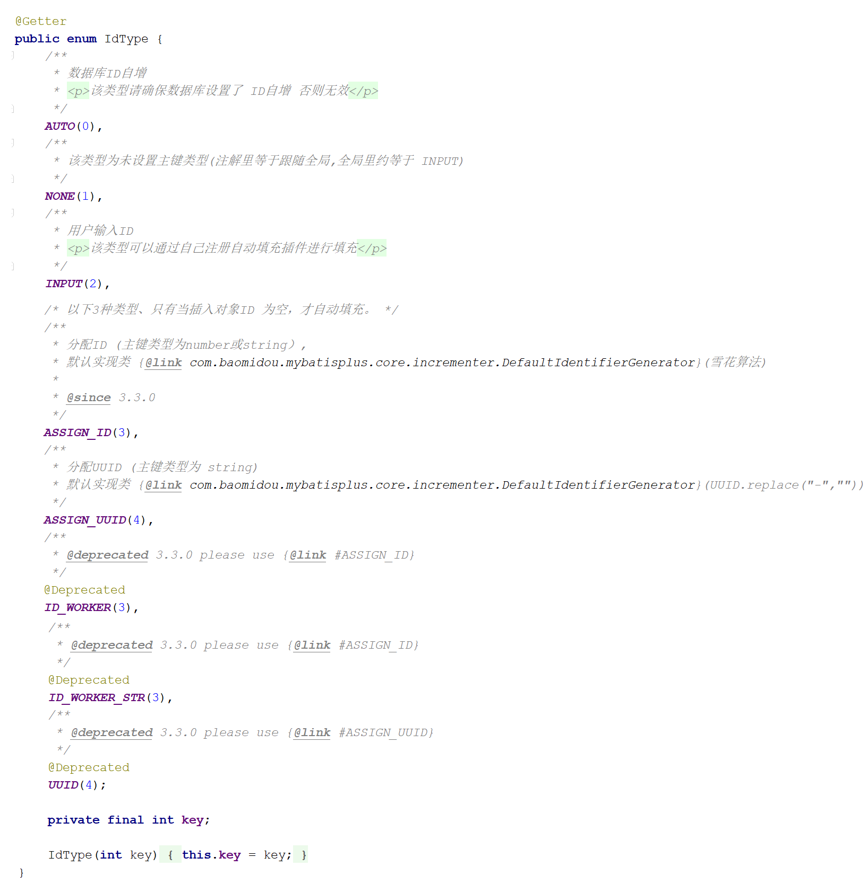

从源码中可以看到，除了AUTO这个策略以外，还有如下几种生成策略:

* **NONE:**  不设置id生成策略
* **INPUT:** 用户手工输入id
* **ASSIGN_ID:** 雪花算法生成id(可兼容数值型与字符串型)
* **ASSIGN_UUID:** 以UUID生成算法作为id生成策略
* 其他的几个策略均已过时，都将被ASSIGN_ID和ASSIGN_UUID代替掉。

**拓展:**

分布式ID是什么?

* 当数据量足够大的时候，一台数据库服务器存储不下，这个时候就需要多台数据库服务器进行存储
* 比如订单表就有可能被存储在不同的服务器上
* 如果用数据库表的自增主键，因为在两台服务器上所以会出现冲突
* 这个时候就需要一个全局唯一ID,这个ID就是分布式ID。

##### AUTO策略

​	==数据库自增id==

###### 步骤1:设置生成策略为AUTO

```java
@Data
@TableName("tbl_user")
public class User {
    @TableId(type = IdType.AUTO)
    private Long id;
    private String name;
    @TableField(value="pwd",select=false)
    private String password;
    private Integer age;
    private String tel;
    @TableField(exist=false)
    private Integer online;
}
```

###### 步骤2:删除测试数据并修改自增值

* 删除测试数据

  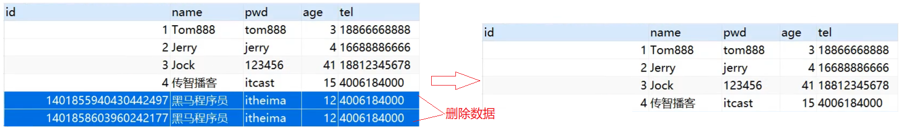

* 因为之前生成主键ID的值比较长，会把MySQL的自动增长的值变的很大，所以需要将其调整为目前最新的id值。

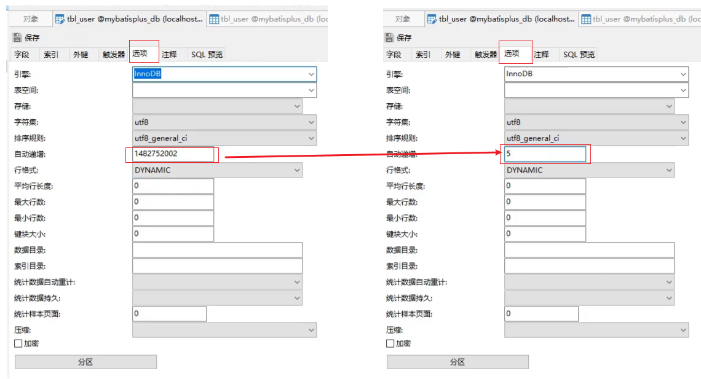

###### 步骤3:运行新增方法  

会发现，新增成功，并且主键id也是从5开始


经过这三步的演示，会发现`AUTO`的作用是==使用数据库ID自增==，在使用该策略的时候一定要确保对应的数据库表设置了ID主键自增，否则无效。

##### INPUT策略

​	==自己写id==

###### 步骤1:设置生成策略为INPUT

```java
@Data
@TableName("tbl_user")
public class User {
    @TableId(type = IdType.INPUT)
    private Long id;
    private String name;
    @TableField(value="pwd",select=false)
    private String password;
    private Integer age;
    private String tel;
    @TableField(exist=false)
    private Integer online;
}
```

**注意:**这种ID生成策略，需要将表的自增策略删除掉


###### 步骤2:添加数据手动设置ID

```java
@SpringBootTest
class Mybatisplus03DqlApplicationTests {

    @Autowired
    private UserDao userDao;
	
    @Test
    void testSave(){
        User user = new User();
        //设置主键ID的值
        user.setId(666L);
        user.setName("黑马程序员");
        user.setPassword("itheima");
        user.setAge(12);
        user.setTel("4006184000");
        userDao.insert(user);
    }
}
```

###### 步骤3:运行新增方法

如果没有设置主键ID的值，则会报错，错误提示就是主键ID没有给值:

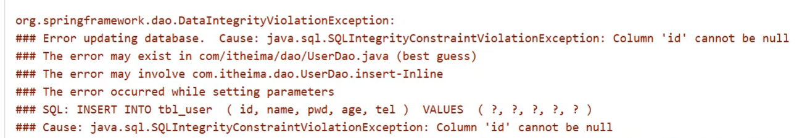

如果设置了主键ID,则数据添加成功，如下:


##### ASSIGN_ID策略

​	==雪花算法生成id(可兼容数值型与字符串型)==

接下来我们来聊一聊雪花算法:

雪花算法(SnowFlake),是Twitter官方给出的算法实现 是用Scala写的。其生成的结果是一个64bit大小整数，它的结构如下图:


1. 1bit,不用,因为二进制中最高位是符号位，1表示负数，0表示正数。生成的id一般都是用整数，所以最高位固定为0。
2. 41bit-时间戳，用来记录时间戳，毫秒级
3. 10bit-工作机器id，用来记录工作机器id,其中高位5bit是数据中心ID其取值范围0-31，低位5bit是工作节点ID其取值范围0-31，两个组合起来最多可以容纳1024个节点
4. 序列号占用12bit，每个节点每毫秒0开始不断累加，最多可以累加到4095，一共可以产生4096个ID

###### 步骤1:设置生成策略为ASSIGN_ID

```java
@Data
@TableName("tbl_user")
public class User {
    @TableId(type = IdType.ASSIGN_ID)
    private Long id;
    private String name;
    @TableField(value="pwd",select=false)
    private String password;
    private Integer age;
    private String tel;
    @TableField(exist=false)
    private Integer online;
}
```

###### 步骤2:添加数据不设置ID

```java
@SpringBootTest
class Mybatisplus03DqlApplicationTests {

    @Autowired
    private UserDao userDao;
	
    @Test
    void testSave(){
        User user = new User();
        user.setName("黑马程序员");
        user.setPassword("itheima");
        user.setAge(12);
        user.setTel("4006184000");
        userDao.insert(user);
    }
}
```

**注意:**这种生成策略，不需要手动设置ID，如果手动设置ID，则会使用自己设置的值。

###### 步骤3:运行新增方法  

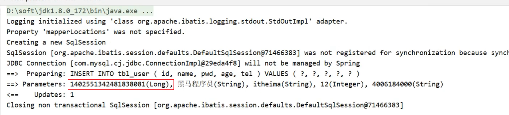

生成的ID就是一个Long类型的数据。

##### ASSIGN_UUID策略

###### 步骤1:设置生成策略为ASSIGN_UUID

==使用uuid需要注意，主键的类型不能是Long，而应该改成String类型，UUID生成的主键为32位==

```java
@Data
@TableName("tbl_user")
public class User {
    @TableId(type = IdType.ASSIGN_UUID)
    private String id;
    private String name;
    @TableField(value="pwd",select=false)
    private String password;
    private Integer age;
    private String tel;
    @TableField(exist=false)
    private Integer online;
}
```

###### 步骤2:修改表的主键类型


主键类型设置为varchar，长度要大于32，因为UUID生成的主键为32位，如果长度小的话就会导致插入失败。

###### 步骤3:添加数据不设置ID

```java
@SpringBootTest
class Mybatisplus03DqlApplicationTests {

    @Autowired
    private UserDao userDao;
	
    @Test
    void testSave(){
        User user = new User();
        user.setName("黑马程序员");
        user.setPassword("itheima");
        user.setAge(12);
        user.setTel("4006184000");
        userDao.insert(user);
    }
}
```

###### 步骤4:运行新增方法

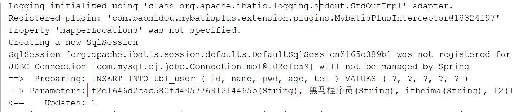

### 5.1.3 ID生成策略对比

介绍了这些主键ID的生成策略，我们以后该用哪个呢?

* NONE: 不设置id生成策略，MP不自动生成，约等于INPUT,所以这两种方式都需要用户手动设置，但是手动设置第一个问题是容易出现相同的ID造成主键冲突，为了保证主键不冲突就需要做很多判定，实现起来比较复杂
* AUTO:数据库ID自增,这种策略适合在数据库服务器只有1台的情况下使用,不可作为分布式ID使用
* ASSIGN_UUID:可以在分布式的情况下使用，而且能够保证唯一，但是生成的主键是32位的字符串，长度过长占用空间而且还不能排序，查询性能也慢
* ASSIGN_ID:可以在分布式的情况下使用，生成的是Long类型的数字，可以排序性能也高，但是生成的策略和服务器时间有关，如果修改了系统时间就有可能导致出现重复主键
* 综上所述，每一种主键策略都有自己的优缺点，根据自己项目业务的实际情况来选择使用才是最明智的选择。

### 5.1.4 简化配置

前面我们已经完成了表关系映射、数据库主键策略的设置，接下来对于这两个内容的使用，我们再讲下他们的简化配置:

##### 模型类主键策略设置

对于主键ID的策略已经介绍完，但是如果要在项目中的每一个模型类上都需要使用相同的生成策略，如: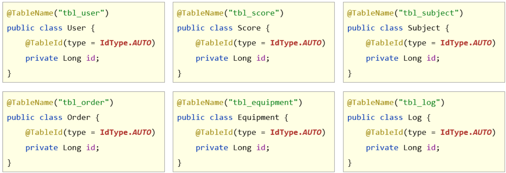

确实是稍微有点繁琐，我们能不能在某一处进行配置，就能让所有的模型类都可以使用该主键ID策略呢?

答案是肯定有，我们只需要在配置文件中添加如下内容:

```yml
mybatis-plus:
  global-config:
    db-config:
    	id-type: assign_id
```

配置完成后，每个模型类的主键ID策略都将成为assign_id.

##### 数据库表与模型类的映射关系

MP会默认将模型类的类名名首字母小写作为表名使用，假如数据库表的名称都以`tbl_`开头，那么我们就需要将所有的模型类上添加`@TableName`，如:


配置起来还是比较繁琐，简化方式为在配置文件中配置如下内容:

```yml
mybatis-plus:
  global-config:
    db-config:
    	table-prefix: tbl_
```

设置表的前缀内容，这样MP就会拿 `tbl_`加上模型类的首字母小写，就刚好组装成数据库的表名。

## 5.2 多记录操作

先来看下问题:


之前添加了很多商品到购物车，过了几天发现这些东西又不想要了，该怎么办呢?

很简单删除掉，但是一个个删除的话还是比较慢和费事的，所以一般会给用户一个批量操作，也就是前面有一个复选框，用户一次可以勾选多个也可以进行全选，然后删一次就可以将购物车清空，这个就需要用到`批量删除`的操作了。

具体该如何实现多条删除，我们找找对应的API方法

```java
int deleteBatchIds(@Param(Constants.COLLECTION) Collection<? extends Serializable> idList);
```

翻译方法的字面意思为:删除（根据ID 批量删除）,参数是一个集合，可以存放多个id值。

> 需求:根据传入的id集合将数据库表中的数据删除掉。

```java
@SpringBootTest
class Mybatisplus03DqlApplicationTests {

    @Autowired
    private UserDao userDao;
	
    @Test
    void testDelete(){
        //删除指定多条数据
        List<Long> list = new ArrayList<>();
        list.add(1402551342481838081L);
        list.add(1402553134049501186L);
        list.add(1402553619611430913L);
        userDao.deleteBatchIds(list);
    }
}
```

执行成功后，数据库表中的数据就会按照指定的id进行删除。

除了按照id集合进行批量删除，也可以按照id集合进行批量查询，还是先来看下API

```java
List<T> selectBatchIds(@Param(Constants.COLLECTION) Collection<? extends Serializable> idList);
```

方法名称翻译为:查询（根据ID 批量查询），参数是一个集合，可以存放多个id值。

> 需求：根据传入的ID集合查询用户信息

```java
@SpringBootTest
class Mybatisplus03DqlApplicationTests {

    @Autowired
    private UserDao userDao;
	
    @Test
    void testGetByIds(){
        //查询指定多条数据
        List<Long> list = new ArrayList<>();
        list.add(1L);
        list.add(3L);
        list.add(4L);
        userDao.selectBatchIds(list);
    }
}
```

查询结果就会按照指定传入的id值进行查询


## 5.3 逻辑删除

接下来要讲解是删除中比较重要的一个操作，逻辑删除，先来分析下问题:

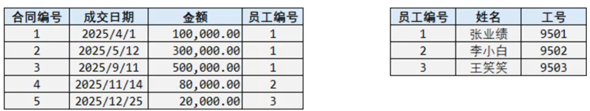

* 这是一个员工和其所签的合同表，关系是一个员工可以签多个合同，是一个一(员工)对多(合同)的表

* 员工ID为1的张业绩，总共签了三个合同，如果此时他离职了，我们需要将员工表中的数据进行删除，会执行delete操作

* 如果表在设计的时候有主外键关系，那么同时也得将合同表中的前三条数据也删除掉

  

* 后期要统计所签合同的总金额，就会发现对不上，原因是已经将员工1签的合同信息删除掉了

* 如果只删除员工不删除合同表数据，那么合同的员工编号对应的员工信息不存在，那么就会出现垃圾数据，就会出现无主合同，根本不知道有张业绩这个人的存在

* **所以经过分析，我们不应该将表中的数据删除掉，而是需要进行保留，但是又得把离职的人和在职的人进行区分，这样就解决了上述问题，如:**

  

* 区分的方式，就是在员工表中添加一列数据`deleted`，如果为0说明在职员工，如果离职则将其改完1，（0和1所代表的含义是可以自定义的）

所以对于删除操作业务问题来说有:

* 物理删除:业务数据从数据库中丢弃，执行的是delete操作
* 逻辑删除:为数据设置是否可用状态字段，删除时设置状态字段为不可用状态，数据保留在数据库中，执行的是update操作

MP中逻辑删除具体该如何实现?

#### 步骤1:修改数据库表添加`deleted`列

字段名可以任意，内容也可以自定义，比如`0`代表正常，`1`代表删除，可以在添加列的同时设置其默认值为`0`正常。


#### 步骤2:实体类添加属性

(1)添加与数据库表的列对应的一个属性名，名称可以任意，如果和数据表列名对不上，可以使用@TableField进行关系映射，如果一致，则会自动对应。

(2)标识新增的字段为逻辑删除字段，使用**`@TableLogic`**

```java
@Data
//@TableName("tbl_user") 可以不写是因为配置了全局配置
public class User {
    @TableId(type = IdType.ASSIGN_UUID)
    private String id;
    private String name;
    @TableField(value="pwd",select=false)
    private String password;
    private Integer age;
    private String tel;
    @TableField(exist=false)
    private Integer online;
  
    @TableLogic(value="0",delval="1")
    //value为正常数据的值，delval为删除数据的值
    private Integer deleted;
}
```

#### 步骤3:运行删除方法

```java
@SpringBootTest
class Mybatisplus03DqlApplicationTests {

    @Autowired
    private UserDao userDao;
	
    @Test
    void testDelete(){
       userDao.deleteById(1L);
    }
}
```

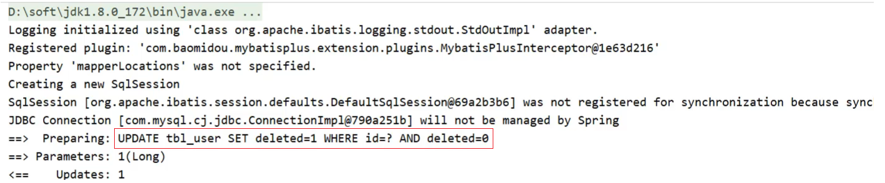

从测试结果来看，逻辑删除最后走的是update操作，会将指定的字段修改成删除状态对应的值。

**思考**

逻辑删除，对查询有没有影响呢?

* 执行查询操作

  ```java
  @SpringBootTest
  class Mybatisplus03DqlApplicationTests {
  
      @Autowired
      private UserDao userDao;
  	
      @Test
      void testFind(){
         System.out.println(userDao.selectList(null));
      }
  }
  ```

  运行测试，会发现打印出来的sql语句中会多一个查询条件，如:

  

  可想而知，MP的逻辑删除会将所有的查询都添加一个未被删除的条件，也就是已经被删除的数据是不应该被查询出来的。

* 如果还是想把已经删除的数据都查询出来该如何实现呢?

  ```java
  @Mapper
  public interface UserDao extends BaseMapper<User> {
      //查询所有数据包含已经被删除的数据
      @Select("select * from tbl_user")
      public List<User> selectAll();
  }
  ```


**如果每个表都要有逻辑删除，那么就需要在每个模型类的属性上添加`@TableLogic`注解，如何优化?**

在配置文件中添加全局配置，如下:

```yml
mybatis-plus:
  global-config:
    db-config:
      # 逻辑删除字段名
      logic-delete-field: deleted
      # 逻辑删除字面值：未删除为0
      logic-not-delete-value: 0
      # 逻辑删除字面值：删除为1
      logic-delete-value: 1
```

介绍完逻辑删除，逻辑删除的本质为:

**逻辑删除的本质其实是修改操作。如果加了逻辑删除字段，查询数据时也会自动带上逻辑删除字段。**

执行的SQL语句为:

UPDATE tbl_user SET ==deleted===1 where id = ? AND ==deleted===0

执行数据结果为:


#### 知识点1：@TableLogic

| 名称     | @TableLogic                                 |
| -------- | ------------------------------------------- |
| 类型     | ==属性注解==                                |
| 位置     | 模型类中用于表示删除字段的属性定义上方      |
| 作用     | 标识该字段为进行逻辑删除的字段              |
| 相关属性 | value：逻辑未删除值<br/>delval:  逻辑删除值 |

## 5.4 乐观锁

### 5.4.1 概念

在讲解乐观锁之前，我们还是先来分析下问题:

==业务并发现象带来的问题:   秒杀==

* 假如有100个商品或者票在出售，为了能保证每个商品或者票只能被一个人购买，如何保证不会出现超买或者重复卖
* 对于这一类问题，其实有很多的解决方案可以使用
* 第一个最先想到的就是锁，锁在一台服务器中是可以解决的，但是如果在多台服务器下锁就没有办法控制，比如12306有两台服务器在进行卖票，在两台服务器上都添加锁的话，那也有可能会导致在同一时刻有两个线程在进行卖票，还是会出现并发问题
* 我们接下来介绍的这种方式是针对于小型企业的解决方案，因为数据库本身的性能就是个瓶颈，如果对其并发量超过2000以上的就需要考虑其他的解决方案了。

简单来说，乐观锁主要解决的问题是当要更新一条记录的时候，希望这条记录没有被别人更新。

### 5.4.2 实现思路

乐观锁的实现方式:

> * 数据库表中添加version列，比如默认值给1
> * 第一个线程要修改数据之前，取出记录时，获取当前数据库中的version=1
> * 第二个线程要修改数据之前，取出记录时，获取当前数据库中的version=1
> * 第一个线程执行更新时，set version = newVersion where version = oldVersion
>   * newVersion = version+1  [2]
>   * oldVersion = version  [1]
> * 第二个线程执行更新时，set version = newVersion where version = oldVersion
>   * newVersion = version+1  [2]
>   * oldVersion = version  [1]
> * 假如这两个线程都来更新数据，第一个和第二个线程都可能先执行
>   * 假如第一个线程先执行更新，会把version改为2，
>   * 第二个线程再更新的时候，set version = 2 where version = 1,此时数据库表的数据version已经为2，所以第二个线程会修改失败
>   * 假如第二个线程先执行更新，会把version改为2，
>   * 第一个线程再更新的时候，set version = 2 where version = 1,此时数据库表的数据version已经为2，所以第一个线程会修改失败
>   * 不管谁先执行都会确保只能有一个线程更新数据，这就是MP提供的乐观锁的实现原理分析。

上面所说的步骤具体该如何实现呢?

### 5.4.3 实现步骤

分析完步骤后，具体的实现步骤如下:

##### 步骤1:数据库表添加列

列名可以任意，比如使用`version`,给列设置默认值为`1`


##### 步骤2:在模型类中添加对应的属性

根据添加的字段列名，在模型类中添加对应的属性值

```java
@Data
//@TableName("tbl_user") 可以不写是因为配置了全局配置
public class User {
    @TableId(type = IdType.ASSIGN_UUID)
    private String id;
    private String name;
    @TableField(value="pwd",select=false)
    private String password;
    private Integer age;
    private String tel;
    @TableField(exist=false)
    private Integer online;
    private Integer deleted;
    @Version
    private Integer version;
}
```

##### 步骤3:添加乐观锁的拦截器

```java
@Configuration
public class MpConfig {
    @Bean
    public MybatisPlusInterceptor mpInterceptor() {
        //1.定义Mp拦截器
        MybatisPlusInterceptor mpInterceptor = new MybatisPlusInterceptor();
        //2.添加乐观锁拦截器
        mpInterceptor.addInnerInterceptor(new OptimisticLockerInnerInterceptor());
        return mpInterceptor;
    }
}
```

##### 步骤4:执行更新操作

```java
@SpringBootTest
class Mybatisplus03DqlApplicationTests {

    @Autowired
    private UserDao userDao;
	
    @Test
    void testUpdate(){
       User user = new User();
        user.setId(3L);
        user.setName("Jock666");
        userDao.updateById(user);
    }
}
```


你会发现，这次修改并没有更新version字段，原因是没有携带version数据。

```java
@SpringBootTest
class Mybatisplus03DqlApplicationTests {

    @Autowired
    private UserDao userDao;
	
    @Test
    void testUpdate(){
        User user = new User();
        user.setId(3L);
        user.setName("Jock666");
        user.setVersion(1);
        userDao.updateById(user);
    }
}
```


**你会发现，我们传递的是1，MP会将1进行加1，然后，更新回到数据库表中。**

所以要想实现乐观锁，首先第一步应该是拿到表中的version，然后拿version当条件在将version加1更新回到数据库表中，所以我们在查询的时候，需要对其进行查询

```java
@SpringBootTest
class Mybatisplus03DqlApplicationTests {

    @Autowired
    private UserDao userDao;
	
    @Test
    void testUpdate(){
        //1.先通过要修改的数据id将当前数据查询出来
        User user = userDao.selectById(3L);
        //2.将要修改的属性逐一设置进去
        user.setName("Jock888");
        userDao.updateById(user);
    }
}
```


大概分析完乐观锁的实现步骤以后，我们来模拟一种加锁的情况，看看能不能实现多个人修改同一个数据的时候，只能有一个人修改成功。

```java
@SpringBootTest
class Mybatisplus03DqlApplicationTests {

    @Autowired
    private UserDao userDao;
	
    @Test
    void testUpdate(){
       //1.先通过要修改的数据id将当前数据查询出来
        User user = userDao.selectById(3L);     //version=3
        User user2 = userDao.selectById(3L);    //version=3
        user2.setName("Jock aaa");
        userDao.updateById(user2);              //version=>4
        user.setName("Jock bbb");
        userDao.updateById(user);               //verion=3?条件还成立吗？
    }
}
```

运行程序，分析结果：

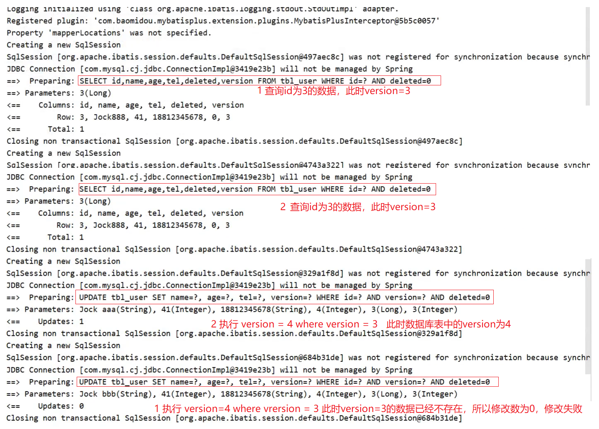

乐观锁就已经实现完成了，如果对于上面的这些步骤记不住咋办呢?

参考官方文档来实现:

`https://mp.baomidou.com/guide/interceptor-optimistic-locker.html#optimisticlockerinnerinterceptor`


# 6. 快速开发

##6.1 代码生成器原理分析

造句:

我们可以往空白内容进行填词造句，比如:

在比如:

观察我们之前写的代码，会发现其中也会有很多重复内容，比如:

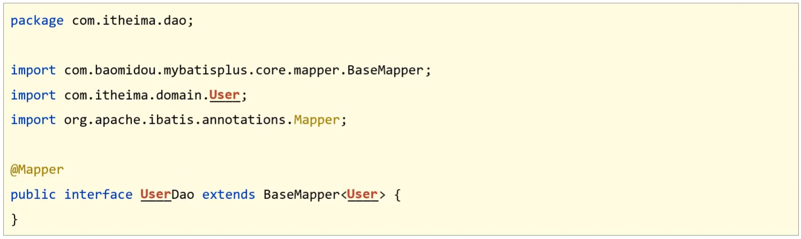

那我们就想，如果我想做一个Book模块的开发，是不是只需要将红色部分的内容全部更换成`Book`即可，如：


所以我们会发现，做任何模块的开发，对于这段代码，基本上都是对红色部分的调整，所以我们把去掉红色内容的东西称之为==模板==，红色部分称之为==参数==，以后只需要传入不同的参数，就可以根据模板创建出不同模块的dao代码。

除了Dao可以抽取模块，其实我们常见的类都可以进行抽取，只要他们有公共部分即可。再来看下模型类的模板：


* ① 可以根据数据库表的表名来填充
* ② 可以根据用户的配置来生成ID生成策略
* ③到⑨可以根据数据库表字段名称来填充

所以只要我们知道是对哪张表进行代码生成，这些内容我们都可以进行填充。

分析完后，我们会发现，要想完成代码自动生成，我们需要有以下内容:

* **模板:** MyBatisPlus提供，可以自己提供，但是麻烦，不建议
* **数据库相关配置**:读取数据库获取表和字段信息
* **开发者自定义配置**:手工配置，比如ID生成策略

## 6.1 代码生成器实现

#### 步骤1:创建一个Maven项目

#### 代码2:导入对应的jar包

```xml
<?xml version="1.0" encoding="UTF-8"?>
<project xmlns="http://maven.apache.org/POM/4.0.0" xmlns:xsi="http://www.w3.org/2001/XMLSchema-instance"
         xsi:schemaLocation="http://maven.apache.org/POM/4.0.0 https://maven.apache.org/xsd/maven-4.0.0.xsd">
    <modelVersion>4.0.0</modelVersion>
    <parent>
        <groupId>org.springframework.boot</groupId>
        <artifactId>spring-boot-starter-parent</artifactId>
        <version>2.5.1</version>
    </parent>
    <groupId>com.itheima</groupId>
    <artifactId>mybatisplus_04_generator</artifactId>
    <version>0.0.1-SNAPSHOT</version>
    <properties>
        <java.version>1.8</java.version>
    </properties>
    <dependencies>
        <!--spring webmvc-->
        <dependency>
            <groupId>org.springframework.boot</groupId>
            <artifactId>spring-boot-starter-web</artifactId>
        </dependency>

        <!--mybatisplus-->
        <dependency>
            <groupId>com.baomidou</groupId>
            <artifactId>mybatis-plus-boot-starter</artifactId>
            <version>3.4.1</version>
        </dependency>

        <!--druid-->
        <dependency>
            <groupId>com.alibaba</groupId>
            <artifactId>druid</artifactId>
            <version>1.1.16</version>
        </dependency>

        <!--mysql-->
        <dependency>
            <groupId>mysql</groupId>
            <artifactId>mysql-connector-java</artifactId>
            <scope>runtime</scope>
        </dependency>

        <!--test-->
        <dependency>
            <groupId>org.springframework.boot</groupId>
            <artifactId>spring-boot-starter-test</artifactId>
            <scope>test</scope>
        </dependency>

        <!--lombok-->
        <dependency>
            <groupId>org.projectlombok</groupId>
            <artifactId>lombok</artifactId>
            <version>1.18.12</version>
        </dependency>

        <!--代码生成器-->
        <dependency>
            <groupId>com.baomidou</groupId>
            <artifactId>mybatis-plus-generator</artifactId>
            <version>3.4.1</version>
        </dependency>

        <!--velocity模板引擎-->
        <dependency>
            <groupId>org.apache.velocity</groupId>
            <artifactId>velocity-engine-core</artifactId>
            <version>2.3</version>
        </dependency>

    </dependencies>

    <build>
        <plugins>
            <plugin>
                <groupId>org.springframework.boot</groupId>
                <artifactId>spring-boot-maven-plugin</artifactId>
            </plugin>
        </plugins>
    </build>

</project>

```

#### 步骤3:编写引导类

```java
@SpringBootApplication
public class Mybatisplus04GeneratorApplication {

    public static void main(String[] args) {
        SpringApplication.run(Mybatisplus04GeneratorApplication.class, args);
    }

}
```

#### 步骤4:创建代码生成类

```java
public class CodeGenerator {
    public static void main(String[] args) {
        //1.获取代码生成器的对象
        AutoGenerator autoGenerator = new AutoGenerator();

        //设置数据库相关配置
        DataSourceConfig dataSourceConfig = new DataSourceConfig();
        dataSourceConfig.setDriverName("com.mysql.cj.jdbc.Driver");
        dataSourceConfig.setUrl("jdbc:mysql://localhost:3306/studysql");
        dataSourceConfig.setUsername("root");
        dataSourceConfig.setPassword("5240zhouquan");
        autoGenerator.setDataSource(dataSourceConfig);

        //设置全局配置
        GlobalConfig globalConfig = new GlobalConfig();
        globalConfig.setOutputDir(System.getProperty("user.dir")+"/demo_codegenerate/src/main/java");    //设置代码生成位置
        globalConfig.setOpen(false);    //设置生成完毕后是否打开生成代码所在的目录
        globalConfig.setAuthor("黑马程序员");    //设置作者
        globalConfig.setFileOverride(true);     //设置是否覆盖原始生成的文件
        globalConfig.setMapperName("%sDao");    //设置数据层接口名，%s为占位符，指数据库表名
        globalConfig.setIdType(IdType.ASSIGN_ID);   //设置Id生成策略
        autoGenerator.setGlobalConfig(globalConfig);

        //设置包名相关配置
        PackageConfig packageInfo = new PackageConfig();
        packageInfo.setParent("com.ccc");   //设置生成的包名，与代码所在位置不冲突，二者叠加组成完整路径
        packageInfo.setEntity("pojo");    //设置实体类包名
        packageInfo.setMapper("mapper");   //设置数据层包名
        autoGenerator.setPackageInfo(packageInfo);

        //策略设置
        StrategyConfig strategyConfig = new StrategyConfig();
        strategyConfig.setInclude("user");  //设置数据库里面参与生成的表名
        strategyConfig.setTablePrefix("tb_");  //设置数据库表的前缀名称，实体名 = 数据库表名 - 前缀名  例如： User = tbl_user - tbl_
        strategyConfig.setRestControllerStyle(true);    //设置是否启用Rest风格
        strategyConfig.setVersionFieldName("version");  //设置乐观锁字段名
        strategyConfig.setLogicDeleteFieldName("deleted");  //设置逻辑删除字段名
        strategyConfig.setEntityLombokModel(true);  //设置是否启用lombok
        autoGenerator.setStrategy(strategyConfig);

        //2.执行生成操作
        autoGenerator.execute();
    }
}
```

对于代码生成器中的代码内容，我们可以直接从官方文档中获取代码进行修改，

`https://mp.baomidou.com/guide/generator.html`

#### 步骤5:运行程序

运行成功后，会在当前项目中生成很多代码，代码包含`controller`,`service`，`mapper`和`entity`


至此代码生成器就已经完成工作，我们能快速根据数据库表来创建对应的类，简化我们的代码开发。

## 6.2 MP中Service的CRUD

回顾我们之前业务层代码的编写，编写接口和对应的实现类:

```java
public interface UserService{
	
}

@Service
public class UserServiceImpl implements UserService{

}
```

接口和实现类有了以后，需要在接口和实现类中声明方法

```java
public interface UserService{
	public List<User> findAll();
}

@Service
public class UserServiceImpl implements UserService{
    @Autowired
    private UserDao userDao;
    
	public List<User> findAll(){
        return userDao.selectList(null);
    }
}
```

MP看到上面的代码以后就说这些方法也是比较固定和通用的，那我来帮你抽取下，所以MP提供了一个Service接口和实现类，分别是:`IService`和`ServiceImpl`,后者是对前者的一个具体实现。

以后我们自己写的Service就可以进行如下修改:

```java
public interface UserService extends IService<User>{
	
}

@Service
public class UserServiceImpl extends ServiceImpl<UserDao, User> implements UserService{

}
```

修改以后的好处是，MP已经帮我们把业务层的一些基础的增删改查都已经实现了，可以直接进行使用。

编写测试类进行测试:

```java
@SpringBootTest
class Mybatisplus04GeneratorApplicationTests {

    private IUserService userService;

    @Test
    void testFindAll() {
        List<User> list = userService.list();
        System.out.println(list);
    }

}
```

**注意:**mybatisplus_04_generator项目中对于MyBatis的环境是没有进行配置，如果想要运行，需要提取将配置文件中的内容进行完善后在运行。

思考:在MP封装的Service层都有哪些方法可以用?

查看官方文档:`https://mp.baomidou.com/guide/crud-interface.html`,这些提供的方法大家可以参考官方文档进行学习使用，方法的名称可能有些变化，但是方法对应的参数和返回值基本类似。

# 7. 性能分析插件

性能分析拦截器，用于输出每条 SQL 语句及其执行时间

SQL 性能执行分析,开发环境使用，超过指定时间，停止运行。有助于发现问题

## 1、配置插件

**（1）参数说明**

参数：maxTime： SQL 执行最大时长，超过自动停止运行，有助于发现问题。

参数：format： SQL是否格式化，默认false。

**（2）在 MybatisPlusConfig 中配置**

```java
/**
 * SQL 执行性能分析插件
 * 开发环境使用，线上不推荐。 maxTime 指的是 sql 最大执行时长
 */
@Bean
@Profile({"dev","test"})// 设置 dev test 环境开启
public PerformanceInterceptor performanceInterceptor() {
    PerformanceInterceptor performanceInterceptor = new PerformanceInterceptor();
    performanceInterceptor.setMaxTime(100);//ms，超过此处设置的ms则sql不执行
    performanceInterceptor.setFormat(true);
    return performanceInterceptor;
}
```

**（3）Spring Boot 中设置dev环境**

```java
#环境设置：dev、test、prod
spring.profiles.active=dev
```

可以针对各环境新建不同的配置文件`application-dev.properties`、`application-test.properties`、`application-prod.properties`

也可以自定义环境名称：如test1、test2

## 2、测试

**（1）常规测试**

```java
/**
 * 测试 性能分析插件
 */
@Test
public void testPerformance() {
    User user = new User();
    user.setName("我是Helen");
    user.setEmail("helen@sina.com");
    user.setAge(18);
    userMapper.insert(user);
}
```

**输出：**


**（2）将maxTime 改小之后再次进行测试**


```
performanceInterceptor.setMaxTime(5);//ms，超过此处设置的ms不执行
```

如果执行时间过长，则抛出异常：The SQL execution time is too large, 

**输出：**


 


